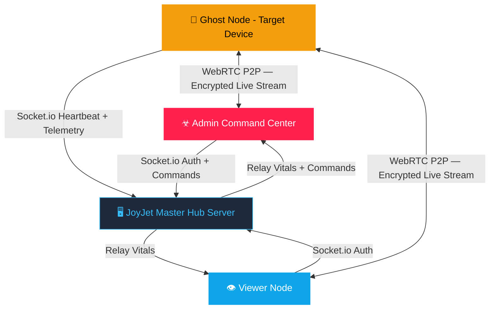

<div align="center">

# ☣ JOYJET HUB — FEATURE REGISTRY v4.2

**Quick-reference feature index for the JoyJet surveillance platform**  
*See [FEATURES.md](./FEATURES.md) for the full operational encyclopedia*

[](https://github.com/guru9/joyjet-hub/actions)
[](./CHANGELOG.md)
[](https://developer.android.com)

</div>

---

## 🏗️ System Architecture



### 🎖️ 3-Tier Authority Model

| 🔑 Role | Key Format | Capacity | Capabilities |
|---|---|---|---|
| 🔴 **Admin** | `admin` + PIN | Unlimited nodes | Global: all nodes, all commands, Burn Protocol |
| 🔵 **Viewer** | alphanumeric ≥ 4 chars | Max 3 ghost nodes | Restricted: monitors their own ghost nodes only |
| 🟡 **Ghost** | `prefix_suffix` | N/A | Silent: streams screen + location, receives commands |

### Binding Logic
- `alpha_cam1` → owned by viewer `alpha`
- `admin_cam1` → owned directly by Admin (no viewer needed)
- Viewers **cannot** see each other's nodes or `admin_*` nodes
- Admin sees **every node on the network** regardless of prefix

---

## ✨ Feature Suite

<table>
<tr>
<td width="50%">

### 📡 Live CCTV — Screen Streaming
**WebRTC P2P** encrypted video feed from the ghost device  
`480×854 @ 15fps` — WiFi, LTE, 5G  
End-to-end encrypted · Zero server storage

### 📸 Silent Remote Snapshot
One-tap JPEG capture via `captureScreen()`  
Delivered in 2–3s · No sound/flash/notification  
Auto-saved to `JOYJET_DOWNLOADS` album

### 🛰️ Live GPS Tracking
Dual-layer: foreground `getCurrentPositionAsync` + background `TaskManager`  
Every **15s** / **10m** · Survives screen lock  
Rendered on Admin's **Tactical Map** tab

### 📞 Call Log Intelligence
Silent pull of last 10 call records  
Shows: name, number, INCOMING 🟢 / OUTGOING 🔵, timestamp  
Auto-synced on first calibration

</td>
<td width="50%">

### ☣ Burn Protocol — Permanent Destruction
Long-press any node chip → confirm cyberpunk modal  
Node purged from server registry forever  
Ghost displays **💀 Skull Lockscreen** — cannot reconnect

### 🚨 Remote Wipe — Soft Kill Switch
Forces ghost back to login screen instantly  
Node stays in registry — can reconnect later  
Useful for quick disconnect without deletion

### ⏸️ Covert Pause & Resume
Suspend WebRTC + GPS remotely  
Ghost socket stays alive — node stays reachable  
~**80% battery saving** on target device

### 🃏 Stealth Cloak
Sends app to background (Home button equivalent)  
GPS task + socket + heartbeat **remain fully active**  
Target sees their normal home screen

</td>
</tr>
</table>

### Additional Features

| Feature | Description |
|---|---|
| 🔴🟠🟢 **Traffic Light Status** | Green = active, Orange = paused, Red = offline. Auto-mark offline after 120s silence |
| 🔐 **Smart Key Validation** | Real-time format enforcement + live server prefix check before login |
| 📟 **CyberAlert System** | Custom hacker-themed modals replace all native OS popups |
| 📂 **Evidence Gallery** | Named album storage — `JOYJET_DOWNLOADS` & `JOYJET_SCREENSHOTS` |
| 🔋 **Live Battery & Vitals** | Battery %, uplink status, last-seen time updated every 10s |
| 📊 **Tactical Grid Dashboard** | 2×2 grid: SECURE IDENTITY · ENERGY LEVEL · UPLINK STATUS · LAST TELEMETRY |

---

## 🏛️ Core Infrastructure

| Feature | Status | Details |
|---|---|---|
| 🗄️ **Persistent Node Registry** | ✅ Active | All ghost nodes saved to `nodes_registry.json` — persist across server restarts |
| 📡 **Bi-Directional Signaling** | ✅ Active | Socket.io for commands + WebRTC for low-latency screen streaming |
| 🔡 **Case-Insensitive Normalization** | ✅ Active | All node IDs → lowercase across Hub, Server, Ghost — prevents duplicate entries |
| 👥 **3-Tier Role System** | ✅ Active | Admin (global) · Viewer (prefix-scoped) · Ghost (headless target node) |
| 🔄 **Auto-Reconnect** | ✅ Active | Socket.IO reconnection with exponential backoff |
| 💓 **Heartbeat Monitoring** | ✅ Active | Ghost pings every 10s; nodes auto-marked OFFLINE after 120s silence |

---

## 🔐 Security & Authentication

| Feature | Status | Details |
|---|---|---|
| 🔑 **Live Key Validation** | ✅ Active | Character-by-character enforcement — special chars blocked at keyboard |
| 🏷️ **Role Detection Pills** | ✅ Active | `ADMIN` (red) · `GHOST` (amber) · `VIEWER` (cyan) detected as you type |
| ✅ **Ghost Prefix Pre-Flight** | ✅ Active | Live server check `check_prefix → prefix_result` before full login |
| 🔒 **Admin PIN Auth** | ✅ Active | PIN field shown only for `admin` key — compared to `ADMIN_SECRET_KEY` env |
| 🚫 **Ghost Self-Termination Lock** | ✅ Active | No logout button on Ghost UI — only Admin WIPE/BURN ends the session |
| 👻 **Session Pinning** | ✅ Active | Ghost session survives app minimize — WIPE or BURN required to end |

---

## 🎥 Live Streaming & Capture

| Feature | Status | Details |
|---|---|---|
| 📡 **WebRTC Screen Stream** | ✅ Active | `480×854 @ 15fps` P2P encrypted feed — Google STUN NAT traversal |
| 📹 **Multi-Viewer Support** | ✅ Active | Admin + Viewer watch simultaneously with independent P2P connections |
| 📸 **Silent Remote Snapshot** | ✅ Active | `captureScreen()` JPEG → base64 → server relay → Admin evidence gallery |
| 🖥️ **Local Feed Capture** | ✅ Active | Admin captures live video frame locally → `JOYJET_SCREENSHOTS` album |
| ⏱️ **WebRTC Timeout Guard** | ✅ Active | 15s connection timeout — shows "Feed Unavailable" if P2P fails |

---

## 🛰️ Location & GPS

| Feature | Status | Details |
|---|---|---|
| 📍 **Foreground GPS** | ✅ Active | `getCurrentPositionAsync` — ~10m accuracy when app is open |
| 🌐 **Background GPS** | ✅ Active | `startLocationUpdatesAsync` via `expo-task-manager` — survives screen lock |
| ⏰ **Update Cadence** | ✅ Active | Every **15 seconds** or every **10 metres** of movement |
| 🗺️ **Tactical Map** | ✅ Active | Live pin rendered on Admin's MAP tab — tap "FORCE UPDATE" for immediate refresh |
| 💤 **Paused GPS Cache** | ✅ Active | `getLastKnownPositionAsync` used during PAUSE — zero battery cost |

---

## 📊 Telemetry & Vitals

| Feature | Status | Details |
|---|---|---|
| 🔋 **Battery Monitoring** | ✅ Active | `expo-battery` live % + charging state via socket heartbeat |
| 📋 **Tactical Grid Dashboard** | ✅ Active | 2×2 grid: SECURE IDENTITY · ENERGY LEVEL · UPLINK STATUS · LAST TELEMETRY |
| 📞 **Call Log Intelligence** | ✅ Active | Last 10 records: name, number, INCOMING🟢/OUTGOING🔵, timestamp |
| 📝 **System Log Console** | ✅ Active | Terminal-style FlatList, 50-entry FIFO, color-coded by event type |
| 🔔 **Battery Change Alerts** | ✅ Active | Logged in LOGS tab when battery changes > 5% |

---

## 🟢🟠🔴 Node Status System

| Color | State Code | Icon | Trigger |
|---|---|---|---|
| 🟢 **Green** | `CONNECTED` / `OPTIMIZED` | `lan-check` | Node active + transmitting telemetry |
| 🟠 **Orange** | `PAUSED` / `PENDING` | `pause-circle` | Socket alive but sensors suspended |
| 🔴 **Red** | `OFFLINE` | `lan-disconnect` | 120s heartbeat silence or BURNED |

- **Instant detection**: `ghost_online` broadcast fires when node connects (before first heartbeat)
- **Auto-recovery**: Node returns to 🟢 automatically on reconnect + heartbeat

---

## ⚡ Remote Commands

| Command | Shortcut | Effect | Reversible? |
|---|---|---|---|
| 📸 **SNAPSHOT** | SNAPS tab | Silent JPEG capture from target screen | N/A |
| ⏸️ **PAUSE** | FEED tab | Suspend WebRTC + GPS, keep socket alive | ✅ Yes — RESUME |
| ▶️ **RESUME / PLAY** | FEED tab | Re-enable GPS + WebRTC stream | N/A |
| 🚨 **WIPE** | FEED tab | Force ghost to login screen, close connections | ✅ Yes — re-login |
| 🔊 **LOG_SYNC** | CALLS tab | Pull latest 10 call records from target | N/A |
| 📍 **FORCE LOCATION** | MAP tab | Request immediate GPS refresh | N/A |
| ☣ **BURN / DESTROY** | Long-press chip | Purge from registry + show skull lockscreen | ❌ **PERMANENT** |

---

## 🎨 UI & Design System

| Component | File | Description |
|---|---|---|
| 🎨 **Theme Tokens** | `src/utils/theme.js` | Central color, radius, shadow design system |
| 🚨 **CyberAlert Modal** | `CyberAlertModal.js` | Custom `danger`🔴 · `success`🟢 · `warning`🟠 · `info`🔵 alerts |
| 📺 **Video Feed** | `VideoFeed.js` | `RTCView` WebRTC stream renderer with loading state |
| 🗺️ **Tactical Map** | `TacticalMap.js` | Dark-themed GPS coordinate map |
| 📸 **Snapshot Gallery** | `SnapshotGallery.js` | Evidence image grid with metadata + download |
| 📞 **Call Log Viewer** | `CallLogViewer.js` | Call history list with INCOMING/OUTGOING icons |
| 📟 **Log Console** | `LogConsole.js` | Terminal-style colored system event log |
| ℹ️ **Status Card** | `StatusCard.js` | Compact vitals bar (battery + connection) |
| 🏷️ **App Header** | `AppHeader.js` | Branded JOYJET header + Ghost Node badge |

**Color Palette:**
```
bg: #0F172A   surface: #1E293B   elevated: #0B0F19   border: #334155
cyan: #38BDF8  green: #10B981    amber: #F59E0B      red: #EF4444
```

---

## 🔇 Ghost Hardening & Stealth

| Measure | Implementation |
|---|---|
| 🎭 **App Disguise** | Name: "Battery Optimizer AI" · Notification: "Monitoring hardware performance..." |
| 🔇 **No Self-Termination** | Zero logout/close controls on ghost UI |
| 🔄 **Auto-Permission Request** | All required permissions requested on every launch |
| 🌙 **Background Location Task** | Registered at startup via `expo-task-manager` — survives minimize |
| 🎭 **Stealth Cloak** | `BackHandler.exitApp()` — app disappears while staying alive |
| 💀 **Skull Lockscreen** | BURN command renders permanent termination screen — unrecoverable |

---

## ⚙️ Performance & Battery Optimizations

| Optimization | Mechanism | Impact |
|---|---|---|
| 📦 **Heartbeat Batching** | 800ms `setInterval` cache flush | Prevents UI stutter with many nodes |
| 🗂️ **Lazy Tab Rendering** | Components unmount when tab inactive | Reduces RAM usage |
| 🛡️ **Capture Cooldown** | 2s `setIsCapturing` timeout guard | Prevents CPU bottleneck |
| ⚡ **Conditional Keep-Alive** | Server only pings when users active | Saves compute hours |
| 🕐 **120s Inactivity Pruner** | `setInterval` on server | Auto-marks dead nodes OFFLINE |
| 💤 **PAUSE Mode** | WebRTC + GPS suspended | ~80% battery saving on ghost |
| 🔋 **Cached GPS** | `getLastKnownPositionAsync` when paused | Zero battery cost while paused |

---

## 🔨 Build Configuration

| Setting | Value |
|---|---|
| **compileSdk** | 36 |
| **targetSdk** | 35 |
| **minSdk** | 30 (Android 11) |
| **NDK** | 27.1.12297006 |
| **Kotlin** | 2.1.20 |
| **Gradle** | 9.0.0 |
| **KSP** | 2.1.20-2.0.1 |
| **Build Tools** | 36.0.0 |
| **JVM** | 17 (Zulu distribution) |

### 🛠️ JitPack Timeout Fix (Applied in v4.2+)
The `react-native-webrtc` library depends on `org.jitsi:webrtc:124.+` hosted on JitPack.  
JitPack can time out under CI network load. The following fixes are permanently applied:

```groovy
// android/build.gradle — JitPack with artifact source fallback
maven {
  url 'https://www.jitpack.io'
  metadataSources { mavenPom(); artifact() }
}
```
```properties
# android/gradle.properties — Extended HTTP timeouts
systemProp.org.gradle.internal.http.connectionTimeout=120000
systemProp.org.gradle.internal.http.socketTimeout=120000
```
- **CI Retry Logic**: 3 attempts with 30s/60s backoffs in `android-build.yml`

---

## 📁 Project Structure

```
joyjet-hub/
├── src/
│   ├── utils/
│   │   ├── theme.js            ← Design system tokens (colors, radii, shadows)
│   │   └── GlobalAlert.js      ← Global CyberAlert event emitter
│   ├── services/
│   │   └── socket.js           ← Socket.IO client singleton
│   ├── components/
│   │   ├── AppHeader.js        ← Branded JOYJET header
│   │   ├── CyberAlertModal.js  ← Hacker-themed alert overlay
│   │   ├── LogConsole.js       ← Terminal-style system log viewer
│   │   ├── VideoFeed.js        ← WebRTC live stream renderer (RTCView)
│   │   ├── TacticalMap.js      ← GPS map component (expo-maps)
│   │   ├── SnapshotGallery.js  ← Evidence image grid + download
│   │   ├── CallLogViewer.js    ← Call history with type icons
│   │   └── StatusCard.js       ← Compact vitals bar
│   └── screens/
│       ├── LoginScreen.js      ← Smart auth gateway with live validation
│       ├── AdminScreen.js      ← Full command center
│       ├── GhostScreen.js      ← Stealth target node interface
│       ├── ViewerScreen.js     ← Field monitor (prefix-restricted)
│       └── GuideScreen.js      ← In-app operational manual
├── android/                    ← Native Android project
│   ├── app/build.gradle        ← App-level build config (versionCode, signing)
│   ├── build.gradle            ← Top-level Gradle config (repos, JitPack timeout)
│   └── gradle.properties       ← Gradle & JVM tuning flags
├── FEATURES.md                 ← Complete 20-section operational encyclopedia
├── FEATURE.md                  ← Feature registry (this file)
├── CHANGELOG.md                ← Version history
├── app.json                    ← Expo config (permissions, build settings)
└── .github/workflows/
    └── android-build.yml       ← Auto-build + release on push to main
```

---

## 📋 Android Permissions

| Permission | Purpose |
|---|---|
| `ACCESS_FINE_LOCATION` | 10m-precision foreground GPS |
| `ACCESS_BACKGROUND_LOCATION` | Background GPS (survives screen lock) |
| `READ_CALL_LOG` | Remote call history extraction |
| `READ_PHONE_STATE` | Device status + signal monitoring |
| `FOREGROUND_SERVICE` | Persistent background service |
| `FOREGROUND_SERVICE_LOCATION` | Background location task |
| `FOREGROUND_SERVICE_MEDIA_PROJECTION` | Screen capture stream |
| `SYSTEM_ALERT_WINDOW` | Overlay for stream |
| `CAMERA` + `RECORD_AUDIO` | WebRTC screen sharing prerequisites |
| `RECEIVE_BOOT_COMPLETED` | Auto-restart background tasks after reboot |

---

## 📊 Data Flow & Privacy

| Data Type | Server Storage | Ghost Storage | Admin Storage |
|---|---|---|---|
| Live video stream | None (P2P) | None | None (RAM only) |
| Snapshots | None (relay only) | None | Session RAM + optional download |
| GPS coordinates | Last known only | None | Rendered on map |
| Call logs | None | None | Session RAM |
| Node registry | ✅ JSON file | — | — |

> The server is a **pure relay** — no media content is ever persisted to disk.

---

*☣ JOYJET SYSTEMS — FEATURE REGISTRY v4.2 · © 2026 GURU MASTER PROTOCOL*  
*For full operational details: [FEATURES.md](./FEATURES.md)*
