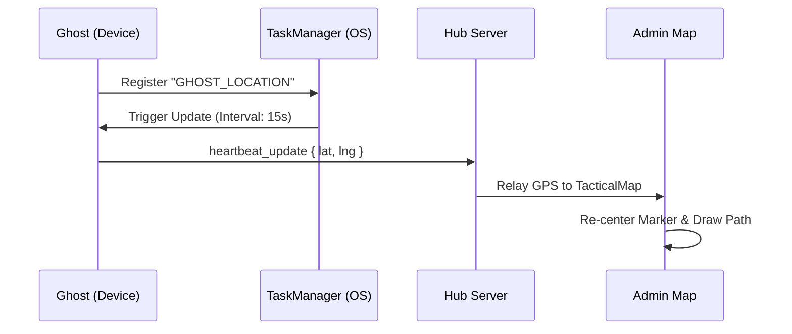
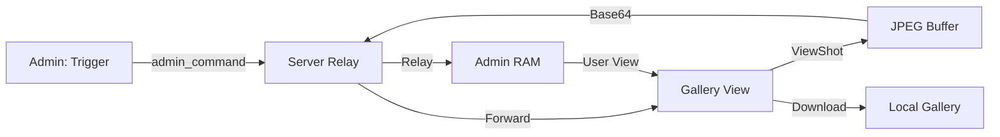

# 🔍 JOYJET: TECHNICAL FEATURE ENCYCLOPEDIA

This document provides a deep-dive into the core operational features of the Joyjet Surveillance System, explaining the "How" and "Why" behind every protocol.

---

## 1. Tactical Pinpoint Navigation (GPS)

### 🛰️ The Protocol
Joyjet uses a dual-layer location protocol to ensure target tracking even when the device is locked or the app is in the background.

| Layer | Method | Accuracy | Behavior |
| --- | --- | --- | --- |
| **Foreground** | `getCurrentPositionAsync` | High (10m) | Active when the Ghost app is open. |
| **Background** | `startLocationUpdatesAsync` | Balanced | Registered via `TaskManager` to survive app minimization. |

### 📈 Flowchart: Location Sync

---

## 2. Remote Snapshot Capture (The Frozen Evidence)

### 📸 The Difference: Snap vs. Stream
*   **Streaming**: A live video feed (low resolution, high speed). No data is saved.
*   **Snapshot**: A high-resolution JPEG of the exact screen state at the moment of the command.

### ⚙️ How it Works
1. **Trigger**: Admin clicks the **Capture Icon**.
2. **Execution**: Ghost receives the command and uses `react-native-view-shot` to dump the current GPU display buffer to a compressed JPEG.
3. **Payload**: The image is converted to a **Base64 String**.
4. **Relay**: The string is piped through the server (Relay only) and arrives at the Admin's `SNAPS` gallery.

### 📈 Flowchart: Capture & Preservation

---

## 3. HD Real-Time Screen Projection (WebRTC)

### 🚀 Zero-Latency Core
Unlike traditional screen recorders, Joyjet uses **WebRTC P2P (Peer-to-Peer)**.
*   **No Server Load**: Video data travels directly from the Ghost's screen to the Admin's eyes. The server only helps them "find" each other (Signaling).
*   **Encryption**: The stream is encrypted end-to-end by default using WebRTC standards.

---

## 4. Telemetry & Vitals Logging

### 🔋 Battery & Signal Monitoring
The system monitors the health of the Ghost node to prevent unexpected disconnects.
*   **Battery**: Updates reported in **Teal Blue** in the console. Alerts are triggered at <15%.
*   **Status**: If a node stops sending heartbeats for 120 seconds, the server marks it as **OFFLINE** and alerts the Admin.

---

## 5. Emergency Remote Wipe

### 🛡️ The Kill Switch
The `WIPE` command is designed for operational security.
- **Vibration**: The target device vibrates to confirm command reception.
- **Detach**: Immediately closes all Socket and WebRTC connections.
- **Logout**: Clears the session tokens and returns the app to a clean Login state.

---

## 💾 Performance Preservation Strategy

To prevent the **"500 Snapshots Slowdown"**:
1. **Lazy Loading**: Individual snapshots are only loaded into memory when the `SNAPS` tab is active.
2. **Garbage Collection**: Ghost devices do not store any local copies of snapshots; they are wiped immediately after the network transmission is confirmed.
3. **Download Override**: By downloading snapshots to your **Local Device Gallery**, you can safely clear the Admin app session without losing evidence.

---

## 📥 Local Storage & Preservation
*   **Downloaded Images**: Located in your phone's Gallery under the album **"JOYJET_SNAPS"**.
*   **File Format**: Standard high-quality `.jpg`.

---
*Document Version: 1.1.0*
