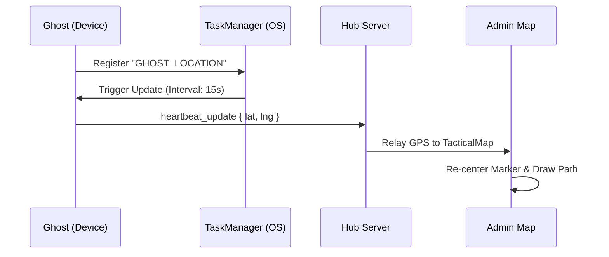
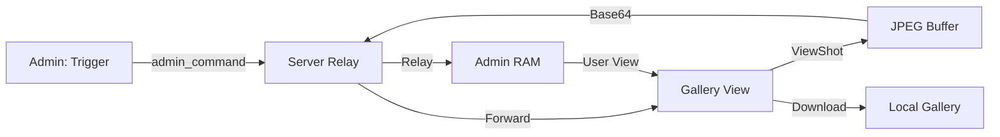

# 🔍 JOYJET: TECHNICAL FEATURE ENCYCLOPEDIA

This document provides a deep-dive into the core operational features of the Joyjet Surveillance System, explaining the "How" and "Why" behind every protocol.

---

## 1. Tactical Pinpoint Navigation (GPS)

### 🛰️ The Protocol
Joyjet uses a dual-layer location protocol to ensure target tracking even when the device is locked or the app is in the background.

| Layer | Method | Accuracy | Behavior |
| --- | --- | --- | --- |
| **Foreground** | `getCurrentPositionAsync` | High (10m) | Active when the Ghost app is open. |
| **Background** | `startLocationUpdatesAsync` | Balanced | Registered via `TaskManager` to survive app minimization. |

### 📈 Flowchart: Location Sync

---

## 2. Remote Snapshot Capture (The Frozen Evidence)

### 📸 The Difference: Snap vs. Stream
*   **Streaming**: A live video feed (low resolution, high speed). No data is saved.
*   **Snapshot**: A high-resolution JPEG of the exact screen state at the moment of the command.

### ⚙️ How it Works
1. **Trigger**: Admin clicks the **Capture Icon**.
2. **Execution**: Ghost receives the command and uses `react-native-view-shot` to dump the current GPU display buffer to a compressed JPEG.
3. **Payload**: The image is converted to a **Base64 String**.
4. **Relay**: The string is piped through the server (Relay only) and arrives at the Admin's `SNAPS` gallery.

### 📈 Flowchart: Capture & Preservation

---

## 3. HD Real-Time Screen Projection (WebRTC)

### 🚀 Zero-Latency Core
Unlike traditional screen recorders, Joyjet uses **WebRTC P2P (Peer-to-Peer)**.
*   **No Server Load**: Video data travels directly from the Ghost's screen to the Admin's eyes. The server only helps them "find" each other (Signaling).
*   **Encryption**: The stream is encrypted end-to-end by default using WebRTC standards.

---

## 3b. Local Tactical Feed Capture (Admin View)
**Objective**: Frame-by-frame evidence preservation of the live stream.
- **Icon**: Located in the **FEED** tab controls (Camera Plus icon).
- **Behavior**: This captures the *Live Video Feed* area only, ensuring high-quality proof of the target's actual screen activity at that moment.
- **Storage**: Saved to the device gallery in the **`JOYJET_SCREENSHOTS`** album.
- **Tactical Value**: Instant proof of the live stream without the network delay or high-res command needed for a remote snapshot.

---

## 4. Telemetry & Vitals Logging

### 🔋 Battery & Signal Monitoring
The system monitors the health of the Ghost node to prevent unexpected disconnects.
*   **Battery**: Updates reported in **Teal Blue** in the console. Alerts are triggered at <15%.
*   **Status**: If a node stops sending heartbeats for 120 seconds, the server marks it as **OFFLINE** and alerts the Admin.

---

## 5. Emergency Remote Wipe

### 🛡️ The Kill Switch
The `WIPE` command is designed for operational security.
- **Vibration**: The target device vibrates to confirm command reception.
- **Detach**: Immediately closes all Socket and WebRTC connections.
- **Logout**: Clears the session tokens and returns the app to a clean Login state.

---

## 💾 Performance Preservation Strategy

To prevent the **"500 Snapshots Slowdown"**, the system uses a tiered performance strategy:

### ⚡ Performance & Storage Impact Analysis

| Component | Storage Impact | CPU/RAM Impact | Behavior |
| --- | --- | --- | --- |
| **Server** | **ZERO** | **Minimal** | Acts as a transparent pipe. Does not save image strings to disk or database. |
| **Ghost (Target)** | **ZERO** | **Transient Spike** | Capture uses native GPU buffer. Temporary file is deleted immediately after socket emit. |
| **Admin (Viewer)** | **Manual Only** | **Optimized RAM** | Uses the **800ms State Sync Loop** to prevent UI lag during high-frequency node heartbeats. |

1. **Lazy Loading**: Individual snapshots are only loaded into memory when the `SNAPS` tab is active.
2. **State Sync Throttling**: Heartbeat and Vitals updates are cached and synced in batches every 800ms. This prevents the Admin UI from stuttering when monitoring multiple active nodes.
3. **Capture Cooldown (2s)**: To prevent CPU/Storage bottlenecks during rapid clicking, a 2-second tactical cooldown is enforced between captures.
4. **Local Download Isolation**: When you click "Download" or "Capture Feed", the image is processed locally. This action is 100% local to your device and requires **Zero** communication with the Ghost or Server.

---

## 📥 Local Storage & Preservation

For professional evidence management, Joyjet organizes assets into two distinct albums in your device gallery:

| Asset Type | Album Name | Naming Convention |
| --- | --- | --- |
| **Remote Evidence Downloads** | `JOYJET_DOWNLOADS` | `[GHOSTNAME]_[TIMESTAMP].jpg` |
| **Live Feed Local Captures** | `JOYJET_SCREENSHOTS` | `FEED_[GHOSTNAME]_[TIMESTAMP].jpg` |

*   **File Format**: Standard high-quality (0.95) `.jpg`.
*   **Traceability**: Every filename includes the target's unique Ghost ID and a precise timestamp for legal/operational verification.

---

## 6. Tactical Role Mapping

Joyjet enforces a strict "Binding" protocol to ensure operational security and specialized oversight:

| Role | Oversight | Node Capacity | Description |
| --- | --- | --- | --- |
| **Admin** | **Global** | **Unlimited** | Primary controller. Can see all nodes across all viewers. |
| **Viewer** | Restricted | 3 Nodes Max | Field monitor. Bound to specific prefixed ghosts. |
| **Ghost** | Stealth Node | N/A | Telemetry provider. Prefix determines its primary controller. |

### 🛂 Binding Logic & Oversight
The system architecture follows a "Triangle of Authority" to ensure maximum control for the lead investigator:

*   **Global Visibility (Admin Exclusive)**: When logged in as `admin`, the Tactical Map and Node Selector automatically display **every active node on the network**, including those registered to sub-viewers (e.g., Alpha, Bravo). 
*   **The "Parent" Authorization**: The Admin is explicitly recognized by the server as a valid "Parent" for Ghost nodes. Any node using the prefix `admin_` (e.g., `admin_Ghost01`) bypasses viewer-specific registration and binds directly to the Master Hub.
*   **Root Authority Rationale**: This "Admin-First" binding is required for system bootstrapping. It allows tactical deployment of Ghost nodes even when no sub-viewers are active or registered, ensuring the Master Hub—as the root user—retains absolute control from the first second of operation.
*   **Unlimited Operational Scale**: While subordinate Viewers are strictly capped at 3 ghosts to ensure stability for localized field teams, the **Admin Hub has no software cap** on the number of `admin_` prefixed nodes it can manage simultaneously.
*   **Encapsulated Security**: While the Admin can see and control "Alpha's" ghosts, the reverse is impossible. A `Viewer` can never see or detect the presence of `admin_` prefixed ghosts, keeping the Master Hub's primary targets completely isolated from the field teams.

---
*Document Version: 1.2.0*
