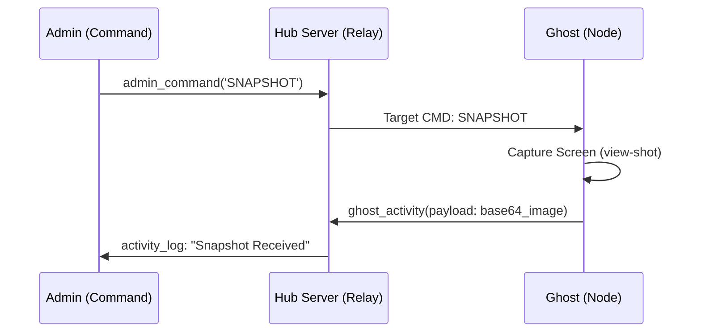

# 🛸 JOYJET HUB | Tactical Surveillance & Stealth Ecosystem (v4.2.1)

JOYJET is a high-performance, low-footprint monitoring solution built with React Native (Expo) and Node.js. It features intelligent data management, automated fail-safes for stealth, and real-time telemetry.

---

## ⚡ LATEST TACTICAL UPDATES (v4.2.1)

- **WebRTC HD Streaming**: Sub-second latency live screen sharing using secure Peer-to-Peer tunnels.
- **Pinpoint GPS Tracking**: Integrated high-precision location updates visualized on a dark-mode Tactical Map.
- **Remote Commands**: Admins can remotely trigger **Snapshots**, **Call Log Sync**, and **System Wipe** commands.
- **Android 15/16 Ready**: Optimized for the latest OS versions; fixed startup crashes and bridge initialization bugs.
- **Free Cloud Build**: Fully integrated GitHub Actions workflow for infinite APK generation without EAS quotas.

---

## 👁️ Surveillance Capabilities

### 1. HD Screen Projection (WebRTC)

Utilizes the **MediaProjection API** to pipe high-definition frames through a WebRTCRTC signaling channel. Optimized to handle up to 15 FPS while maintaining low thermal impact.

### 2. Tactical GPS Mapping

The **TacticalMap** component plots accurate coordinates in real-time.

- **Idle Mode**: Updates location every 60 seconds.
- **Tactical Mode**: Updates every 15 seconds with `BestForNavigation` accuracy when requested by Admin.

### 3. Hardware Vitals & Telemetry

Monitors and reports:

- **Battery**: Real-time percentage and charging status.
- **Network**: Auto-detection of Wi-Fi vs. Cellular.
- **Signal Strength**: Connection health indicator for active nodes.
- **Call Logs**: One-touch synchronization of the latest target device interactions.

---

## ⚙️ Role-Based Protocol Matrix

| Entity        | UI Profile          | Primary Controls                                 | Sensitivity |
| :------------ | :------------------ | :----------------------------------------------- | :---------- |
| **🛡️ ADMIN**  | **Command Center**  | Live Video, Tactical Map, Captures, Remote Wipe  | **HIGH**    |
| **👁️ VIEWER** | **Monitor Hub**     | Live Video (Assigned Only), Tactical Map         | **MED**     |
| **👻 GHOST**  | **Stealth (Black)** | Media Projection, GPS Telemetry, Background Loop | **LOW**     |

### **Auth Keys**

- **Admin Name**: `admin`
- **Admin Key**: `****` (Masked for Security)
- **Viewer Name**: Prefix of the target node (e.g., `Alpha` for nodes starting with `Alpha_`)

---

## 📦 FREE APK BUILD SOLUTION (GitHub Actions)

We have bypassed Expo EAS quotas by using GitHub's free runners for the compilation process.

### **How to build your APK:**

1.  **Commit & Push**: `git commit -m "feat: new tactical build" ; git push origin main`
2.  **Open GitHub**: Visit your repository in a web browser.
3.  **Actions Tab**: Click on the **"Actions"** tab at the top.
4.  **Wait for Job**: Look for the **"Build Android APK"** job. It takes 5-7 minutes.
5.  **Download**: Once complete, scroll to the **"Artifacts"** section and download the `app-debug.apk` zip.

---

## 📊 Infrastructure & Quota Management

To maintain a sustainable development environment and bypass restrictive limits, this project uses a hybrid build strategy:

### **1. Expo EAS Quotas (Legacy/Local)**

- **Build Limit**: ~30 builds per month (Free Tier).
- **Concurrency**: 1 concurrent build (Long wait times).
- **Usage**: Primarily restricted to configuration testing.

### **2. GitHub Actions (Production/Tactical)**

- **Build Limit (Public)**: **Unlimited Minutes** 🆓.
- **Build Limit (Private)**: 2,000 minutes per month.
- **Concurrency**: Up to 20 concurrent builds.
- **Strategy**: This is the primary method for generating APKs.

### **3. Storage Optimization**

- **APK Retention**: To save data storage and keep the environment clean, old APK artifacts are **automatically deleted after 1 day**.
- **Download Urgency**: Ensure you download your `app-debug.apk` within 24 hours of the build completing.

---

## 🏗️ Technical Logic Flow

---

## 🛠️ Performance Specifications

- **Transport**: Socket.io (Engine v4.8)
- **Buffer**: 100MB (`maxHttpBufferSize: 1e8`)
- **Stream Quality**: WebRTC P2P (Optimized 480x854)
- **Backend**: [joyjet-server.onrender.com](https://joyjet-server.onrender.com)

---

_Status: Tactical Build Finalized. Ready for Deployment._
