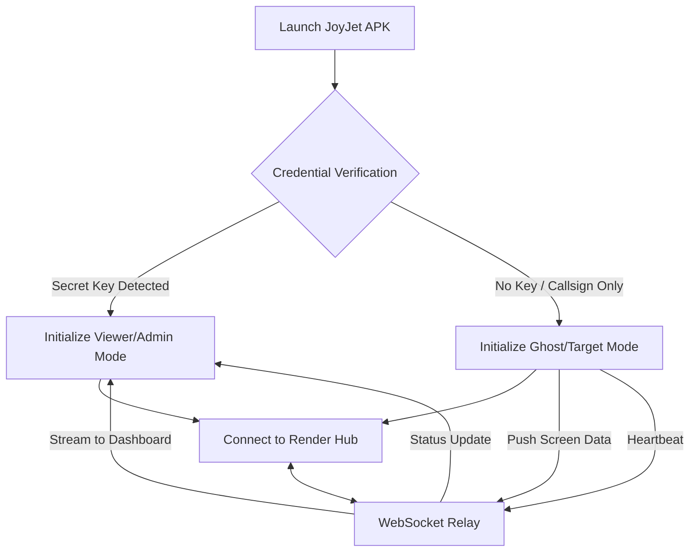

# 🛩️ JOYJET HUB: Unified Stealth Sync & Remote Monitoring

**JoyJet Hub** is a specialized mobile infrastructure designed for secure, real-time communication and remote visual monitoring between a **Viewer (Admin)** and a **Ghost (Target)** device. This system uses a dual-identity architecture, allowing one application to serve as both a tracker and a monitoring dashboard.

---

## 📊 Project Overview

| Feature | Description |
| :--- | :--- |
| **Dual-Role Binary** | One APK file. Role determined by the "Secret Key" input. |
| **Screen Sharing** | Target (Ghost) devices stream screen frames to the Admin. |
| **WebSocket Bridge** | Powered by `Socket.io` on a Render Node.js backend. |
| **Stealth Design** | Disguised as a "Pilot Login" interface to remain inconspicuous. |
| **Direct APK** | Built for manual installation, bypassing the Google Play Store. |

---

## 🏗️ Technical Architecture

The JoyJet ecosystem follows a **Star Topology** with a centralized proxy server.

### **The Logic Flow**

