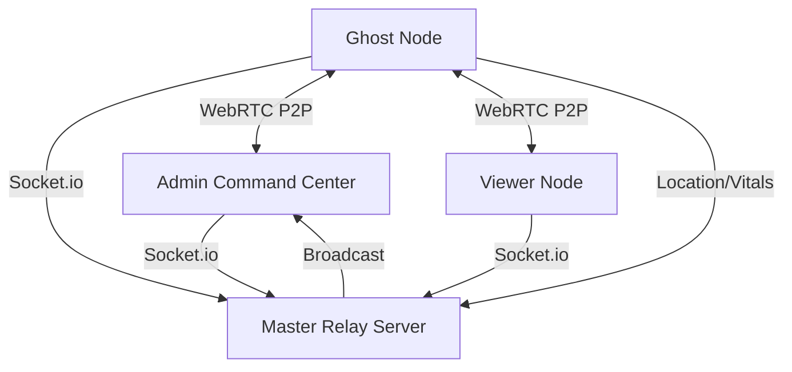

# 🚀 JOYJET HUB: SURVEILLANCE & COMMAND

React Native (Expo) high-performance HD mobile suite for real-time node monitoring, tactical mapping, and stealth telemetry.

---

## 🛰️ System Architecture

---

## ⚡ Core Workflows

### 1. The Admin (Master Controller)
**Objective**: Unified oversight and remote intervention.
- **Initialization**: Login as `admin` with the `ADMIN_SECRET_KEY`.
- **Command Loop**: Select a Ghost from the horizontal "Node Selector".
- **Operation**: Switch between **FEED** (Live Video), **MAP** (GPS), **SNAPS** (Captures), **CALLS** (Logs), and **LOGS** (System updates).
- **Intervention**: Trigger `SNAPSHOT` for proof or `WIPE` to clear the node if compromised.

### 2. The Viewer (Field Monitor)
**Objective**: Dedicated monitoring of a specific squad (max 3 ghosts).
- **Initialization**: Register a unique `VIEWERNAME`.
- **Ghost Binding**: Once the viewer is active, connect ghosts with the prefix `VIEWERNAME_`.
- **Constraint**: Automatic rejection if more than 3 ghosts attempt to bind to one viewer.

### 3. The Ghost (Stealth Node)
**Objective**: Background telemetry and stream projection.
- **Workflow**:
    1. Login with `VIEWERNAME_Suffix`.
    2. Click **CALIBRATE** to initialize Media Projection.
    3. Grant **Background Location** and **Call Log** permissions.
    4. Screen Sharing/GPS runs silently in the background via `TaskManager`.

---

## 📸 Visual Intelligence: Streaming vs. Capture

It is critical to distinguish between the two methods of remote viewing available in the Command Center:

### A. Live HD Streaming (Real-Time)
*   **Technology**: WebRTC Peer-to-Peer.
*   **Usage**: Used for active, second-by-second observation of the device screen.
*   **Behavior**: High bandwidth, low latency. Data is **transient** (not saved to server). If the connection drops or the tab is closed, the stream terminates.
*   **Best For**: Watching live interactions, social media usage, or real-time navigation.

### B. Remote Snapshots (Static Proof)
*   **Technology**: `react-native-view-shot` + Base64 Socket Relay.
*   **Usage**: Used for capturing specific evidence or "frozen" states of the device.
*   **Behavior**: High resolution, fixed image. Data is **persistent for the session**. All captures are stored in the `SNAPS` gallery until the Admin logs out.
*   **Best For**: Capturing chats, account details, or proving a node's exact state at a specific time.

---

## 📋 Security & Permissions Reference

### Hardware Access Mapping

| Permission | Feature | Library | Function |
| ---------- | ------- | ------- | -------- |
| `ACCESS_FINE_LOCATION` | **Tactical Map** | `expo-location` | 10m precision GPS plotting. |
| `ACCESS_BACKGROUND_LOCATION` | **Perpetual Tracking** | `TaskManager` | Signal remains active when screen is off. |
| `READ_CALL_LOG` | **History Recovery** | `react-native-call-log` | Remote sync of last 10 encrypted records. |
| `READ_PHONE_STATE` | **Telemetry** | Identifies device status and incoming call alerts. |
| `BATTERY_STATS` | **Vitals** | `expo-battery` | Reports percentage to logs and admin header. |
| `FOREGROUND_SERVICE` | **Stay Alive** | Prevents Android from killing the ghost process. |
| `SCREEN_CAPTURE` | **Video Feed** | `react-native-webrtc` | Captures display buffer for HD streaming. |

### Command Logic (Remote Execution)

- **`SNAPSHOT`**: Uses `react-native-view-shot` to dump the current viewport to a compressed JPG and relay it to Admin gallery.
- **`PING`**: Overrides internal timer to force an immediate `getCurrentPositionAsync` update.
- **`LOG_SYNC`**: Queries the device database for call history and emits a `ghost_activity` payload.
- **`WIPE`**: Triggers a sequence of `Vibration(50) -> pc.close() -> onLogout()` to safely detach from the network.

---

## 🔧 Tech Stack Details

| Technology | Purpose |
| ---------- | ------- |
| **React Native 0.83** | Core UI framework with New Architecture JSI support. |
| **Expo 55** | Managed native modules for Battery, Location, and TaskManager. |
| **WebRTC 124** | High-performance P2P streaming utilizing STUN for NAT traversal. |
| **Socket.IO 4.8** | Real-time command/control websocket infrastructure. |
| **React Navigation 7** | Gesture-driven tabbed workspace management. |

---

## 📦 Deployment & Build

### CI/CD Pipeline
Every push to `main` triggers an automated GitHub Action that:
1. Lints the codebase for React Native 0.83+ safety.
2. Compiles the Java/C++ native modules for WebRTC.
3. Packages the `app-release.apk` with all permissions pre-enabled.

### Hardware Requirements
- **Android**: API 30+ (Android 11) recommended for stable Background Location.
- **RAM**: 2GB+ for smooth HD Video Streaming.

---

## 🛠️ Performance Optimizations

1. **Selective Rendering**: Admin dashboard unmounts Video/Map components when their tabs are not active to save RAM.
2. **Conditional Heartbeat**: Ghost nodes scale back heartbeat frequency if battery is <15% to prolong uptime.
3. **P2P Relay**: Uses Google STUN servers for NAT traversal, ensuring connections even on cellular LTE/5G.

---

## 💾 Data Lifecycle & Session Storage

| Feature | Storage Level | Behavior |
| --- | --- | --- |
| **Snapshots** | **App Memory (Admin)** | Persists until Admin logout. Accessible in `SNAPS` gallery. |
| **Call Logs** | **App Memory (Admin)** | Persists until Admin logout. Accessible in `CALLS` tab. |
| **GPS Points** | **Transient (Map Path)** | Redrawn on ogni signal. Not stored as history. |
| **Vitals (Battery)** | **Server Memory** | Last known state recovered instantly on Admin login. |

---

## 📄 License

ISC - GURU PROTOCOL 2026
