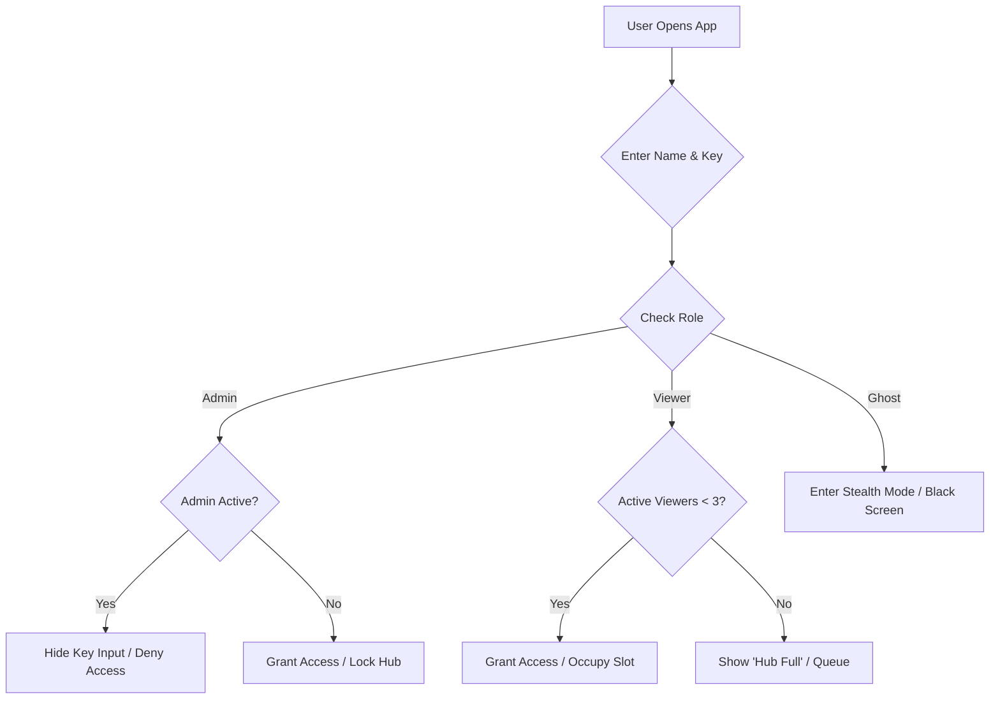

# 🛸 JOYJET HUB | Tactical Surveillance & Stealth Ecosystem (v4.2.0)

JOYJET is a high-performance, low-footprint monitoring solution built with React Native (Expo) and Node.js. It features intelligent data management, automated fail-safes for stealth, and real-time telemetry.

---

## ⚡ LATEST UPDATES (v4.2.0)

- **Android 15/16 Compatibility**: Fixed "Black Screen" and startup crashes by targeting **SDK 35**.
- **WebRTC Integration**: HD low-latency streaming ready with auto-configured permissions.
- **Automated Free Builds**: Added **GitHub Actions** workflow to bypass Expo/EAS quotas.
- **System Stability**: Added a 2.5s bridge initialization delay for reliable startup on modern Android devices.

---

## 🛠️ System Architecture & Access

- **Master Hub Lock:** Exclusive "Occupied" state—if an Admin is active, the Secret Key input is hidden for others to prevent session hijacking.
- **System Watchdog:** Real-time Socket.io heartbeat on the login gateway showing "Server Online/Offline" status.
- **Viewer Slot Optimization:** Hard-capped at **3 active viewing slots**. A 4th viewer is queued until a slot is released or an Admin "Kicks" an inactive session.
- **Dynamic Filtering:** Viewers only see "Ghosts" that match their specific username prefix.

## 👁️ Surveillance Protocols

### 1. Dual-Stream Pipeline

- **LIVE Mode:** High-frequency real-time screen mirroring for active target monitoring.
- **ECO (Snappy) Mode:** Ultra-low bandwidth snapshotting (1 frame every 5 seconds) to minimize the data footprint and battery heat.

### 2. Network Intelligence & Fail-Safes

- **Auto-Detection:** Detects if the Ghost is on **Wi-Fi** or **Mobile Data**.
- **The Cellular Governor:**
  - **5-Minute Hard Cap:** Live streaming on mobile data automatically terminates after 300 seconds to prevent carrier data alerts.
  - **Tactical Countdown:** Admin-side timer (flashing red at <60s) showing the remaining "Signal Window."
  - **Auto-Fallback:** System automatically reverts to ECO Mode when the cellular timer expires.

### 3. Pinpoint Location Telemetry

- **On-Demand GPS:** High-precision tracking (BestForNavigation) activates only upon request.
- **Motion Data:** Provides live coordinates, speed (m/s), and heading for targets in transit.
- **Stealth Backgrounding:** Uses `FOREGROUND_SERVICE` with a masked system notification to stay active while the device is locked.

---

## 📦 FREE APK BUILD SOLUTION (GitHub Actions)

Since EAS monthly quotas are limited, use our integrated **GitHub Cloud Build** to generate your APK for free.

### **How to build your APK:**

1. **Push your code** to your GitHub repository: `git push origin main`.
2. **Open your Repository** on GitHub in your browser.
3. Click the **"Actions"** tab at the top.
4. Select the workflow named **"Build Android APK"** (or look for the latest commit).
5. Wait for the green checkmark (approx. 4-6 minutes).
6. **Download**: Scroll down to the **"Artifacts"** section at the bottom of the job summary and click **`app-debug-apk`** to download your ready-to-install file.

---

## 🏗️ JOYJET | System Logical Flow

### **🔄 Logic Summary**

1. **The Validation:** The **Server** enforces the **3-Viewer Cap** and routes binary stream data to specific authorized IDs.
2. **The Activation:** The **Ghost** wakes the required hardware (GPS chip or Screen buffer) only for the duration of the request.
3. **The Delivery:** The **Server** streams data and **immediately clears it from RAM**, ensuring a zero digital footprint on the backend.

---

## 📡 Identity & Auth Matrix

| Role       | Name Format    | Key Required  | Access Level                          |
| :--------- | :------------- | :------------ | :------------------------------------ |
| **Admin**  | `admin`        | **GURU_8310** | Full control of all nodes & Wipe      |
| **Viewer** | `Alpha`        | No            | Monitors nodes starting with `Alpha_` |
| **Ghost**  | `Alpha_Node01` | No            | Stealthily relays HD data             |

---

## ⚙️ Technical Specifications

- **Transport Protocol**: Socket.io (WebSocket)
- **Buffer Size**: 100MB (`maxHttpBufferSize: 1e8`)
- **Format**: Base64 / WebRTC
- **Target SDK**: 35 (Android 15/16 compatible)
- **Backend**: Deployed on Render.com ([joyjet-server.onrender.com](https://joyjet-server.onrender.com))

---

_Status: Finalized for Build. Ready for APK Deployment._
