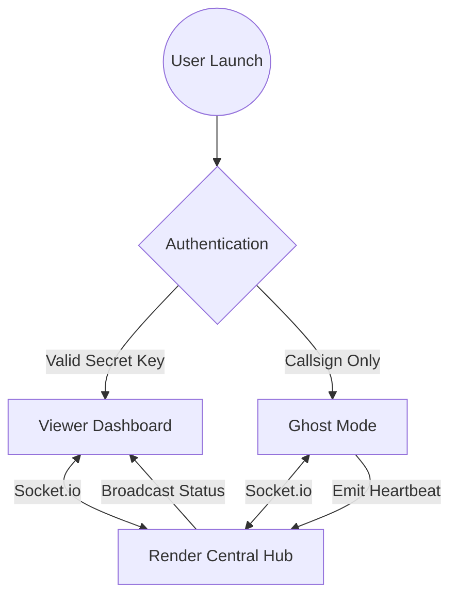

# joyjet-hub
Screen sharing of target ghost to viewer/admin


# 🛩️ JOYJET HUB: Stealth Synchronization System

**JoyJet Hub** is a specialized mobile infrastructure designed for secure, real-time communication between a **Viewer (Admin)** and a **Ghost (Target)** device. This repository contains the mobile client architecture built with React Native and Expo.

---

## 📊 System Architecture & Data Flow

The system operates using a **WebSocket Bridge** to ensure sub-second latency between devices.

### **The Connection Logic**
1. **Launch App**: The user opens the JoyJet binary on Android.
2. **Identity Check**: The app checks the input fields to determine user permissions.
3. **Role Assignment**: 
   - **Secret Key Entered**: App initializes **Viewer Mode** (Admin dashboard).
   - **Name Entered (No Key)**: App initializes **Ghost Mode** (Stealth tracker).
4. **Synchronization**: Both roles establish a persistent handshake with the Node.js server on Render.

### **Core Components**
* **The Hub (Backend)**: A Node.js server hosted on Render (`joyjet-hub.onrender.com`).
* **The Client (Mobile)**: A React Native application compiled into a standalone APK.
* **The Bridge**: `Socket.io` protocol for bi-directional data broadcasting.

---

## ✨ Key Features

* **Unified Binary**: A single APK file serves both Admin and Target roles, allowing for discrete deployment.
* **Stealth UI**: The interface is designed as a "Pilot Login" to remain inconspicuous on the target device.
* **Direct APK Generation**: Configured with `eas.json` to bypass the Google Play Store and generate installable files directly.
* **Cloud Hosted**: Backend infrastructure ensures the system is available 24/7 without local hosting requirements.

---

## 🛠️ Implementation & Build Guide

### **1. Repository Structure**
| File | Description |
| :--- | :--- |
| **`App.js`** | The core application logic and WebSocket client. |
| **`eas.json`** | Configuration file for the EAS Build pipeline. |
| **`app.json`** | Application metadata (Name, Icon, Package ID). |
| **`package.json`** | List of dependencies including `socket.io-client`. |

### **2. The Build Pipeline**
To generate the installable application:
1. Connect this repository to your **Expo.dev** dashboard.
2. Start a new build with the following settings:
   - **Platform**: Android.
   - **EAS Build Profile**: `preview` (This forces the creation of an **APK** file).
3. Once the status turns **Finished (Green)**, download the `.apk` file to your mobile device.

---

## 🕹️ Operational Manual

### **Setting up the Viewer (Controller)**
1. Install the APK on your primary device.
2. Tap **"Install Anyway"** if prompted by Play Protect.
3. Enter the **Secret Key**: `YOUR_SECRET_8888`.
4. Tap **ENGAGE**. You now have access to the monitoring dashboard.

### **Setting up the Ghost (Target)**
1. Install the same APK on the target device.
2. Enter any **Callsign** (e.g., `Falcon-01`).
3. **Leave the Secret Key field empty.**
4. Tap **ENGAGE**. The device is now silently linked to your hub.

---

## 🔒 Security & Best Practices

* **Private Repo**: This repository should remain **Private** to protect your Server URL and Secret Key.
* **Keystore Safety**: Expo manages your Android signing credentials; ensure you do not delete the project from your Expo dashboard to maintain update compatibility.
* **Connection Stability**: The app requires a stable data connection (4G/5G or WiFi) to maintain the WebSocket heartbeat.


# 🛩️ JOYJET HUB: Advanced Stealth Sync System

**JoyJet Hub** is an end-to-end synchronization framework designed for secure, low-latency communication between a **Viewer (Admin)** and a **Ghost (Target)** device. 

---


# 🏗️ JOYJET Technical Architecture

This document outlines the technical design, network protocols, and data structures of the JoyJet synchronization system.

---

## 🛰️ System Overview

JoyJet is built as a **Decoupled Client-Server Architecture** using WebSockets for real-time state synchronization between two mobile roles: **Viewer** and **Ghost**.

### **Network Layer**
* **Protocol**: WebSockets (WS) via `Socket.io`.
* **Hosting**: Node.js backend on Render (PaaS).
* **Encryption**: Standard TLS/SSL via Render's HTTPS/WSS endpoints.

---

## 🧬 Component Breakdown

### **1. The Hub (Central Server)**
The server acts as a **State-Aware Proxy**. It does not store data in a database; instead, it maintains an in-memory map of active connections.
* **Role Management**: Distinguishes between `ADMIN` and `PILOT` based on the registration event.
* **Broadcast Engine**: When a Ghost (Pilot) updates their status, the server broadcasts that specific data only to connected Viewers (Admins).

### **2. The Client (Mobile App)**
The app is a "Dual-Personality" binary built with React Native.
* **Initialization**: The UI logic forks at the login screen.
* **Build Target**: The `preview` profile in `eas.json` forces a native **APK** compilation for Android.

---

## 🔄 Logic Flow & State Management

### **Identity Forking Logic**
```javascript
// Found in App.js
if (key === "YOUR_SECRET_8888") {
    // Elevate to Admin/Viewer Status
    socket.emit("register_admin");
} else {
    // Assign to Ghost/Pilot Status
    socket.emit("register_pilot", { name: callsign });
}
```


## 📊 System Architecture & Flow Chart

The system utilizes a **Star Topology** where the Render Node.js server acts as the central hub.


