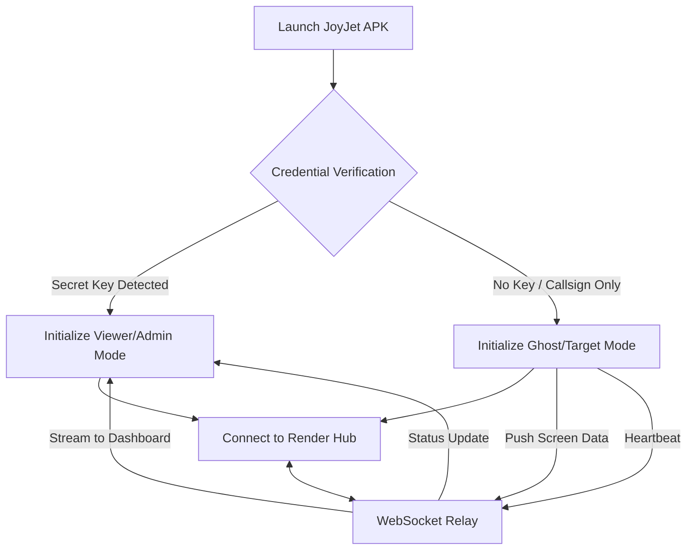

# 🛸 JOYJET HUB | Tactical Surveillance & Stealth Ecosystem

JOYJET is a high-performance, low-footprint monitoring solution built with React Native (Expo) and Node.js. It features intelligent data management, automated fail-safes for stealth, and real-time telemetry.

## 🛠️ System Architecture & Access
* **Master Hub Lock:** Exclusive "Occupied" state—if an Admin is active, the Secret Key input is hidden for others to prevent session hijacking.
* **System Watchdog:** Real-time Socket.io heartbeat on the login gateway showing "Server Online/Offline" status.
* **Viewer Slot Optimization:** Hard-capped at **3 active viewing slots**. A 4th viewer is queued until a slot is released or an Admin "Kicks" an inactive session.
* **Dynamic Filtering:** Viewers only see "Ghosts" that match their specific username prefix.

## 👁️ Surveillance Protocols
### 1. Dual-Stream Pipeline
* **LIVE Mode:** High-frequency real-time screen mirroring for active target monitoring.
* **ECO (Snappy) Mode:** Ultra-low bandwidth snapshotting (1 frame every 5 seconds) to minimize the data footprint and battery heat.

### 2. Network Intelligence & Fail-Safes
* **Auto-Detection:** Detects if the Ghost is on **Wi-Fi** or **Mobile Data**.
* **The Cellular Governor:** * **5-Minute Hard Cap:** Live streaming on mobile data automatically terminates after 300 seconds to prevent carrier data alerts.
    * **Tactical Countdown:** Admin-side timer (flashing red at <60s) showing the remaining "Signal Window."
    * **Auto-Fallback:** System automatically reverts to ECO Mode when the cellular timer expires.

### 3. Pinpoint Location Telemetry
* **On-Demand GPS:** High-precision tracking (BestForNavigation) activates only upon request.
* **Motion Data:** Provides live coordinates, speed (m/s), and heading for targets in transit.
* **Stealth Backgrounding:** Uses `FOREGROUND_SERVICE` with a masked system notification to stay active while the device is locked.

## ⚡ Admin "God Mode" Controls
* **Remote Session Toggle:** Force any viewer to "Offline" status to free up active slots.
* **The Remote Wipe (Kill-Switch):** Instantly clears target app cache, logs the user out, and locks the screen with a "System Error" overlay.
* **Visual Radar:** * 🔵 **IDLE:** Connected/Stealth.
    * 🟢 **ACTIVE:** Transmitting Live/ECO data.
    * 🔴 **LOCKED:** System at 3/3 capacity.

## 📦 Technical Requirements (Build Day)
| Module | Command / Permission |
| :--- | :--- |
| **Network** | `npx expo install expo-network` |
| **Location** | `npx expo install expo-location expo-task-manager` |
| **Capture** | `npx expo install expo-screen-capture react-native-view-shot` |
| **Background** | `ACCESS_BACKGROUND_LOCATION` / `FOREGROUND_SERVICE` |

---
*Status: Finalized for Build. Ready for APK Deployment.*


---

## 🏗️ Technical Architecture

The JoyJet ecosystem follows a **Star Topology** with a centralized proxy server.

### **The Logic Flow**


---

**1. Entry & Authentication Flow**

```mermaidr
graph TD
    Start[User Opens App] --> Login{Enter Name & Key}
    Login --> Role{Check Role}
    
    Role -- Admin --> AdminLock{Admin Active?}
    AdminLock -- Yes --> Reject[Hide Key Input / Deny Access]
    AdminLock -- No --> GrantAdmin[Grant Access / Lock Hub]
    
    Role -- Viewer --> SlotCheck{Active Viewers < 3?}
    SlotCheck -- Yes --> GrantViewer[Grant Access / Occupy Slot]
    SlotCheck -- No --> Waiting[Show 'Hub Full' / Queue]
    
    Role -- Ghost --> Stealth[Enter Stealth Mode / Black Screen]
```

**2. Surveillance & Network Selection Flow**

```mermaidr
sequenceDiagram
    participant A as Admin/Viewer
    participant S as Server
    participant G as Ghost
    
    A->>S: Select Ghost & Click [MONITOR]
    S->>G: Request Network Status
    G-->>S: Reporting: CELLULAR
    S-->>A: UI Warning: "High Risk - Cellular Detected"
    
    alt Admin Selects LIVE
        A->>S: START_LIVE
        S->>G: Begin High-Speed Stream
        Note over A,G: 5-Minute Governor Starts
        G->>A: Streaming Data...
        A->>A: Timer Hits 0:00
        A->>S: FORCE_ECO
        S->>G: Stop Stream -> Switch to Snapshots
    else Admin Selects ECO
        A->>S: START_ECO
        S->>G: Send Snapshot every 5s
        G->>A: Low-Data Images...
    end
```

**3. Pinpoint Location Flow**

```mermaidr
graph LR
    A[Admin] -- Click Pinpoint --> S[Server]
    S -- ACTIVATE_GPS_HIGH --> G[Ghost]
    G -- "Wake Hardware" --> GPS((GPS))
    GPS -- "Lat/Lng Data" --> G
    G -- "emit(location_data)" --> S
    S -- "Smooth Map Update" --> A
    A -- Close Map --> End[Deactivate GPS / Save Battery]
```


**4. System Exit & Security Flow**

```mermaidr
graph TD
    A[Admin] -- WIPE command --> S[Server]
    S -- SYSTEM_DESTROY --> G[Ghost/Viewer]
    
    subgraph Self-Destruct Sequence
    G --> Clear[AsyncStorage.clear]
    G --> UI[Show Fake Error Overlay]
    G --> Exit[Kill App Process]
    end
    
    Exit --> Release[Server Frees Slot for Viewer 4]
```


