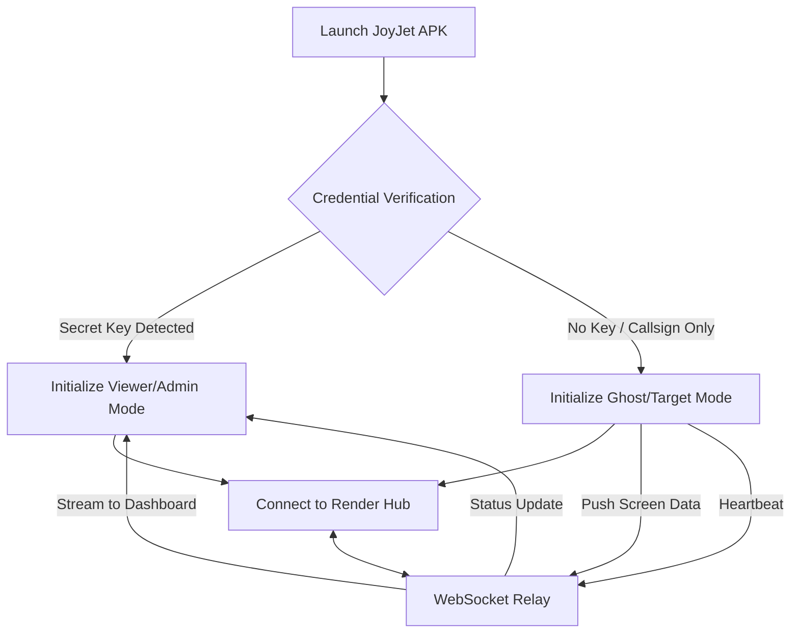

# 🛩️ JOYJET HUB: Unified Stealth Sync & Remote Monitoring

**JoyJet Hub** is a specialized mobile infrastructure designed for secure, real-time communication and remote visual monitoring between a **Viewer (Admin)** and a **Ghost (Target)** device. This system uses a dual-identity architecture, allowing one application to serve as both a tracker and a monitoring dashboard.

---

## 📊 Project Overview

| Feature | Description |
| :--- | :--- |
| **Dual-Role Binary** | One APK file. Role determined by the "Secret Key" input. |
| **Screen Sharing** | Target (Ghost) devices stream screen frames to the Admin. |
| **WebSocket Bridge** | Powered by `Socket.io` on a Render Node.js backend. |
| **Stealth Design** | Disguised as a "Pilot Login" interface to remain inconspicuous. |
| **Direct APK** | Built for manual installation, bypassing the Google Play Store. |

---

## 🏗️ Technical Architecture

The JoyJet ecosystem follows a **Star Topology** with a centralized proxy server.

### **The Logic Flow**

---

# JOYJET HUB | Advanced Tactical Surveillance System

A high-performance, stealth-oriented monitoring ecosystem built with React Native (Expo) and Node.js. Designed for low-footprint operation, real-time data streaming, and master-level administrative control.

## 🚀 Core Features

### 1. Advanced Session Management
* **Master Hub Lock:** Exclusive "Occupied" state—only one Admin can access the Master Hub at a time. The Secret Key input is hidden globally if an Admin session is active.
* **System Watchdog:** Real-time Socket.io heartbeat providing a "Systems Online/Offline" status indicator on the login gateway.
* **Viewer Slot Optimization:** Hard-capped at **3 active viewing slots** to maintain server stability. A 4th viewer is automatically queued until a slot is released.

### 2. Intelligent Surveillance (The "Ghost" Protocol)
* **Dual-Stream Pipeline:**
    * **LIVE Mode:** High-frequency real-time screen mirroring for active monitoring.
    * **ECO (Snappy) Mode:** Low-bandwidth snapshotting (1 frame every 5 seconds) to minimize data footprints.
* **Network-Aware Governor (`expo-network`):**
    * **Auto-Detection:** Detects if the Target (Ghost) is on Wi-Fi or Cellular data.
    * **Cellular Fail-Safe:** Automated **5-minute hard limit** for LIVE streaming on mobile data.
    * **Tactical Countdown:** Admin-side visual timer with "Signal Loss" warnings (Flashing Red at <60s) before auto-switching to ECO mode.

### 3. Administrative "God Mode"
* **Remote Session Toggle:** Admin can remotely force-toggle any Viewer to "Offline" to free up bandwidth or slots.
* **The Remote Wipe (Kill-Switch):** One-click command to remotely clear the target app's cache, force-logout, and lock the device with a "System Error" overlay.
* **Dynamic Radar:** Visual feedback for Ghost status:
    * 🔵 **IDLE:** Connected but resting (Zero data usage).
    * 🟢 **ACTIVE:** Currently transmitting data.
    * 🔴 **LOCKED:** Slot limit reached.

### 4. Technical Architecture
* **Frontend:** React Native / Expo Go
* **Backend:** Node.js (Socket.io) hosted on Render
* **Communication:** Binary Buffer streaming for optimized frame delivery.
* **Privacy:** Volatile streaming—data exists only during live viewing; no permanent storage footprint on the server.

---
*Developed for high-security stealth operations and remote monitoring.*
